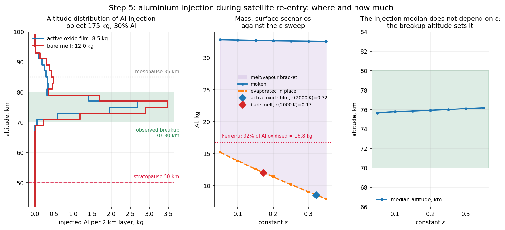

# alakazam: aluminium injected into the mesosphere by re-entering satellites

[](https://github.com/miss-mississippi/alakazam/actions/workflows/tests.yml)
[](LICENSE)


A satellite re-entry and ablation model that estimates **how much aluminium
evaporates during atmospheric entry and at which altitudes it is injected**.
Standard demise-analysis tools (DRAMA/SESAM, ORSAT) do not give this number: they
were built to assess the risk to people on the ground, and their demise criterion
is melting. Atmospheric chemistry needs the vapour.

The full report, with the derivation of every number, the assumptions, the
constants and an error log, is in **[docs/REPORT.md](docs/REPORT.md)**.

## Main result

A 175 kg object with 30% aluminium (52.5 kg Al), spread uniformly over the fragments.
Entry at 120 km / 7500 m/s / −1.5°, inclination 53°, NRLMSIS 2.1 atmosphere.



| surface scenario | ε at ~2000 K | Al evaporated | yield | injection median | molten Al |
|---|---|---|---|---|---|
| oxide film optically active | 0.32<!--=step5.scenarios.film.eps2000:.2f--> (0.30<!--=step5.film_shape.eps2000_min:.2f-->–0.33<!--=step5.film_shape.eps2000_max:.2f-->) | **8.5<!--=step5.scenarios.film.total:.1f--> kg** | 16<!--=step5.scenarios.film.yield_pct:.0f-->% | 76.1<!--=step5.scenarios.film.median:.1f--> km | 32.4<!--=step5.scenarios.film.melt:.1f--> kg |
| no film, bare melt | ≈0.17<!--=step5.scenarios.bare.eps2000:.2f--> (estimate) | **12.0<!--=step5.scenarios.bare.total:.1f--> kg** | 23<!--=step5.scenarios.bare.yield_pct:.0f-->% | 75.9<!--=step5.scenarios.bare.median:.1f--> km | 32.8<!--=step5.scenarios.bare.melt:.1f--> kg |

All of the injection happens above the stratopause (50 km), and about 10<!--=step5.scenarios.film.above_meso_pct:.0f-->% above
the mesopause (85 km). The melt is an upper bound: everything that could in
principle become oxide. Between melt and vapour lies the fate of the droplet phase,
which no current model resolves.

## What the work shows

1. **Demise in DRAMA/ORSAT means melting, not evaporation.** Complete melting takes
   1.01<!--=step4.criteria.melt:.2f--> MJ/kg (ORSAT: 0.93; the 8<!--=verify_step4.orsat.diff_pct:.0f-->% difference comes from the alloy properties),
   complete evaporation 13.6<!--=step4.criteria.vapour:.1f--> MJ/kg, 13.4<!--=step4.criteria.ratio:.1f--> times more.
2. **Aluminium boils at the stagnation pressure, not at 1 atm.** At 70–80 km that is
   0.1–1 kPa, and Al boils at 1759<!--=step4.fragments.film.panels.Tb_min:.0f-->–2039<!--=step4.fragments.film.mli.Tb_max:.0f--> K instead of 2792 K. With boiling at 1 atm
   the film scenario would evaporate 0.6<!--=step5.changes.film_1atm:.1f--> kg instead of 8.5<!--=step5.scenarios.film.total:.1f-->.
3. **The surface state is not the main uncertainty.** The "film" and "bare melt"
   scenarios differ by a factor of 1.4<!--=step5.scenarios.ratio:.1f-->: at ~2000 K the film emissivity is
   pinned by the α-Al₂O₃ reference point, and the liquid metal's is already ~0.17.
4. **The mass is set by where the aluminium sits.** At the same 30% fraction, the
   distribution of Al over fragments gives 0<!--=step5.sensitivity.al_split.lo:.0f-->–17<!--=step5.sensitivity.al_split.hi:.0f--> kg, a thin-walled mass fraction
   of 25–75% gives 4.3<!--=step5.sensitivity.thin_fraction.lo:.1f-->–13.1<!--=step5.sensitivity.thin_fraction.hi:.1f--> kg, and a breakup altitude of ±10 km gives 4.4<!--=step5.sensitivity.breakup.lo:.1f-->–11.1<!--=step5.sensitivity.breakup.hi:.1f--> kg.
5. **The injection altitude is inherited from the breakup altitude H.** In the
   68–83 km window the injection median is ≈ 75.9<!--=step5b.transfer.intercept78:.1f--> + 0.82<!--=step5b.transfer.gain_mid:.2f-->·(H − 78) km; at a fixed H
   the offset is +1.7<!--=step5b.offsets.min:+.1f-->…+2.8<!--=step5b.offsets.max:+.1f--> km across all other parameters.
6. **Comparison with Ferreira et al. 2024: order-of-magnitude agreement.** They
   oxidise 32<!--=step5.ferreira.theirs.pct:.0f-->% of the Al (molecular dynamics); we evaporate 16<!--=step5.ferreira.film_uniform.pct:.0f-->–23<!--=step5.ferreira.bare_uniform.pct:.0f-->% with uniform Al
   and 32<!--=step5.ferreira.film_thin.pct:.0f-->–46<!--=step5.ferreira.bare_thin.pct:.0f-->% if the Al is concentrated in thin-walled parts.
7. **Experiment.** The emissivity of oxidised Al can be obtained from room-temperature
   reflectance, but mid-IR in full hemispherical geometry (a gold integrating
   sphere) is required: without it the error is −84<!--=step5b.no_midir.T2000.err_pct:.0f-->%.

## Quick start

```bash
git clone https://github.com/miss-mississippi/alakazam.git
cd alakazam
python -m venv .venv && source .venv/bin/activate
pip install -r requirements-dev.txt

python -m pytest                     # all checks + documents vs code
```

Recompute everything (≈ 3 minutes):

```bash
python run_step1.py && python explore_step1b.py && python run_step2.py
python run_step3.py && python run_step4.py && python run_step5.py
python analysis_step5b.py
for n in 1 2 3 4 5; do python verify_step$n.py; done
python check_docs.py --fix           # update the numbers in the documents from results/
```

## How the computation is organized

| step | script | what it does | figure |
|---|---|---|---|
| 1 | `run_step1.py` | 3-DOF trajectory, exponential atmosphere, Allen–Eggers comparison | [trajectory](figures/step1_trajectory.png) |
| 1b | `explore_step1b.py` | heating peak versus deceleration peak, fragmentation | [fragmentation](figures/step1b_fragmentation.png) |
| 2 | `run_step2.py` | NRLMSIS 2.1, solar activity, latitude, season | [atmosphere](figures/step2_atmosphere.png) |
| 3 | `run_step3.py` | Sutton–Graves heating, atmospheric rotation, uncertainty budget | [heating](figures/step3_heating.png) |
| 4 | `run_step4.py` | fragments, per-band thermal model, boiling at local pressure | [ε and regimes](figures/step4_epsilon.png) |
| 5 | `run_step5.py` | altitude distribution of injection, budget, Ferreira comparison | [result](figures/step5_main.png) |
| 5b | `analysis_step5b.py` | altitude transfer function, ε(T) from α-Al₂O₃, instruments | [revision](figures/step5b_revision.png) |

The physics lives in the `reentry/` package: atmosphere, trajectory, heating,
ablation, emissivity.

## Checks and number tracking

- **37<!--=checks.total:.0f--> checks** in `verify_step1.py` … `verify_step5.py`: each one tests an
  identity or an independent benchmark (Kepler test, energy balance inside the ODE,
  Stardust, CRC vapour-pressure table, analytic plate equilibrium, etc.) and fails
  through `assert`. Run them with pytest or one at a time: `python verify_step4.py`.
- **Numbers in the documents cannot silently drift from the code.** The scripts
  write their results to `results/*.json`, and the numbers in this README and in the
  report carry invisible tags `<!--=key:format-->`. `check_docs.py` checks them;
  `test_docs.py` does the same in pytest and recomputes a sample of the results.

## Repository layout

```
alakazam/
├── reentry/            model package: atmosphere, trajectory, heating, ablation, emissivity
├── run_step*.py        computation steps 1–5, explore_step1b.py, analysis_step5b.py
├── verify_step*.py     checks (pytest or standalone scripts)
├── check_docs.py       checks the numbers in the documents against results/
├── test_docs.py        the same in pytest
├── results/            numbers written by the scripts
├── figures/            figures
└── docs/REPORT.md      full report
```

## Main assumptions

Stable fragment orientation (the fast-tumbling limit is checked separately); three
fragment classes, each treated thermally as aluminium; the melt stays on the
fragment until it boils; vapour blowing and the heat of oxidation are not in the
base case; the emissivity of bare liquid Al is estimated from electrical
resistivity; breakup altitudes are inputs, not results. The full list is in
[section 15 of the report](docs/REPORT.md#15-full-list-of-assumptions).

## How to cite

Citation metadata is in [CITATION.cff](CITATION.cff) (GitHub shows it through the
"Cite this repository" button).

## License

[MIT](LICENSE).
