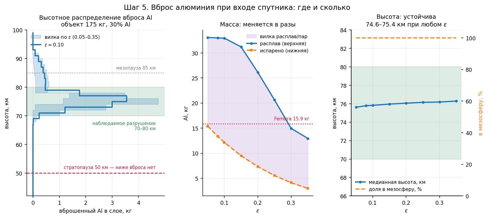
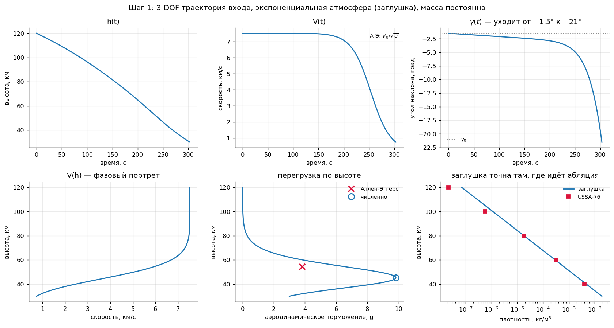
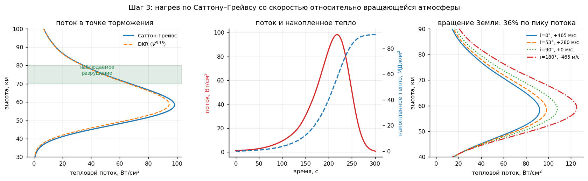
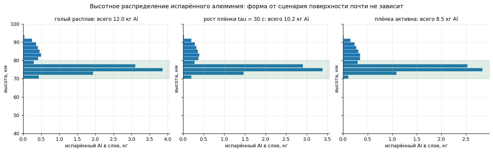
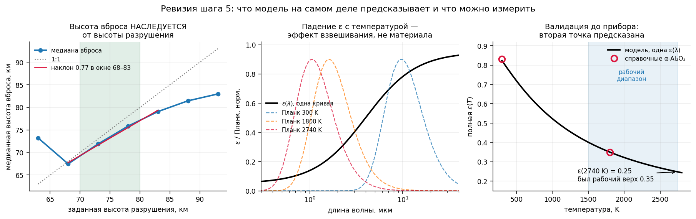
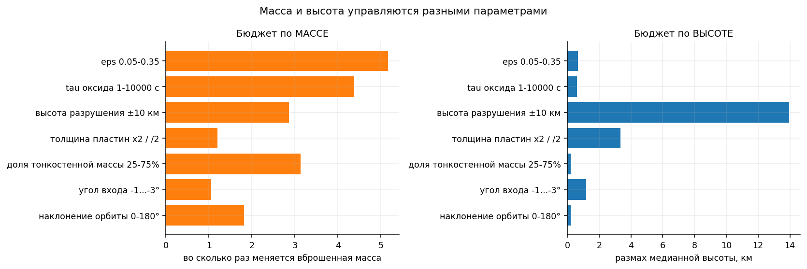
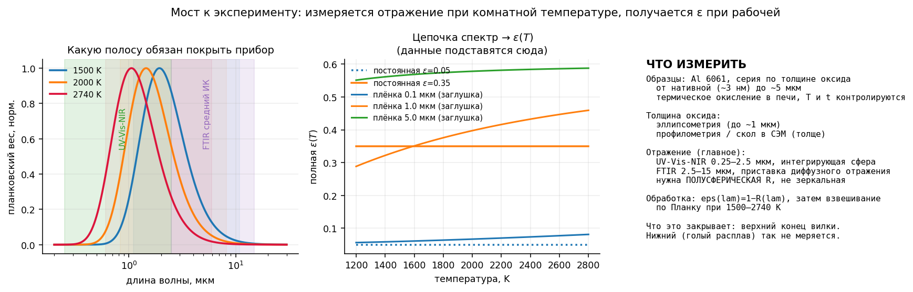

# Вброс алюминия при входе спутников в атмосферу

Модель входа и абляции, считающая **испарённую массу алюминия по высоте** —
величину, которую инструменты анализа демиза (DRAMA/SESAM, ORSAT) не выдают,
потому что проектировались под casualty risk и считают демизом расплав.

Опубликованные оценки атмосферного эффекта (Ferreira 2024, Barker 2026,
Maloney 2025) расходятся, потому что все вынуждены угадывать входные параметры.
Эта работа считает вброс снизу вверх и показывает, **какие величины определяют
ответ по массе и по высоте** — и что это разные величины.

```
pip install -r requirements.txt

python run_step1.py       # траектория, экспоненциальная атмосфера (заглушка)
python run_step2.py       # NRLMSIS 2.1: атмосфера и свипы среды
python run_step3.py       # нагрев, вращение Земли, бюджет неопределённостей
python run_step4.py       # фрагментация, тепловой отклик, абляция, вилка
python run_step5.py       # ГЛАВНЫЙ РЕЗУЛЬТАТ, бюджет, сверка с Ferreira
python analysis_step5b.py # передаточная функция, валидация ε, приборы

pip install -r requirements-dev.txt
python -m pytest          # все проверки verify_step*.py + сверка документов
python check_docs.py      # числа в README и отчёте против results/*.json
python check_docs.py --fix  # переписать числа в тексте из results/
```

Каждый `run_step*.py` пишет свои числа в `results/<шаг>.json`. Числа в этом
README и в отчёте помечены невидимыми метками `<!--=ключ:формат-->`, и
`check_docs.py` сверяет их с `results/`: текст не может молча разойтись с кодом.
Проверки `verify_step*.py` запускаются и как скрипты (`python verify_step4.py`),
и через pytest.

Все 37<!--=checks.total:.0f--> проверок проходят. `explore_step1b.py` — диагностика, по которой
фрагментация была поднята в приоритете. Полный отчёт с выводом каждой цифры —
`REPORT_full.md` (вне репозитория); история формулировок — `README_history.md`.

---

## 1. Главный результат

Объект 175 кг, 30% Al = 52.5 кг Al, распределён по фрагментам равномерно.
Вход 120 км / 7500 м/с / −1.5°, наклонение 53°. Алюминий кипит при давлении
торможения (раздел 2.5).



| сценарий поверхности | ε при ~2000 K | испарено Al, кг | выход | медиана вброса | расплав Al, кг |
|---|---|---|---|---|---|
| **оксидная плёнка оптически активна** | 0.32<!--=step5.scenarios.film.eps2000:.2f--> (0.30<!--=step5.film_shape.eps2000_min:.2f-->–0.33<!--=step5.film_shape.eps2000_max:.2f-->) | **8.5<!--=step5.scenarios.film.total:.1f-->** | 16<!--=step5.scenarios.film.yield_pct:.0f-->% | 76.1<!--=step5.scenarios.film.median:.1f--> км | 32.4<!--=step5.scenarios.film.melt:.1f--> |
| **плёнки нет, голый расплав** | ≈0.17<!--=step5.scenarios.bare.eps2000:.2f--> (оценка) | **12.0<!--=step5.scenarios.bare.total:.1f-->** | 23<!--=step5.scenarios.bare.yield_pct:.0f-->% | 75.9<!--=step5.scenarios.bare.median:.1f--> км | 32.8<!--=step5.scenarios.bare.melt:.1f--> |

Весь вброс идёт выше стратопаузы; около 10<!--=step5.scenarios.film.above_meso_pct:.0f-->% — выше мезопаузы (85 км).

Сценарии поверхности различаются всего в **1.4<!--=step5.scenarios.ratio:.1f--> раза**. Массу определяет прежде
всего не ε, а **где лежит алюминий и какая доля массы тонкостенная** (раздел 6):
при той же общей доле 30% распределение Al по фрагментам даёт 0<!--=step5.sensitivity.al_split.lo:.0f-->–17<!--=step5.sensitivity.al_split.hi:.0f--> кг.

Отдельно от этого модель выдаёт **вилку расплав/испарение** — она про судьбу
капельной фазы, и её ширина (32.5 против 8.5–12 кг) сама по себе физический
результат (раздел 4).

### Сверка с Ferreira

Ferreira et al. 2024 (GRL): 250 кг, 30% Al = 75 кг Al. Молекулярная динамика
окисления при 2200 K и 86 км, масштабированная на спутник: **окисляется
24.0 кг Al (32<!--=step5.ferreira.theirs.pct:.0f-->%)**, образуя 29.8 кг кластеров AlO. 32<!--=step5.ferreira.theirs.pct:.0f-->% — выход их модели,
а не допущение.

| | Al в пар / окислено | доля Al |
|---|---|---|
| наш, плёнка активна, Al равномерно | 8.5<!--=step5.ferreira.film_uniform.total:.1f--> кг | 16<!--=step5.ferreira.film_uniform.pct:.0f-->% |
| наш, голый расплав, Al равномерно | 12.0<!--=step5.ferreira.bare_uniform.total:.1f--> кг | 23<!--=step5.ferreira.bare_uniform.pct:.0f-->% |
| наш, плёнка активна, весь Al в тонкостенных | 17.0<!--=step5.ferreira.film_thin.total:.1f--> кг | 32<!--=step5.ferreira.film_thin.pct:.0f-->% |
| **Ferreira** (в нормировке на 52.5 кг Al) | 16.8<!--=step5.ferreira.theirs.total:.1f--> кг | **32<!--=step5.ferreira.theirs.pct:.0f-->%** |

Путь совершенно другой (траектория, тепловой баланс, распределение потока против
МД окисления), и величины разные: у нас испарённый Al, у них окисленная доля при
полной абляции. Это **согласие по порядку величины, а не валидация**.

---

## 2. Структура модели

### 2.1 Траектория

Планарные уравнения входа в инерциальной полярной системе,
состояние `[V, γ, h, s]`, γ — угол наклона к местному горизонту (положительный вверх):

```
dV/dt     = -(1/2)·ρ(h)·V_отн²·Cd·A/m  -  (μ/r²)·sin γ
dγ/dt     = cos γ · ( V/r  -  μ/(r²·V) )
dh/dt     = V·sin γ
ds/dt     = V·cos γ · R⊕/r                       r = R⊕ + h
```

Выбор в пользу этой системы, а не ECI-декартовой: V и h — прямо переменные
состояния, а именно они входят в закон нагрева `q ~ √ρ(h)·V³` и в главный выход;
γ₀ задаётся как начальное условие напрямую. Цена — сингулярность при V→0,
безразличная, потому что интегрирование останавливается на ~Mach 1.

V — инерциальная скорость. Вращение атмосферы входит через скорость относительно
воздуха: `V_отн = V − ω·R⊕·cos i`. Вывод: атмосфера идёт на восток со скоростью
`ω·R·cos(lat)`, вдоль трассы работает проекция `u·sin A`, а из сферической
тригонометрии `sin A = cos i / cos(lat)` — **широта сокращается, остаётся только
наклонение**. Пределы: i=0 → +465<!--=verify_step3.rotation.i0.v_corot:+.0f--> м/с, 53 → +280<!--=verify_step3.rotation.i53.v_corot:+.0f-->, 90 → 0, 180 → −465<!--=verify_step3.rotation.i180.v_corot:+.0f--> м/с.
Сил Кориолиса в инерциальной постановке нет. Шаги 1–2 считаются без вращения
атмосферы (`earth_rotation=False` явно).

Численно: `DOP853`, rtol 1e-8, покомпонентный atol, max_step 2 с, два terminal-события
(h = 30 км, V = 300 м/с), пересэмплирование через dense_output на сетку 0.1 с.



### 2.2 Атмосфера

**NRLMSIS 2.1** через `pymsis`, затабулированная на сетке 250 м и интерполированная
кубическим сплайном **по log ρ**: плотность меняется на 6 порядков, логарифм почти
линеен. Кубический, а не линейный, потому что линейный по log даёт кусочно-
экспоненциальную ρ с изломами производной, на которых адаптивный интегратор режет шаг.

Экспоненциальная заглушка `ρ = 1.225·exp(−h/7.2км)` оставлена как эталон и для
аналитики Аллена–Эггерса.


**Почему 2.1, а не NRLMSISE-00.** У 00 рвётся производная `ln ρ` на **72.5 км**
и **123.4 км** — это внутренние границы её формулировки: термосферные плотности
считались независимо от нижних слоёв, профили сшивались апостериорно. У 2.x сшивку
убрали, гидростатический профиль непрерывен от земли до экзосферы. Emmert et al.
(2021): *«In the mesosphere and below, residual biases and standard deviations are
considerably lower than NRLMSISE-00»*. Один из швов 00 лежит на 72.5 км — прямо
в зоне абляции. `version=0` сохранён переключаемым; разница версий идёт строкой
в бюджете (0.9<!--=step3.budget.msis_version.h_km:.1f--> км).

### 2.3 Нагрев

Саттон–Грейвс для точки торможения:

```
q_stag = k·√(ρ/Rn)·V_отн³              k = 1.7415e-4
```

**Размерность разобрана по бенчмарку, а не по подписи в источнике.**
NASA TFAWS подписывает результат как Вт/см². Проверка на Stardust (Rn = 0.23 м,
V = 12.6 км/с, ρ ≈ 3e-4, расчётный пик ~1200 Вт/см²) даёт 1.258e7 — это
1258<!--=verify_step3.stardust_wcm2:.0f--> Вт/см² только если выход в **Вт/м²**. В Вт/см² промах в 10⁴ раз.

Поправка на горячую стенку `(1 − h_w/h_0)`, `h_0 = V²/2`, `h_w = c_p,возд·T`: при
температуре кипения на ~1 кПа (2046<!--=verify_step3.energy.T_boil:.0f--> K) −9% при 7500 м/с, −14% при 6100, −33% при 4000.

Detra–Kemp–Riddell используется **только как форма** (показатель 3.15 против 3.0),
нормированная на С–Г в опорной точке: абсолютную константу из надёжного
первоисточника взять не удалось. Цена показателя: +0.40<!--=verify_step3.dkr.dh_km:+.2f--> км по высоте пика,
−4.4<!--=verify_step3.dkr.dQ_pct:.1f-->% по интегралу — эффект четвёртого порядка.

Вдув пара блокирует часть потока. В ламинарном слое (на 70–80 км он ламинарный)
блокировка сильнее, чем в турбулентном; значение η с первоисточником не сверено,
поэтому вдув — ось чувствительности (η 0–0.6), а не часть базового расчёта.



### 2.4 Фрагментация

Не N равных осколков, а **список фрагментов со спектром β**. Каждый — либо
**пластина** (задаётся толщиной), либо **компактный** (задаётся β).

Для пластины β выводится из толщины и ничем больше:

```
β = m/(Cd·A_проекц) = ρ·A·t/(Cd·A/2) = 2ρt/Cd
```

(средняя проекция кувыркающейся пластины = половина её площади — формула Коши).
Для Al при Cd = 1.5: t = 1 мм → β = 3.6; t = 2 мм → 7.2. Это ровно та полоса 1–10,
которую дают панели и MLI в списках фрагментов.

Пластина прогрета насквозь, поэтому **излучает двумя сторонами**; оболочка
(компактный фрагмент) — одной. Сфероэквивалент `Rn = √(A/π)` для пластины неверен:
панель с β = 4 получила бы Rn = 96 см. Радиус кромки пластины ~t/2 с полом 5 мм.

Высоты разрушения — параметры. По умолчанию SESAM: панели 95 км, корпус 78 км.

| фрагмент | доля массы | вид | параметр | β | h разрушения |
|---|---|---|---|---|---|
| солнечные панели | 10% | пластина | 1.5 мм | 5 | 95 км |
| силовой набор | 50% | компактный | β = 55 | 55 | 78 км |
| мелкие элементы, MLI | 40% | пластина | 1.0 мм | 4 | 78 км |

Тепловая модель считает каждый фрагмент алюминиевым; доля Al во фрагменте задаёт,
какая часть испарённой массы — алюминий. В базе — 30% в каждом; распределение
Al по фрагментам — ось чувствительности.

### 2.5 Тепловой отклик и абляция

**Алюминий кипит при давлении торможения, а не при 1 атм.** 2792 K — кипение Al
при 1 атм (CRC). На поверхности фрагмента давление `p₀ = 0.92·ρV²`, на 70–80 км
это 0.1–1 кПа, и по Клапейрону–Клаузиусу Al там кипит при 1759<!--=step4.fragments.film.panels.Tb_min:.0f-->–2039<!--=step4.fragments.film.mli.Tb_max:.0f--> K (против
таблицы давления паров CRC — до 1.4<!--=verify_step4.crc.max_diff_pct:.1f-->%). Порог испарения `εσT⁴` падает втрое.

| p, Па | 100 | 300 | 1 000 | 3 000 | 101 325 |
|---|---|---|---|---|---|
| T_кип, K | 1806<!--=step4.boil.p100.T:.0f--> | 1913<!--=step4.boil.p300.T:.0f--> | 2046<!--=step4.boil.p1000.T:.0f--> | 2185<!--=step4.boil.p3000.T:.0f--> | 2792<!--=step4.boil.p101325.T:.0f--> |

**Поэлементный энергобаланс по угловому распределению потока**, а не одна средняя
температура. Испарение — задача пороговая, излучение идёт как `T⁴`; в такой задаче
среднее занижает систематически.

```
q(θ)/q_stag = cos θ                    (Ньютон + Lees 1956), свободных параметров нет
```

Среднее этого распределения по полной сфере равно **ровно 1/4** — стандартная полоса
форм-фактора демиз-кодов 0.25–0.30. Распределение означает устойчивую ориентацию;
предел быстрого кувыркания (средний поток) проверен отдельно: 5.9<!--=step5.sensitivity.orientation.lo:.1f--> кг против 8.5.

Состояние каждого пояса — удельная энтальпия `h_s` и испарённая из него масса;
температура выводится из энтальпии монотонной кусочной функцией с полками:

```
h₁ = c_p,тв(T_пл − T₀)            = 0.61<!--=step4.criteria.h1:.2f-->     начало плавления
h₂ = h₁ + L_пл                    = 1.01<!--=step4.criteria.h2:.2f-->     конец плавления            [МДж/кг]
h₃ = h₂ + c_p,ж(T_кип(p) − T_пл)  ≈ 2.0–2.4  начало кипения
```

c_p твёрдой фазы — эффективная 1038 Дж/(кг·К) (NIST, 300–890 K), жидкой — 1177;
T_пл = 890 K (6061: солидус 855, ликвидус 925 K).

Каждый пояс излучает `n·ε(T)·σT⁴` (n = 2 у пластины), испаряет не больше своей
массы (выкипевший пояс исчезает), а расплав считается **по максимуму энтальпии
за полёт**. Поэтому в каждом поясе испарено ≤ расплавлено ≤ масса — по построению.
Аудит энергии внутри той же системы ОДУ, невязка ~1e-15.

Замкнутые формы (сверены с численным интегрированием до 1e-9), `C = n·εσT_кип⁴/q_stag`:

```
доля кипящей поверхности = (1 − C)/2
скорость испарения       = A_омыв·q_stag·(1 − C)²/(4·L_исп)
```

---

## 3. Два режима: энергетический и радиационный

Режимы разделяет **масса на единицу омываемой площади** `m'' = m/A_омыв`
(у пластины омываются обе грани, m'' = ρt/2):

```
Π = φ·∫q dt / (m''·h_кип)
```

| | эквив. толщина | нужно до кипения | доступно | **Π** | режим |
|---|---|---|---|---|---|
| целый объект | 16.2<!--=step4.regime.whole.equiv_mm:.1f--> мм | 104<!--=step4.regime.whole.need_MJ:.0f--> МДж/м² | 25<!--=step4.regime.whole.avail_MJ:.0f--> | **0.24<!--=step4.regime.whole.Pi:.2f-->** | энергетический |
| пластина 1 мм | 0.5<!--=step4.regime.plate.equiv_mm:.1f--> мм | 3.2<!--=step4.regime.plate.need_MJ:.1f--> МДж/м² | 42<!--=step4.regime.plate.avail_MJ:.0f--> | **13.2<!--=step4.regime.plate.Pi:.1f-->** | радиационный |

Целый объект испаряет 0% при любом ε (расплав ~29<!--=step4.eps.e005.whole_melt_pct:.0f-->%); пластина 1 мм от точки входа —
78<!--=step4.eps.e005.plate_vap_pct:.0f-->% при ε = 0.05, 43<!--=step4.eps.e035.plate_vap_pct:.0f-->% при 0.35. **ε важна только для тонкостенных элементов** —
панелей, MLI, обшивки. Силовой набор не испаряет ничего ни при каком ε.


---

## 4. Почему результат — вилка

**Демиз в DRAMA означает расплав, а не испарение.** ORSAT для generic aluminum
использует specific heat of ablation = 934.5 кДж/кг; наш расчёт для Al 6061
`c_p,тв(T_пл−T₀) + L_пл` даёт 1.01<!--=step4.criteria.melt:.2f--> МДж/кг — расхождение 8<!--=verify_step4.orsat.diff_pct:.0f-->%. Полное испарение
требует **13.6<!--=step4.criteria.vapour:.1f--> МДж/кг** (кипение на ~1 кПа), отношение **13.4<!--=step4.criteria.ratio:.1f-->×**.

Расплавленный алюминий, сорванный сдвигом в поток, — это не Al₂O₃-наночастицы:
капля может испариться дальше по траектории, может окислиться только по поверхности
и выпасть миллиметровой сферулой, может застыть целиком. Между «демизовало»
и «стало наночастицами» стоит коэффициент выхода, которого DRAMA не считает.

| | что это | чему отвечает |
|---|---|---|
| **верхняя граница** | расплавленная масса (по максимуму за полёт) | всё, что в принципе может стать оксидом; воспроизводит критерий DRAMA |
| **испарение на месте** | масса, испарённая при удержании расплава | то, что стало паром, если расплав не сорвало |
| **ширина** | судьба капельной фазы | физика, которую не разрешает ни одна текущая модель |

Испарение на месте — **не строгая нижняя граница**: если расплав срывает сразу,
на месте испарится меньше. Срыв расплава — не отложенная физика, а **причина
существования вилки**.



---

## 5. Что модель предсказывает, а что наследует

**Высота вброса наследуется от высоты разрушения, а не предсказывается.**

| h разрушения, км | медиана вброса, км | смещение |
|---|---|---|
| 68 | 67.5<!--=step5b.transfer.m10.median:.1f--> | +0.5<!--=step5b.transfer.m10.offset:+.1f--> |
| 73 | 71.9<!--=step5b.transfer.m5.median:.1f--> | +1.1<!--=step5b.transfer.m5.offset:+.1f--> |
| 78 | 76.1<!--=step5b.transfer.p0.median:.1f--> | +1.9<!--=step5b.transfer.p0.offset:+.1f--> |
| 83 | 79.7<!--=step5b.transfer.p5.median:.1f--> | +3.3<!--=step5b.transfer.p5.offset:+.1f--> |
| 88 | 82.6<!--=step5b.transfer.p10.median:.1f--> | +5.4<!--=step5b.transfer.p10.offset:+.1f--> |

В правдоподобном окне 68–83 км: **h_вброс ≈ 75.9<!--=step5b.transfer.intercept78:.1f--> + 0.82<!--=step5b.transfer.gain_mid:.2f-->·(H − 78) км**
(0.50<!--=step5b.transfer.gain_all:.2f--> по всему размаху — зависимость насыщается на краях). Масса при этом меняется
в 4.5<!--=step5b.transfer.mass_ratio:.1f--> раза. При фиксированной H смещение +1.7<!--=step5b.offsets.min:+.1f-->…+2.8<!--=step5b.offsets.max:+.1f--> км по сценарию поверхности,
росту плёнки, вдуву, ориентации и углу входа.

Это позволяет переводить *наблюдаемые* высоты разрушения в высоты вброса.
**Главная неопределённость по высоте лежит в наблюдательных данных, а не в модели.**



---

## 6. Бюджет неопределённостей

Бюджетов **два**, и путать их нельзя: часть параметров двигает высоту вброса,
часть — массу.



База — «плёнка активна», Al равномерно, 8.5<!--=step5.sensitivity.base.total:.1f--> кг:

| фактор | испарено Al, кг | раз | медиана, км |
|---|---|---|---|
| **распределение Al по фрагментам** (весь в силовом / равномерно / весь в тонкостенных) | 0.0<!--=step5.sensitivity.al_split.lo:.1f--> – 17.0<!--=step5.sensitivity.al_split.hi:.1f--> | ∞ | 0.0<!--=step5.sensitivity.al_split.median_span:.1f--> |
| **доля тонкостенной массы 25–75%** | 4.3<!--=step5.sensitivity.thin_fraction.lo:.1f--> – 13.1<!--=step5.sensitivity.thin_fraction.hi:.1f--> | 3.1<!--=step5.sensitivity.thin_fraction.ratio:.1f-->× | 0.2<!--=step5.sensitivity.thin_fraction.median_span:.1f--> |
| **высота разрушения ±10 км** | 4.4<!--=step5.sensitivity.breakup.lo:.1f--> – 11.1<!--=step5.sensitivity.breakup.hi:.1f--> | 2.5<!--=step5.sensitivity.breakup.ratio:.1f-->× | **15.1<!--=step5.sensitivity.breakup.median_span:.1f-->** |
| наклонение орбиты 0–180° | 7.4<!--=step5.sensitivity.inclination.lo:.1f--> – 12.4<!--=step5.sensitivity.inclination.hi:.1f--> | 1.7<!--=step5.sensitivity.inclination.ratio:.1f-->× | 0.2<!--=step5.sensitivity.inclination.median_span:.1f--> |
| вдув пара, η 0–0.6 | 4.9<!--=step5.sensitivity.blowing.lo:.1f--> – 8.5<!--=step5.sensitivity.blowing.hi:.1f--> | 1.7<!--=step5.sensitivity.blowing.ratio:.1f-->× | 0.3<!--=step5.sensitivity.blowing.median_span:.1f--> |
| ориентация: устойчивая / кувыркание | 5.9<!--=step5.sensitivity.orientation.lo:.1f--> – 8.5<!--=step5.sensitivity.orientation.hi:.1f--> | 1.5<!--=step5.sensitivity.orientation.ratio:.1f-->× | 0.1<!--=step5.sensitivity.orientation.median_span:.1f--> |
| сценарий поверхности (плёнка / голый) | 8.5<!--=step5.sensitivity.surface.lo:.1f--> – 12.0<!--=step5.sensitivity.surface.hi:.1f--> | 1.4<!--=step5.sensitivity.surface.ratio:.1f-->× | 0.2<!--=step5.sensitivity.surface.median_span:.1f--> |
| рост плёнки τ 1–10⁴ с | 8.7<!--=step5.sensitivity.growth.lo:.1f--> – 11.9<!--=step5.sensitivity.growth.hi:.1f--> | 1.4<!--=step5.sensitivity.growth.ratio:.1f-->× | 0.2<!--=step5.sensitivity.growth.median_span:.1f--> |
| толщина пластин ×2 / ÷2 | 7.8<!--=step5.sensitivity.thickness.lo:.1f--> – 8.8<!--=step5.sensitivity.thickness.hi:.1f--> | 1.1<!--=step5.sensitivity.thickness.ratio:.1f-->× | 2.9<!--=step5.sensitivity.thickness.median_span:.1f--> |
| форма кривой плёнки (48 наборов) | 8.3<!--=step5.sensitivity.film_shape.lo:.1f--> – 9.0<!--=step5.sensitivity.film_shape.hi:.1f--> | 1.1<!--=step5.sensitivity.film_shape.ratio:.1f-->× | 0.1<!--=step5.sensitivity.film_shape.median_span:.1f--> |
| угол входа −1…−3° | 8.4<!--=step5.sensitivity.entry_angle.lo:.1f--> – 8.5<!--=step5.sensitivity.entry_angle.hi:.1f--> | 1.0<!--=step5.sensitivity.entry_angle.ratio:.1f-->× | 1.1<!--=step5.sensitivity.entry_angle.median_span:.1f--> |

Из бюджета шага 3 (пик нагрева и удельная энергия, целый объект):

| фактор | высота, км | удельная энергия |
|---|---|---|
| фрагментация (L 1.0→0.1) | 16.0<!--=step3.budget.fragmentation.h_km:.1f--> | 887<!--=step3.budget.fragmentation.energy_pct:.0f-->% |
| Cd 1.0–2.2 | 5.8<!--=step3.budget.cd.h_km:.1f--> | 49<!--=step3.budget.cd.energy_pct:.0f-->% |
| широта входа −75…0° | 4.6<!--=step3.budget.latitude.h_km:.1f--> | 3<!--=step3.budget.latitude.energy_pct:.0f-->% |
| угол входа −1…−3° | 2.1<!--=step3.budget.entry_angle.h_km:.1f--> | 24<!--=step3.budget.entry_angle.energy_pct:.0f-->% |
| сезон март/сентябрь | 1.8<!--=step3.budget.season.h_km:.1f--> | 1<!--=step3.budget.season.energy_pct:.0f-->% |
| версия MSIS 00 / 2.1 | 0.9<!--=step3.budget.msis_version.h_km:.1f--> | 0<!--=step3.budget.msis_version.energy_pct:.0f-->% |
| солнечная активность F10.7 70–220 | **0.0<!--=step3.budget.solar.h_km:.1f-->** | 0<!--=step3.budget.solar.energy_pct:.0f-->% |
| эффективный Rn 0.2–1.0 м | — | 124<!--=step3.budget.rn.energy_pct:.0f-->% |
| форм-фактор φ 0.25–0.30 | — | 20<!--=step3.budget.shape_factor.energy_pct:.0f-->% |

**Структурный вывод:** параметр может выпасть из одного бюджета и вернуться в другой.
Угол входа выпал из бюджета по высоте, но вернулся в бюджет по удельной энергии
целого объекта через длительность полёта. Обратный случай — радиус затупления:
124% по массе и **ровно ноль** по высоте. Высота разрушения — в обоих сразу.
Отсюда правило: **список ведущих параметров надо строить отдельно для каждой
выходной величины.**

**Что решает массу:** список материалов фрагментов (где лежит Al, какая доля
тонкостенная) и высота разрушения. Состояние поверхности — одна из нескольких
осей порядка 1.4–1.7×.

Наклонение и широта — не неопределённости, а **известные входы** из орбиты аппарата.

---

## 7. Мост к эксперименту

Измерение прижимает **сценарий поверхности** и порог по толщине оксида — одну из
величин, от которых зависит выход Al в пар, и единственную, которую можно измерить
на комнатной оптике. Главные неопределённости по массе (раздел 6) лабораторией
не закрываются. Прямая высокотемпературная эмиссометрия не нужна:

```
ε(λ) = 1 − R(λ)                          Кирхгоф, непрозрачный образец
ε(T) = ∫ε(λ)B(λ,T)dλ / ∫B(λ,T)dλ         планковское взвешивание
```

`emissivity.total_emissivity_from_reflectance(λ, R, T)` принимает массивы прямо
с прибора.



### 7.1 Метод проверен до прибора

Справочные данные по α-Al₂O₃: ε = 0.83 при 300 K, 0.35 при 1800 K. Гипотеза: падение —
эффект **взвешивания**, а не изменения ε(λ). Край фононной области подобран **по одной
точке** (1800 K) → λ_c = 3.98<!--=step5b.kirchhoff.lam_c_um:.2f--> мкм; вторая точка предсказывается: ε(300 K) = 0.823<!--=step5b.kirchhoff.e300:.3f-->
против 0.83.

**Это не подтверждение.** В кривой четыре параметра формы, а подбирается один.
Свип по 48 наборам формы с перефитом под ту же точку:

| величина | разброс по наборам |
|---|---|
| предсказанная ε(300 K), справочное 0.83 | **0.644<!--=step5b.shape.e300_min:.3f--> – 0.986<!--=step5b.shape.e300_max:.3f-->** (−22<!--=step5b.shape.e300_min_pct:.0f-->% … +19<!--=step5b.shape.e300_max_pct:+.0f-->%) |
| **рабочая ε(2000 K)** | **0.303<!--=step5b.shape.T2000.min:.3f--> – 0.334<!--=step5b.shape.T2000.max:.3f-->, фактор 1.10<!--=step5b.shape.T2000.factor:.2f-->** |
| для сравнения ε(2740 K) | 0.189<!--=step5b.shape.T2740.min:.3f--> – 0.290<!--=step5b.shape.T2740.max:.3f-->, фактор 1.53<!--=step5b.shape.T2740.factor:.2f--> |

Корректная формулировка: **в разумном семействе кривых существует набор,
воспроизводящий обе справочные точки** — поддержка гипотезы. Зато рабочее число
устойчиво: при ~2000 K край пришпилен условием при 1800 K. И Al₂O₃ там ещё
твёрдый (плавится при 2345 K).

**Голый металл.** ε ≈ 0.05 — это полированный твёрдый Al при 300–900 K. У жидкого
Al сопротивление в 2.4–5 раз выше; оценка по сопротивлению (Parker & Abbott)
даёт ~0.10 у плавления и ~0.17<!--=step5.scenarios.bare.eps2000:.2f--> при 2000 K. Проверено на полированном твёрдом
Al при 600–900 K (совпадает со справочником); для жидкости выше 1500 K — оценка.

### 7.2 Требуемая спектральная полоса

| T, K | пик Вина, мкм | 95% энергии, мкм |
|---|---|---|
| 1500 | 1.93<!--=step5.band.T1500.wien_um:.2f--> | 1.11<!--=step5.band.T1500.lo_um:.2f--> – 10.86<!--=step5.band.T1500.hi_um:.2f--> |
| 2000 | 1.45<!--=step5.band.T2000.wien_um:.2f--> | 0.83<!--=step5.band.T2000.lo_um:.2f--> – 8.15<!--=step5.band.T2000.hi_um:.2f--> |
| 2200 | 1.32<!--=step5.band.T2200.wien_um:.2f--> | 0.76<!--=step5.band.T2200.lo_um:.2f--> – 7.41<!--=step5.band.T2200.hi_um:.2f--> |

Объединение по рабочим 1500–2200 K: **0.76<!--=step5.band.union_lo_um:.2f--> – 10.9<!--=step5.band.union_hi_um:.1f--> мкм**.

### 7.3 Что мерить

- **Образцы:** Al 6061, тонкостенные, серия по толщине оксида. Термическое
  окисление ниже плавления самоограничивается на ~0.1–0.2 мкм; толще — анодирование,
  ПЭО или ALD/магнетронный Al₂O₃. У 6061 в оксид уходит Mg — фиксировать EDS/XPS.
- **Толщина оксида:** эллипсометрия до ~1 мкм, скол в СЭМ толще.
- **Отражение:** полная (зеркальная + диффузная) полусферическая R(λ), UV-Vis-NIR
  и средний ИК.
- **Обработка:** ε(λ) = 1 − R(λ) → планковское взвешивание при 1500–2200 K.

**Требование к образцу:** `ε = 1 − R` работает только для **непрозрачного** образца.
Сфера даёт ε около нормали, модели нужна полусферическая (для металлов разница
10–30%).

### 7.4 Приборные ограничения — посчитаны, а не оценены

Проверка по каталогу НУ: UV-2600i + ISR-2600Plus доходит до **1.4 мкм**, не 2.5.
FTIR в списке — только **ATR** (Bruker Alpha II, Thermo Nicolet iS12).

| T, K | <1.4 мкм | 1.4–2.5 | 2.5–5 | >5 мкм |
|---|---|---|---|---|
| 1500 | 8.3<!--=step5b.fractions.T1500.lt14:.1f-->% | 35.1<!--=step5b.fractions.T1500.b14_25:.1f-->% | 40.1<!--=step5b.fractions.T1500.b25_5:.1f-->% | 16.6<!--=step5b.fractions.T1500.gt5:.1f-->% |
| 2000 | 22.8<!--=step5b.fractions.T2000.lt14:.1f-->% | 40.6<!--=step5b.fractions.T2000.b14_25:.1f-->% | 28.0<!--=step5b.fractions.T2000.b25_5:.1f-->% | 8.6<!--=step5b.fractions.T2000.gt5:.1f-->% |
| 2200 | 29.1<!--=step5b.fractions.T2200.lt14:.1f-->% | 40.0<!--=step5b.fractions.T2200.b14_25:.1f-->% | 24.1<!--=step5b.fractions.T2200.b25_5:.1f-->% | 6.8<!--=step5b.fractions.T2200.gt5:.1f-->% |

**Провал 1.4–2.5 мкм не страшен — и с интерференцией.** Полосы прозрачной плёнки
Al₂O₃ на Al при толщинах 0.3–5 мкм ложатся ровно в этот диапазон, но их контраст
мал (подложка отражает ~95%): ошибка ε(2000 K) от интерполяции провала ≤ 0.3<!--=step5b.interference.worst_pct:.1f-->%.
Расширять UV-Vis за 1.4 мкм не надо.

**Средний ИК обязателен.** Без него (экстраполяция постоянной от 1.4 мкм) ошибка
**−83<!--=step5b.no_midir.T2200.err_pct:.0f-->…−88<!--=step5b.no_midir.T1500.err_pct:.0f-->%**. Даже если взять край из литературы, но не мерить, неопределённость
его положения 3–6 мкм даёт разброс ε **+66<!--=step5b.edge.T1500.spread_pct:+.0f-->…+77<!--=step5b.edge.T2200.spread_pct:+.0f-->%**.

**ATR принципиально не подходит:** меряет затухающей волной (~0.5–2 мкм в среднем
ИК) через прижатый кристалл, отражения образца не даёт, и оптический контакт
с жёстким металлическим купоном не обеспечить.

Искать поимённо: **интегрирующая сфера для среднего ИК с золотым покрытием**.
DRIFT (Praying Mantis) — только запасной вариант: собирает не всю полусферу
и без калибровки по эталону не даёт абсолютной R. Если сферы нет, это главный
блокер экспериментальной части.

### 7.5 Что измерение закрывает, а что нет

1. Оптические константы сами зависят от T — метод этого не ловит.
2. Реальная поверхность на входе — **расплав** с плёнкой, а меряется твёрдый
   окисленный образец. Измерение прижимает сценарий «плёнка активна»; сценарий
   «голый расплав» так не меряется.
3. ε не константа, а **траектория**: плёнка растёт по ходу полёта. Реализовано
   как `Aluminium(tau_oxide=τ)`, время — с момента разрушения. Любое τ даёт
   8.7<!--=step4.growth.tau1.total:.1f-->–11.9<!--=step4.growth.tau10000.total:.1f--> кг — между двумя сценариями. Мерить надо **ε как функцию толщины
   оксида**.
4. Главные неопределённости по массе — список материалов и высота разрушения —
   измерением не закрываются.

---

## 8. Допущения — полный список

### Физика объекта

1. **Постоянный Cd = 1.5.** Параметр свипа: 1.0–2.2 стоит 5.8 км по высоте пика
   нагрева; торможение в свободномолекулярной зоне пренебрежимо.
2. **Фиксированная форма и площадь миделя** (кувыркание учтено статистически,
   через формулу Коши).
3. **Rn — подгоночный параметр.** Разброс φ стоит 20%, эффективного Rn — 124%.
4. **Корреляция для точки торможения** разносится по поверхности угловым
   распределением `cos θ`.
5. **Сосредоточенная по толщине** тепловая модель: глубина прогрева 14 см за полёт.
6. **Масса не убывает в траекторном уравнении.**
7. **Все фрагменты термически — алюминий**; доля Al во фрагменте — ось свипа.
8. **Устойчивая ориентация**; предел быстрого кувыркания проверен.
9. **У оболочки греется лобовая половина**: расплав компактного фрагмента ≤ 50%.

### Динамика

10. **Инерциальная постановка**, вращение атмосферы через `V_отн`; Кориолиса
    в ней нет. Не учтена поперечная составляющая скорости атмосферы (~0.1% в |V_отн|).
11. **Сферическая Земля, гравитация μ/r², без J2.**
12. **Нет подъёмной и боковой силы** → планарное движение.
13. **Нет ветра.**

### Атмосфера

14. **Профиль заморожен на момент входа.** За 300 с объект проходит ~16° дуги,
    ~10° по широте; ρ(70 км) меняется на единицы процентов.

### Абляция

15. **Радиационный нагрев ударного слоя не учтён** (включается около 10 км/с).
16. **Кипение при давлении торможения на всей освещённой поверхности** (на боках
    давление ниже — допущение занижает испарение); испарение ниже точки кипения
    не моделируется.
17. **Вдув не в базе**, ось η 0–0.6.
18. **Теплота окисления Al не учтена** (~31 МДж на кг Al).
19. **Судьба сорванного расплава не моделируется** — это и есть ширина вилки.
20. **ε(T) плёнки** — кривая по объёмному α-Al₂O₃; **ε(T) голого металла** —
    оценка по сопротивлению.

---

## 9. Константы

| величина | значение | источник | неопределённость |
|---|---|---|---|
| μ = GM⊕ | 3.986004418e14 м³/с² | WGS-84 / IERS | ~1e-9 отн. |
| R⊕ | 6371.0 км (средний) | — | сплюснутость ±21 км → <0.3% в g |
| ω⊕ | 7.292115e-5 рад/с | — | точное |
| k Саттона–Грейвса | 1.7415e-4 (СИ → Вт/м²) | NASA TR R-376 / TFAWS | 10–20% корреляции, +5% вариант 1.83e-4 |
| показатель DKR | 3.15 | открытые реализации | используется только форма |
| φ (форм-фактор) | 0.27 | среднее `cos θ` = 0.25, полоса демиз-кодов 0.25–0.30 | 20% |
| p₀/(ρV²) | 0.92 | формула Рэлея для трубки Пито, γ = 1.4 | ~5% |
| η (вдув) | 0 в базе, ось 0–0.6 | ламинарный слой блокируется сильнее турбулентного | значение не сверено |
| c_p Al 6061, тв. / ж. | 1038 / 1177 Дж/(кг·К) | NIST Shomate (эфф. 300–890 K / Al(l)) | ~5% |
| k (Al 6061) | 167 Вт/(м·К) | справочники дают 155–167 | ~7% |
| T плавления (6061) | 890 K | солидус 855, ликвидус 925 K | ±35 K |
| T кипения | 2792 K при 1 атм; Клапейрон–Клаузиус при p | CRC | ≤1.4<!--=verify_step4.crc.max_diff_pct:.1f-->% против таблицы CRC |
| L плавления | 397 кДж/кг | чистый Al | ~5% |
| L испарения | 10.90 МДж/кг при 2792 K + Кирхгоф | CRC | ~3% |
| ORSAT heat of ablation (Al) | 934.5 кДж/кг | NTRS 20140016958 | — |
| **ε(T) плёнки** | 0.32<!--=step5.scenarios.film.eps2000:.2f--> при 2000 K | кривая по α-Al₂O₃ 0.35@1800 K | 0.30<!--=step5.film_shape.eps2000_min:.2f-->–0.33<!--=step5.film_shape.eps2000_max:.2f--> по 48 формам |
| **ε(T) голого металла** | 0.17<!--=step5.scenarios.bare.eps2000:.2f--> при 2000 K | Parker & Abbott, сопротивление Al (Desai 1984) | оценка, ±30% |
| ρ (Al) | 2700 кг/м³ | — | — |

Правило проекта: ни одно число не появляется в коде без строки об источнике.
Константы собраны в `reentry/constants.py`, `heating.py`, `ablation.py`, `emissivity.py`.

---

## 10. Проверки

37<!--=checks.total:.0f--> проверок, все проходят. Принцип: каждая проверка бьёт по **тождеству или
независимому бенчмарку**, а не по «выглядит правдоподобно».

### verify_step1.py — траектория (4<!--=checks.verify_step1:.0f-->)

1. **Кеплеров тест.** Дрейф энергии и момента импульса ~1e-15.
2. **Сходимость.** rtol 1e-6…1e-12, max_step 5…0.25 с: высота пика 45.322<!--=verify_step1.convergence.h_peak_km:.3f--> км везде.
3. **Аллен–Эггерс** (NACA TR-1381) — три аналитические цели.
4. **Чувствительность к β** — `h* ∝ H·ln β`: −5.0<!--=verify_step1.beta_step.0:.1f--> км на удвоение против предсказанных 5.0.

### verify_step2.py — атмосфера (5<!--=checks.verify_step2:.0f-->)

1. Точность сплайна против прямого вызова pymsis: вдали от швов максимум 1.2e-5.
2. **Численный поиск швов модели** — 72.5 и 123.4 км у 00, у 2.1 нет.
3. Сходимость по шагу табуляции.
4. **Механизм F10.7** — рост чувствительности с высотой.
5. Ранжирование факторов среды.

### verify_step3.py — нагрев (10<!--=checks.verify_step3:.0f-->)

1. **Размерность k** по бенчмарку Stardust.
2. Энергетическая вменяемость: 1.8<!--=verify_step3.heat_fraction_pct:.1f-->% кинетической энергии.
3. **Вращение Земли**: i=90° в точности совпадает с выключенным вращением.
4. С–Г против DKR.
5. Rn не двигает высоту пика (разброс ровно 0).
6. **Формула Коши**: A_омыв = 4·A точно.
7. **Показатели по размеру**: +1.500<!--=verify_step3.scaling.frozen_E:+.3f--> и −1.500<!--=verify_step3.scaling.frozen_S:+.3f--> до шестого знака.
8. Энергия на расплав и испарение против доступной.
9. **Вдув: замкнутая форма против 200 итераций** — 1e-9.
10. Горячая стенка.

### verify_step4.py — абляция (10<!--=checks.verify_step4:.0f-->)

1. Среднее углового распределения = 0.25 точно.
2. Замкнутая формула скорости испарения против численного интегрирования: 1e-9.
3. Сходимость по числу поясов.
4. **Энергетический баланс** (с вдувом): невязка ~1e-15, аудит внутри той же ОДУ.
5. Критерий ORSAT: 8%.
6. **По поясам: испарено ≤ расплавлено ≤ масса пояса**, без `max()`.
7. Применимость сосредоточенной модели.
8. **Клапейрон–Клаузиус против таблицы давления паров Al (CRC)**: ≤ 1.4%.
9. **Пластина излучает двумя сторонами**: равновесная T против аналитики, 0.03%.
10. **Регуляризация вскипания** не влияет на результат (0.004%).

### verify_step5.py — главный результат (8<!--=checks.verify_step5:.0f-->)

1. **Планк → Стефан–Больцман**: `π∫B dλ = σT⁴` с точностью 1e-9.
2. Постоянная ε возвращается в точности.
3. Смещение Вина: 1e-6.
4. Кирхгоф round-trip.
5. **Сохранение массы**: сумма по слоям = прямой счёт с долями Al, 2e-16.
6. Независимость медианы от ширины бина (регрессия).
7. Требуемая полоса.
8. **ε голого металла по сопротивлению** против справочника для полированного Al.

---

## 11. Что было неверно и как поймано

| что | как поймано | цена, если бы прошло |
|---|---|---|
| **Пояс на кипении не мог остывать** | энергетический баланс разошёлся на 50% | завышенное испарение |
| **Медиана считалась по гистограмме** | тест независимости от ширины бина: гуляла на 1.5 км | цифру пришлось бы защищать в статье |
| **Метрика массы через q_stag в Вт/м²** | размерный анализ: `P ~ Rn^+1.5` | **ошибка знака** |
| **Rn пластины из сфероэквивалента** | панель с β = 4 получила Rn = 96 см | панели не испарялись бы вовсе |
| **«Солнечная активность меняет ρ на 120 км в разы»** | прямая проверка: ×1.07 | неверная физическая картина |
| **Критерий режимов через глубину прогрева** | и 1 мм, и 16 мм тоньше 14 см | верная физика с неверным обоснованием |
| **«Высота вброса устойчива»** | передаточная функция | заявка шире доказанного |

После ревью (версия 2):

| что | цена |
|---|---|
| **Пластина излучала одной стороной** | плёночный сценарий завышен в 3–9 раз |
| **Пояс испарял больше своей массы** | сценарий без плёнки завышен на 12% |
| **Расплав по конечной энтальпии, вложенность через `max()`** | столбец «расплав» ложно падал с ε; проверка была тавтологией |
| **Кипение при 1 атм** на поверхности с давлением 0.1–1 кПа | порог испарения завышен втрое (0.6 кг вместо 8.5) |
| **ε голого расплава 0.05** (полированный твёрдый Al) | сценарии казались разнесёнными в 2–3.5 раза, на деле 1.4 |
| **Все фрагменты — Al, ×0.30 равномерно**, без записи в допущения | самая сильная ось по массе не была видна |
| **Ferreira: 21% вместо 32%** (AlO пересчитан как Al₂O₃) | сверка и её интерпретация были неверны |
| **95% демизабельности против 3% испаримой доли** | «разрыв в 30 раз» вместо ~2× (95% — критерий расплава) |
| **Шаги 1–2 не воспроизводились** (`earth_rotation=True` по умолчанию) | цифры не совпадали с кодом |
| **c_p = 900 в жидкой фазе, T_пл = 933 K для сплава** | энтальпия до кипения занижена ~24% |
| **Π пластины по полной толщине**; **рост плёнки с ε(200 с) и ε_окс = 0.35** | неверные цифры в таблицах |
| **η вдува: подписи перепутаны, вдув не вызывался** | допущение описывало то, чего не было |
| **Провал 1.4–2.5 мкм проверялся на гладкой модели** | круговой аргумент; с интерференцией вывод устоял |
| **DRIFT наравне со сферой; термический оксид до 5 мкм** | неверный приборный запрос, нереализуемая серия |
| **«Кориолис — главное допущение»** в инерциальной постановке | неверно названное допущение |

Численные дефекты, найденные попутно: жёсткое переключение «греется/кипит»
давало разрыв правой части (сглаживание по окну 1% дало ускорение в 200 раз),
и `argmax` по узлам солвера давал зависимость высоты пика от `max_step` на ~1 км.

---

## 12. Что делать дальше

**Модельная часть.** Реальный список фрагментов и материалов конкретного аппарата —
самая сильная ось по массе. Испарение ниже точки кипения и давление на боках.
Критерий кувыркания против тепловой постоянной (~3 с для пластины 1 мм).
Сверить η вдува. Замкнуть обратную связь абляции на β.

**Наблюдательная часть.** Главная неопределённость по высоте — в данных по высоте
разрушения (раздел 5). Расширение выборки наблюдённых входов даст больше, чем
любое уточнение физики.

**Экспериментальная часть.** Первым пунктом — наличие золотой интегрирующей сферы
для среднего ИК. Серия образцов по толщине оксида, полная полусферическая R
в полосе 0.76–11 мкм, поиск толщины, на которой ε(2000 K) переходит от ~0.1–0.2
к ~0.3. Поиск прямых измерений ε жидкого Al выше 1500 K.

---

## Литература

- Allen H.J., Eggers A.J. *A study of the motion and aerodynamic heating of ballistic
  missiles entering the Earth's atmosphere at high supersonic speeds.* NACA TR-1381, 1958.
- Sutton K., Graves R.A. *A general stagnation-point convective heating equation for
  arbitrary gas mixtures.* NASA TR R-376, 1971.
- Lees L. *Laminar heat transfer over blunt-nosed bodies at hypersonic flight speeds.*
  Jet Propulsion 26, 1956.
- Emmert J.T. et al. *NRLMSIS 2.0.* Earth and Space Science 8, e2020EA001321, 2021;
  *NRLMSIS 2.1.* JGR Space Physics 127, e2022JA030896, 2022.
- Lips T. et al. *Equivalent re-entry breakup altitude and fragment list.*
  6th European Conference on Space Debris. (SESAM: панели 95 км, корпус 78 км)
- Ferreira J.P. *Space Debris Demise in the Atmosphere: The case of Aluminum.*
  UNOOSA/IAF 2024. (наблюдения: ATV-1 74 км, Cygnus OA6 70 км, SALSA 80 км)
- Ferreira J.P. et al. *Potential ozone depletion from satellite demise during
  atmospheric reentry in the era of mega-constellations.* GRL 51, e2024GL109280, 2024.
- Barker et al. (2026) Earth's Future (название и DOI уточнить); Maloney et al. (2025) JGR.
- NASA ODPO, ORSAT. NTRS 20140016958 (heat of ablation для generic aluminum).
- CRC Handbook of Chemistry and Physics (Al: кипение, теплота испарения, давление паров);
  NIST Chemistry WebBook (Shomate для Al).
- Parker W.J., Abbott G.L. *Theoretical and experimental studies of the total emittance
  of metals.* NASA SP-55, 1965. Desai P.D. et al. *Electrical resistivity of aluminum and
  manganese.* JPCRD 13, 1131, 1984.
- Rakić A.D. et al. Applied Optics 37, 5271, 1998 (оптика Al по Друде).
- *Variable transpiration cooling effectiveness in laminar and turbulent flows for
  hypersonic vehicles.* AIAA Journal, 10.2514/1.J053053.

---

Полная история разработки с промежуточными формулировками — в `README_history.md`.
