# Вброс алюминия в мезосферу при входе спутников: полный отчёт

**Автор:** Бекнур Оразбай, Назарбаев Университет
**Период работы:** сентябрь 2026
**Код:** Python (numpy, scipy, matplotlib, pymsis), репозиторий [alakazam](https://github.com/miss-mississippi/alakazam)
**Статус:** модель закрыта, 37<!--=checks.total:.0f--> автоматических проверок проходят, экспериментальная часть спроектирована
**Версия 2:** исправлены ошибки, найденные при ревью (раздел 18.2); главный результат пересчитан

---

## Оглавление

0. [Кратко: что получено](#0-кратко-что-получено)
1. [Постановка задачи](#1-постановка-задачи)
2. [Архитектура модели и порядок сборки](#2-архитектура-модели-и-порядок-сборки)
3. [Шаг 1. Траектория](#3-шаг-1-траектория)
4. [Диагностика: разрыв в 25–30 км и перенос фрагментации](#4-диагностика-разрыв-в-2530-км-и-перенос-фрагментации)
5. [Шаг 2. Реальная атмосфера](#5-шаг-2-реальная-атмосфера)
6. [Шаг 3. Аэродинамический нагрев](#6-шаг-3-аэродинамический-нагрев)
7. [Метрика массы: инверсия знака по размеру](#7-метрика-массы-инверсия-знака-по-размеру)
8. [Шаг 4. Фрагментация, тепловой отклик, абляция](#8-шаг-4-фрагментация-тепловой-отклик-абляция)
9. [Шаг 5. Главный результат](#9-шаг-5-главный-результат)
10. [Что модель предсказывает, а что наследует](#10-что-модель-предсказывает-а-что-наследует)
11. [Сверка с Ferreira](#11-сверка-с-ferreira)
12. [Бюджеты неопределённостей](#12-бюджеты-неопределённостей)
13. [Эмиссивность: валидация, свип формы, два сценария](#13-эмиссивность-валидация-свип-формы-два-сценария)
14. [Экспериментальная часть и приборы НУ](#14-экспериментальная-часть-и-приборы-ну)
15. [Полный список допущений](#15-полный-список-допущений)
16. [Константы и их источники](#16-константы-и-их-источники)
17. [Проверки: все 37](#17-проверки-все-37)
18. [Ошибки, найденные по ходу, и как они пойманы](#18-ошибки-найденные-по-ходу-и-как-они-пойманы)
19. [Ожидаемые вопросы и ответы на них](#19-ожидаемые-вопросы-и-ответы-на-них)
20. [Что делать дальше](#20-что-делать-дальше)
21. [Структура репозитория и как запускать](#21-структура-репозитория-и-как-запускать)
22. [Литература](#22-литература)

---

## 0. Кратко: что получено

**Задача.** Посчитать, сколько алюминия испаряется при входе спутника в атмосферу и на каких высотах он вбрасывается. Опубликованные оценки атмосферного эффекта (Ferreira 2024, Barker 2026, Maloney 2025) расходятся на порядок, потому что все вынуждены угадывать входные параметры. Штатный инструмент ESA (DRAMA/SESAM) эту величину не даёт.

**Главный результат.** Для объекта 175 кг с 30% алюминия (52.5 кг Al), распределённого по фрагментам равномерно; контролируемый сход 120 км / 7500 м/с / −1.5°, наклонение 53°:

| сценарий поверхности | ε при ~2000 K | испарено Al | выход | медиана вброса |
|---|---|---|---|---|
| оксидная плёнка оптически активна | 0.32<!--=step5.scenarios.film.eps2000:.2f--> (0.30<!--=step5.film_shape.eps2000_min:.2f-->–0.33<!--=step5.film_shape.eps2000_max:.2f-->) | **8.5<!--=step5.scenarios.film.total:.1f--> кг** | 16<!--=step5.scenarios.film.yield_pct:.0f-->% | 76.1<!--=step5.scenarios.film.median:.1f--> км |
| плёнки нет, голый расплав | ≈0.17<!--=step5.scenarios.bare.eps2000:.2f--> (оценка) | **12.0<!--=step5.scenarios.bare.total:.1f--> кг** | 23<!--=step5.scenarios.bare.yield_pct:.0f-->% | 75.9<!--=step5.scenarios.bare.median:.1f--> км |

Расплавлено при этом 32.4<!--=step5.scenarios.film.melt:.1f-->–32.8<!--=step5.scenarios.bare.melt:.1f--> кг Al (62<!--=step5.scenarios.film.melt_pct:.0f-->%) — верхняя граница. Весь вброс идёт выше стратопаузы; около 10<!--=step5.scenarios.film.above_meso_pct:.0f-->% — выше мезопаузы (85 км).

**Семь выводов, которые несут работу:**

1. **Демиз в DRAMA/ORSAT означает расплав, а не испарение.** Энергия до расплава 1.01<!--=step4.criteria.melt:.2f--> МДж/кг (у ORSAT 0.93, расхождение 8<!--=verify_step4.orsat.diff_pct:.0f-->% — свойства сплава), до полного испарения 13.6<!--=step4.criteria.vapour:.1f--> МДж/кг — разница в 13.4<!--=step4.criteria.ratio:.1f--> раза. Между «демизовало» и «стало наночастицами Al₂O₃» стоит коэффициент выхода, которого DRAMA не считает.
2. **Алюминий на поверхности фрагмента кипит при давлении торможения, а не при 1 атм.** На 70–80 км это 0.1–1 кПа и 1750–2050 K вместо 2792 K. Порог испарения εσT⁴ падает втрое, испарённая масса в сценарии «плёнка активна» — с 0.6<!--=step5.changes.film_1atm:.1f--> до 8.5<!--=step5.scenarios.film.total:.1f--> кг. Это самая крупная физическая поправка во всей работе.
3. **Результат — вилка «расплав/испарение», а не одно число.** Её ширина (32.5 против 8.5<!--=step5.scenarios.film.total:.1f-->–12.0<!--=step5.scenarios.bare.total:.1f--> кг Al) задаётся судьбой капельной фазы, которую никто не считает. Два сценария поверхности различаются всего в 1.4<!--=step5.scenarios.ratio:.1f--> раза: при ~2000 K ε плёнки пришпилена справочной точкой α-Al₂O₃ (1800 K), а ε жидкого металла уже ~0.17.
4. **Массу определяет прежде всего то, где лежит алюминий и какая доля массы тонкостенная.** При той же общей доле 30% распределение Al по фрагментам даёт 0<!--=step5.sensitivity.al_split.lo:.0f-->–17<!--=step5.sensitivity.al_split.hi:.0f--> кг, доля тонкостенной массы 25–75% — 4.3<!--=step5.sensitivity.thin_fraction.lo:.1f-->–13.1<!--=step5.sensitivity.thin_fraction.hi:.1f--> кг, высота разрушения ±10 км — 4.4<!--=step5.sensitivity.breakup.lo:.1f-->–11.1<!--=step5.sensitivity.breakup.hi:.1f--> кг. Состояние поверхности (1.4<!--=step5.sensitivity.surface.ratio:.1f-->×) — на уровне вдува пара (1.7<!--=step5.sensitivity.blowing.ratio:.1f-->×) и ориентации (1.5<!--=step5.sensitivity.orientation.ratio:.1f-->×).
5. **Высота вброса наследуется, а не предсказывается.** В окне 68–83 км медиана вброса ≈ 75.9<!--=step5b.transfer.intercept78:.1f--> + 0.82<!--=step5b.transfer.gain_mid:.2f-->·(H − 78) км, где H — высота разрушения; при фиксированной H смещение +1.7<!--=step5b.offsets.min:+.1f-->…+2.8<!--=step5b.offsets.max:+.1f--> км по всем остальным параметрам. Главная неопределённость по высоте лежит в наблюдательных данных.
6. **Сверка с Ferreira — согласие по порядку величины.** У Ferreira окисляется 32<!--=step5.ferreira.theirs.pct:.0f-->% Al (24.0 из 75 кг) — это выход их молекулярной динамики. У нас испаряется 16<!--=step5.ferreira.film_uniform.pct:.0f-->–23<!--=step5.ferreira.bare_uniform.pct:.0f-->% при равномерном Al и 32<!--=step5.ferreira.film_thin.pct:.0f-->–46<!--=step5.ferreira.bare_thin.pct:.0f-->%, если Al сосредоточен в тонкостенных элементах.
7. **Эксперимент по-прежнему нужен, но закрывает не главную неопределённость.** Он прижимает сценарий «плёнка активна» и порог по толщине оксида. Для этого обязателен средний ИК в полной полусферической отражательной способности (без него ошибка −84<!--=step5b.no_midir.T2000.err_pct:.0f-->%): нужна золотая интегрирующая сфера; ATR из каталога НУ не годится. Главные неизвестные по массе — список материалов фрагментов и высота разрушения.

---

## 1. Постановка задачи

### 1.1 Зачем это нужно

Спутники в конце жизни сводят с орбиты и сжигают в атмосфере. Алюминий корпуса испаряется, окисляется до Al₂O₃, и наночастицы оксида остаются в мезосфере и стратосфере на годы. Там они потенциально катализируют разрушение озона и меняют радиационный баланс. С развёртыванием мегасозвездий (Starlink, OneWeb) число входов растёт на порядки.

Ключевые работы по атмосферному эффекту:

- **Ferreira et al. 2024, GRL** — оценка массы Al₂O₃ на спутник через молекулярную динамику окисления, вывод о потенциальном разрушении озона.
- **Barker et al. 2026, Earth's Future** — моделирование в GEOS-Chem.
- **Maloney et al. 2025, JGR** — моделирование в WACCM, радиационный эффект.

Они расходятся в оценках на порядок, потому что все вынуждены угадывать входные параметры: сколько массы испаряется и где.

### 1.2 Почему не DRAMA

Штатный инструмент ESA — DRAMA, модули SARA/SESAM. Он не подходит по двум причинам:

1. Доступ через Space Debris User Portal под вопросом.
2. **Главное:** DRAMA проектировался под casualty risk — риск для людей на земле. Он отслеживает **выжившие** фрагменты, а испарившаяся масса для него просто убыль. Нужна ровно она.

По ходу работы выяснилось, что дело хуже (раздел 8.6): DRAMA и ORSAT отслеживают не выживших, а **расплавленных**. Их критерий демиза — плавление, а не испарение. Это меняет исходную посылку работы, а не уточняет её.

### 1.3 Что должна считать модель

Пять звеньев:

1. **Атмосфера** — плотность как функция высоты, 120–30 км.
2. **Траектория** — 3-DOF, точечная масса, сопротивление и гравитация.
3. **Аэродинамический нагрев** — тепловой поток в точке торможения (Саттон–Грейвс).
4. **Тепловой отклик** — энергобаланс: приход тепла, переизлучение, нагрев до плавления, скрытые теплоты.
5. **Абляция** — скорость уноса массы.

**Главный выход:** распределение испарённой массы алюминия по высоте — сколько кг вбрасывается в каждый слой от 100 до 40 км.

### 1.4 Исходные параметры

| параметр | значение | откуда |
|---|---|---|
| масса объекта | 175 кг (диапазон 150–200) | ТЗ |
| доля алюминия | 30% | Ferreira et al. 2024 |
| начальная высота | 120 км | ТЗ |
| начальная скорость | 7500 м/с | ТЗ |
| угол входа | −1.5° (диапазон −1…−3°) | контролируемый сход |
| наклонение орбиты | 53° | типовая НОО (Starlink-подобная) |
| точка входа | 40° ю.ш., 140° з.д. | SPOUA — район затопления в южной части Тихого океана |

Свойства Al 6061 (раздел 16): плавление 855–925 K (солидус–ликвидус; 933 K — чистый Al), кипение 2792 K при 1 атм и 1750–2050 K при давлении торможения на 70–80 км, теплота испарения 10.9 МДж/кг, теплоёмкость 1038 Дж/(кг·К) в твёрдой фазе (эффективная 300–890 K) и 1177 в жидкой.

### 1.5 Принципы работы

- Точность второстепенна. Цель — порядок величины температур и высот, а не предсказание реального входа с точностью до километра.
- Каждое численное значение — с источником и порядком неопределённости.
- Константы проверяются по литературе, а не по памяти.
- Сборка по шагам; после каждого шага запуск и проверка графиков.
- Каждая проверка бьёт по тождеству или независимому бенчмарку, а не по «выглядит правдоподобно».

---

## 2. Архитектура модели и порядок сборки

### 2.1 Исходный план и что с ним стало

| шаг | исходный план | что сделано |
|---|---|---|
| 1 | экспоненциальная атмосфера + траектория | сделано |
| 2 | NRLMSISE-00 вместо заглушки | сделано, базовой выбрана NRLMSIS 2.1 |
| 3 | нагрев по Саттону–Грейвсу | сделано, плюс вращение Земли |
| 4 | тепловой отклик и абляция | сделано, **плюс фрагментация, перенесённая сюда** |
| 5 | высотное распределение массы | сделано, плюс мост к эксперименту |
| 6 | README | сделано, плюс этот отчёт |

Главное изменение плана: **фрагментация перенесена из «потом, как параметр» в шаг 4, до построения гистограммы.** Без неё гистограмма систематически смещена вниз на 25–30 км и отвечает на другой вопрос (раздел 4).

### 2.2 Модули кода

| модуль | содержимое |
|---|---|
| `reentry/constants.py` | физические константы с источниками |
| `reentry/atmosphere.py` | экспоненциальная заглушка и NRLMSIS через pymsis |
| `reentry/vehicle.py` | объект, фрагменты (пластина с излучением двумя сторонами / компактный), начальные условия, вращение Земли |
| `reentry/trajectory.py` | уравнения движения, интегрирование, аналитика Аллена–Эггерса |
| `reentry/heating.py` | Саттон–Грейвс, DKR как форма, горячая стенка, давление торможения, вдув, угловое распределение, замкнутые формы испарения |
| `reentry/ablation.py` | свойства Al 6061, кипение при местном давлении, поэлементная тепловая модель, критерий режимов Π |
| `reentry/emissivity.py` | планковское взвешивание, ε(T) плёнки и голого металла, мост к измерению отражения |

---

## 3. Шаг 1. Траектория

### 3.1 Выбор системы координат

Рассматривались три варианта:

- **Инерциальная декартова (ECI), состояние `[x, y, z, vx, vy, vz]`.** Универсально, без сингулярностей. Но высота и скорость относительно атмосферы — производные величины, а угол входа γ, который является входным параметром, вообще не переменная состояния.
- **Планарные «уравнения входа» в связанной с планетой полярной системе, состояние `[V, γ, h, s]`.** Выбрано.
- **Полная 3-DOF в сферических координатах с вращением** — избыточно.

Почему выбран второй вариант: V и h — прямо переменные состояния, а именно они входят в закон нагрева `q ~ √ρ(h)·V³` и в главный выход — гистограмму массы по высоте. γ₀ задаётся как начальное условие напрямую. Цена — сингулярность при V → 0, безразличная, потому что интегрирование останавливается на ~Mach 1.

При отсутствии подъёмной силы, боковой силы и вращения Земли движение **строго планарное** — это не приближение, а следствие допущений.

Уравнения записаны в **инерциальной** системе: V — скорость относительно невращающейся Земли. Вращение атмосферы входит позже (шаг 3, раздел 6.3) только через скорость относительно воздуха V_отн в сопротивлении и нагреве. Сил инерции от вращения Земли (кориолисовой и переносной центробежной) в такой постановке нет — они появляются только во вращающейся системе; член V/r во втором уравнении — кинематический, от кривизны траектории. Шаги 1–2 считаются без вращения атмосферы (`earth_rotation=False` явно).

### 3.2 Уравнения движения

γ — угол наклона траектории к местному горизонту, положительный вверх; r = R⊕ + h:

```
dV/dt  = −(1/2)·ρ(h)·V_отн²·Cd·A/m  −  (μ/r²)·sin γ
dγ/dt  = cos γ · ( V/r  −  μ/(r²·V) )
dh/dt  = V·sin γ
ds/dt  = V·cos γ · R⊕/r
```

Ядро задачи — второе уравнение. `V/r` — центробежный член, `μ/(r²V)` — гравитационный. На 120 км круговая скорость 7836 м/с, а вход на 7500 м/с, поэтому эти члены почти сокращаются. При γ₀ = −1.5°:

```
dγ/dt = 1.1554e−3 − 1.2609e−3 = −1.05e−4 рад/с = −0.006 °/с
```

Второе следствие: на 120 км торможение `D/m ≈ 0.011 м/с²` против `g·sin γ ≈ 0.25 м/с²`. Первые ~100 секунд объект фактически летит по кеплеровой дуге, торможение включается около 100 км.

### 3.3 Численная схема

- Интегратор `DOP853` (система нежёсткая, при жёстких допусках дешевле RK45).
- `rtol = 1e−8`, `atol` покомпонентный (м/с, рад, м, м) — один скаляр на разномасштабные величины давать нельзя.
- `max_step = 2 с` — страховка: на бездрагвой дуге интегратор разгоняет шаг до сотен секунд и может перепрыгнуть включение торможения.
- Два terminal-события: h = 30 км и V = 300 м/с (ниже Mach 1 гиперзвуковая физика неприменима).
- Пересэмплирование через `dense_output` на равномерную сетку 0.1 с. Без этого `argmax` по узлам солвера давал зависимость высоты пика от `max_step` на ~1 км.

### 3.4 Экспоненциальная атмосфера-заглушка

`ρ = 1.225·exp(−h/7.2 км)`. H = 7.2 км — не физическая шкала высот, а подгонка. Точность против U.S. Standard Atmosphere 1976:

| h, км | 40 | 60 | 80 | 100 | 120 |
|---|---|---|---|---|---|
| модель / USSA-76 | ×1.2 | ×1.0 | ×1.0 | ×2 | ×3.2 |

Заглушка точна ровно там, где идёт абляция (40–90 км), и врёт втрое там, где торможение пренебрежимо.

### 3.5 Результаты шага 1

Базовый случай: m = 175 кг, Cd·A = 1.0 м², β = 175 кг/м², вход 120 км / 7500 м/с / −1.5°.

```
длительность до 30 км     303<!--=step1.base.t_end:.0f--> с
дальность                 1878<!--=step1.base.range_km:.0f--> км
макс. торможение          9.8<!--=step1.base.amax_g:.1f--> g на 45.3<!--=step1.base.h_peak_km:.1f--> км, при V = 3862<!--=step1.base.V_peak:.0f--> м/с
γ в точке пика            −5.3<!--=step1.base.gamma_peak_deg:.1f-->°   (стартовали с −1.5°)
γ в конце                 −21.5<!--=step1.base.gamma_end_deg:.1f-->°
```

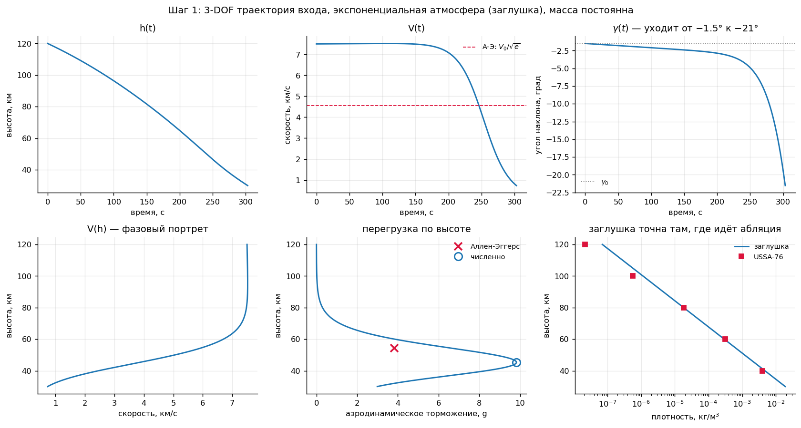

**Сверка с Алленом–Эггерсом (NACA TR-1381, 1958).** Аналитика предполагает γ = const и сопротивление ≫ гравитации. У нас нарушены оба допущения, поэтому ожидалось расхождение в 20–30%:

| величина | численно | А-Э с γ₀ | А-Э с γ в пике |
|---|---|---|---|
| макс. торможение, g | 9.83<!--=verify_step1.ae.num.amax_g:.2f--> | 3.84<!--=verify_step1.ae.g0.amax_g:.2f--> | 13.49<!--=verify_step1.ae.gpeak.amax_g:.2f--> |
| высота пика, км | 45.32<!--=verify_step1.ae.num.h_km:.2f--> | 54.45<!--=verify_step1.ae.g0.h_km:.2f--> | 45.40<!--=verify_step1.ae.gpeak.h_km:.2f--> |
| скорость в пике, м/с | 3862<!--=verify_step1.ae.num.V:.0f--> | 4549<!--=verify_step1.ae.g0.V:.0f--> | — |

По перегрузке расхождение оказалось 156<!--=verify_step1.ae.amax_dev_pct:.0f-->%, а не 20–30%: γ уходит от −1.5° до −5.3<!--=verify_step1.ae.gamma_peak_deg:.1f-->° к моменту пика, а `a_max ∝ sin|γ|`. Если подставить фактический γ в пике, формула высоты даёт 45.40<!--=verify_step1.ae.gpeak.h_km:.2f--> км против численных 45.32<!--=verify_step1.ae.num.h_km:.2f--> — расходится именно допущение γ = const, а не уравнения.

**Подтверждённые предсказания:**

- `h* ∝ H·ln β`: удвоение β опускает пик на −5.0<!--=verify_step1.beta_step.0:.1f--> / −5.0<!--=verify_step1.beta_step.1:.1f--> / −5.0<!--=verify_step1.beta_step.2:.1f--> км против предсказанных `H·ln 2 = 5.0 км`.

| β, кг/м² | 43.8<!--=verify_step1.beta.0.beta:.1f--> | 87.5<!--=verify_step1.beta.1.beta:.1f--> | 175<!--=verify_step1.beta.2.beta:.0f--> | 350<!--=verify_step1.beta.3.beta:.0f--> |
|---|---|---|---|---|
| высота пика, км | 55.30<!--=verify_step1.beta.0.h_km:.2f--> | 50.32<!--=verify_step1.beta.1.h_km:.2f--> | 45.32<!--=verify_step1.beta.2.h_km:.2f--> | 40.36<!--=verify_step1.beta.3.h_km:.2f--> |
| макс. торможение, g | 9.55<!--=verify_step1.beta.0.amax_g:.2f--> | 9.69<!--=verify_step1.beta.1.amax_g:.2f--> | 9.83<!--=verify_step1.beta.2.amax_g:.2f--> | 9.97<!--=verify_step1.beta.3.amax_g:.2f--> |

- `a_max` не зависит от β: при изменении β в 8 раз перегрузка меняется на 4%.

### 3.6 Неожиданный результат: угол входа выпадает

Высота пика торможения почти не зависит от угла входа в диапазоне ТЗ:

| γ₀ | время, с | дальность, км | макс. g | высота пика, км |
|---|---|---|---|---|
| −1.0° | 348<!--=step1.gamma_sweep.g10.t:.0f--> | 2200<!--=step1.gamma_sweep.g10.range_km:.0f--> | 9.5<!--=step1.gamma_sweep.g10.amax_g:.1f--> | 45.3<!--=step1.gamma_sweep.g10.h_km:.1f--> |
| −1.5° | 303<!--=step1.gamma_sweep.g15.t:.0f--> | 1878<!--=step1.gamma_sweep.g15.range_km:.0f--> | 9.8<!--=step1.gamma_sweep.g15.amax_g:.1f--> | 45.3<!--=step1.gamma_sweep.g15.h_km:.1f--> |
| −2.0° | 268<!--=step1.gamma_sweep.g20.t:.0f--> | 1629<!--=step1.gamma_sweep.g20.range_km:.0f--> | 10.4<!--=step1.gamma_sweep.g20.amax_g:.1f--> | 45.3<!--=step1.gamma_sweep.g20.h_km:.1f--> |
| −3.0° | 216<!--=step1.gamma_sweep.g30.t:.0f--> | 1276<!--=step1.gamma_sweep.g30.range_km:.0f--> | 11.8<!--=step1.gamma_sweep.g30.amax_g:.1f--> | 45.0<!--=step1.gamma_sweep.g30.h_km:.1f--> |

Время полёта меняется в 1.6 раза, высота пика — нет. Гравитационный разворот стирает начальный угол раньше, чем включается торможение, поэтому эффективный γ в точке пика примерно одинаков независимо от входного.

Для проекта это прямо ценно: угол входа выпадает из списка параметров, от которых зависит **высотное** распределение вброса. Позже (раздел 12) выяснилось, что в бюджет по **массе** он возвращается через длительность полёта.

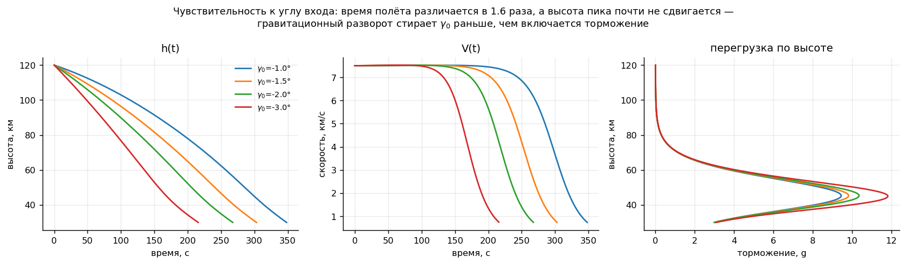

---

## 4. Диагностика: разрыв в 25–30 км и перенос фрагментации

### 4.1 Проблема

Наблюдаемое разрушение спутников при входе:

| аппарат | высота разрушения |
|---|---|
| ATV-1 | 74 км |
| Cygnus OA6 | 70 км |
| Cluster II (SALSA) | 80 км |

Настройки SESAM по умолчанию: отрыв солнечных панелей на 95 км, разрушение корпуса на 78 км (Lips et al., SDC6).

У целого объекта в модели торможение пикует на 45 км, нагрев — на 56 км. Разрыв с наблюдениями 25–30 км. Причина не в ошибке, а в допущении «объект целый».

Это критично именно для этой задачи: весь вопрос проекта — на какой высоте происходит вброс. От этого зависит время жизни частиц и то, попадают ли они в мезосферу с годами спуска или сразу в стратосферу. Модель, кладущая всю массу на 45 км, отвечает на другой вопрос.

### 4.2 Пик нагрева против пика торможения

Высоту пика нагрева `√ρ·V³` можно посчитать уже на шаге 1: она не зависит ни от константы Саттона–Грейвса, ни от радиуса затупления.

```
пик торможения    45.3<!--=step1b.peaks.decel_h_km:.1f--> км   V = 3862<!--=step1b.peaks.decel_V:.0f--> м/с   9.8<!--=step1b.peaks.decel_g:.1f--> g
пик нагрева       56.4<!--=step1b.peaks.heat_h_km:.1f--> км   V = 6258<!--=step1b.peaks.heat_V:.0f--> м/с
разнос            11.1<!--=step1b.peaks.separation_km:.1f--> км
```

Нагрев пикует выше, потому что скорость входит в третьей степени, а плотность в степени 1/2.

### 4.3 Коэффициент сопротивления разрыв не закрывает

Для беспорядочно кувыркающегося нерегулярного тела в континууме в кодах выживаемости обычно берут Cd = 1.4–2.0. Базовым принят 1.5.

| Cd | β, кг/м² | h торможения, км | h нагрева, км |
|---|---|---|---|
| 1.0 | 175<!--=step1b.cd.cd10.beta:.0f--> | 45.3<!--=step1b.cd.cd10.h_decel_km:.1f--> | 56.4<!--=step1b.cd.cd10.h_heat_km:.1f--> |
| 1.5 | 117<!--=step1b.cd.cd15.beta:.0f--> | 48.3<!--=step1b.cd.cd15.h_decel_km:.1f--> | 59.4<!--=step1b.cd.cd15.h_heat_km:.1f--> |
| 2.2 | 80<!--=step1b.cd.cd22.beta:.0f--> | 51.0<!--=step1b.cd.cd22.h_decel_km:.1f--> | 62.2<!--=step1b.cd.cd22.h_heat_km:.1f--> |

Весь свип от 1.0 до 2.2 стоит 5.8<!--=step1b.cd.span_heat_km:.1f--> км — впятеро меньше разрыва.

### 4.4 Фрагментация закрывает

При геометрически подобном дроблении `m ~ L³`, `A ~ L²`, значит `β ~ L`. Разрушение на 78 км, осколки с разным β (Cd = 1.5):

| β осколка, кг/м² | h пика нагрева, км |
|---|---|
| 117<!--=step1b.frag.r1.beta:.0f--> (целый) | 59.4<!--=step1b.frag.r1.h_heat_km:.1f--> |
| 58<!--=step1b.frag.r2.beta:.0f--> | 64.9<!--=step1b.frag.r2.h_heat_km:.1f--> |
| 23<!--=step1b.frag.r5.beta:.0f--> | 72.5<!--=step1b.frag.r5.h_heat_km:.1f--> |
| 12<!--=step1b.frag.r10.beta:.0f--> | **78.0<!--=step1b.frag.r10.h_heat_km:.1f--> — пик на самой высоте разрушения** |
| 6<!--=step1b.frag.r20.beta:.0f--> | 78.0<!--=step1b.frag.r20.h_heat_km:.1f--> |
| 2.3<!--=step1b.frag.r50.beta:.1f--> | 78.0<!--=step1b.frag.r50.h_heat_km:.1f--> |

**Ниже β ≈ 20 кг/м² зависимость насыщается.** Тепловой поток зависит только от ρ и V, а в момент разрушения они у всех осколков одинаковы. Лёгкий осколок тормозится быстрее, чем растёт плотность, поэтому его поток монотонно падает от точки разрушения. Для лёгких фрагментов высоту вброса задаёт **высота разрушения**, а не β.

Зависимость от высоты разрушения при дроблении в 10 раз:

| h разрушения, км | 95 | 84 | 78 | 70 |
|---|---|---|---|---|
| h пика нагрева, км | 76.9<!--=step1b.breakup.h95.h_heat_km:.1f--> | 77.8<!--=step1b.breakup.h84.h_heat_km:.1f--> | 78.0<!--=step1b.breakup.h78.h_heat_km:.1f--> | 70.0<!--=step1b.breakup.h70.h_heat_km:.1f--> |

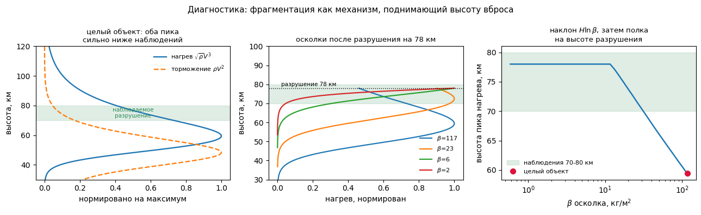

### 4.5 Два уточнения

1. **Не N равных осколков, а спектр β.** Чтобы пик лёг на 75 км, нужен β ≈ 17<!--=step1b.inverse.beta_needed:.0f--> против 117 у целого — падение в 6.7<!--=step1b.inverse.factor:.1f--> раза. При равном дроблении это N ~ 300 осколков, что многовато. Реалистичнее спектр: панели и MLI β ~ 1–10 кг/м², силовой набор ~ 30–80.
2. **Пик потока — верхняя граница высоты вброса, а не сам вброс.** Испарение требует накопленного тепла: прогрев до ~900 K, плавление, кипение (~2000 K на местном давлении, раздел 8.4). Масса пойдёт ниже пика потока.

**Решение:** фрагментация переносится в шаг 4, до построения гистограммы.

---

## 5. Шаг 2. Реальная атмосфера

### 5.1 Реализация

NRLMSIS через `pymsis`, затабулированная и сплайненная:

- **Табуляция, а не прямой вызов.** `solve_ivp` вызывает плотность десятки тысяч раз за прогон. Один вызов MSIS на сетке 250 м до 200 км.
- **Сплайн по log ρ, а не по ρ.** Плотность меняется на 6 порядков, логарифм почти линеен по высоте.
- **Кубический, а не линейный.** Линейная интерполяция по log ρ даёт кусочно-экспоненциальную плотность с изломами производной, на каждом из которых адаптивный интегратор режет шаг. Кубический сплайн даёт гладкость C2.
- **Профиль замораживается на момент входа.** За 300 с объект проходит ~1800 км — ~16° дуги, из них ~10° по широте (азимут трассы ~52° при i = 53° на 40° ю.ш.). ρ(70 км) при этом меняется на единицы процентов — меньше собственной неопределённости MSIS.

### 5.2 Заглушка оказалась лучше, чем заслуживала

| h, км | экспонента | NRLMSISE-00 | exp / MSIS | MSIS 2.1 / 00 | локальная H, км |
|---|---|---|---|---|---|
| 40 | 4.74e−3 | 3.83e−3 | 1.24 | 1.00 | 6.80 |
| 60 | 2.95e−4 | 2.81e−4 | 1.05 | 0.91 | 7.61 |
| 70 | 7.34e−5 | 7.05e−5 | 1.04 | 0.90 | 6.91 |
| 80 | 1.83e−5 | 1.58e−5 | 1.16 | 0.89 | 6.50 |
| 100 | 1.14e−6 | 5.40e−7 | 2.11 | 1.00 | 5.27 |
| 120 | 7.08e−8 | 1.80e−8 | 3.92 | 0.99 | 7.80 |

Локальная шкала высот на 40–120 км гуляет от 5.2<!--=step2.density.H_min_km:.1f--> до 8.0<!--=step2.density.H_max_km:.1f--> км — разброс 39<!--=step2.density.H_spread_pct:.0f-->% вокруг подогнанных 7.2 км. Но траектория при этом почти не сдвинулась:

| атмосфера | t, с | дальность, км | h торможения | макс. g | h нагрева |
|---|---|---|---|---|---|
| экспонента | 306<!--=step2.traj.exp.t:.0f--> | 1822<!--=step2.traj.exp.range_km:.0f--> | 48.3<!--=step2.traj.exp.h_decel_km:.1f--> | 9.7<!--=step2.traj.exp.amax_g:.1f--> | 59.4<!--=step2.traj.exp.h_heat_km:.1f--> |
| NRLMSISE-00 | 305<!--=step2.traj.m00.t:.0f--> | 1843<!--=step2.traj.m00.range_km:.0f--> | 47.1<!--=step2.traj.m00.h_decel_km:.1f--> | 9.1<!--=step2.traj.m00.amax_g:.1f--> | 59.6<!--=step2.traj.m00.h_heat_km:.1f--> |
| NRLMSIS 2.1 | 306<!--=step2.traj.m21.t:.0f--> | 1854<!--=step2.traj.m21.range_km:.0f--> | 46.3<!--=step2.traj.m21.h_decel_km:.1f--> | 9.3<!--=step2.traj.m21.amax_g:.1f--> | 58.8<!--=step2.traj.m21.h_heat_km:.1f--> |

Выше 90 км, где заглушка врала в разы, торможение пренебрежимо; в зоне 40–80 км она давала 4–24%.

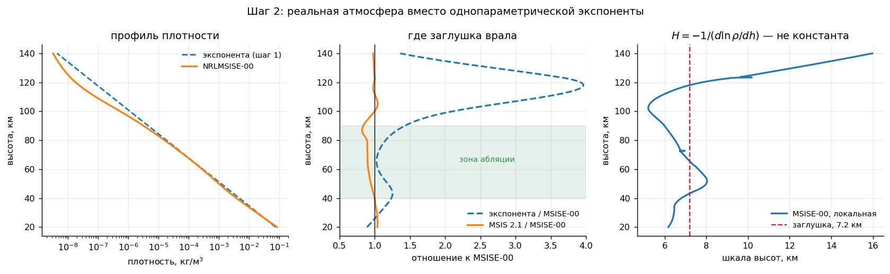

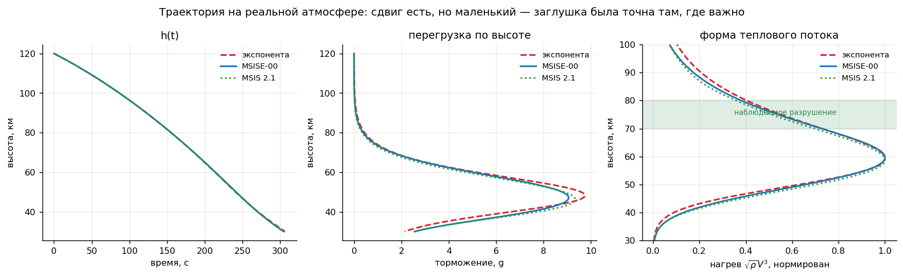

### 5.3 Исправление: солнечная активность на 120 км почти не работает

На шаге 1 было дважды заявлено, что солнечная активность меняет плотность на 120 км «в разы». Проверка это опровергла:

| h, км | 70 | 100 | 120 | 150 | 200 | 300 | 400 |
|---|---|---|---|---|---|---|---|
| ρ(F10.7=220) / ρ(F10.7=70) | 0.99<!--=verify_step2.solar_ratio.70:.2f--> | 0.95<!--=verify_step2.solar_ratio.100:.2f--> | **1.07<!--=verify_step2.solar_ratio.120:.2f-->** | 1.23<!--=verify_step2.solar_ratio.150:.2f--> | 2.18<!--=verify_step2.solar_ratio.200:.2f--> | 6.35<!--=verify_step2.solar_ratio.300:.2f--> | 15.2<!--=verify_step2.solar_ratio.400:.1f--> |

Механизм: солнечный нагрев управляет температурой экзосферы, а она задаёт шкалу высот в **верхней** термосфере. На 120 км атмосфера ещё определяется мезосферой снизу. Утверждение верно для 300+ км, то есть для орбитального времени жизни, но не для входа.

### 5.4 Чем на самом деле управляется атмосферный разброс

Размах высоты пика нагрева по каждому фактору:

| фактор | размах, км |
|---|---|
| широта −75°…0° | 3.9<!--=verify_step2.env_span_km.lat:.1f--> |
| сезон март/сентябрь | 1.6<!--=verify_step2.env_span_km.season:.1f--> |
| геомагнитная буря Ap 4 → 80 | 0.1<!--=verify_step2.env_span_km.geomag:.1f--> |
| солнечная активность F10.7 70 → 220 | 0.0<!--=verify_step2.env_span_km.solar:.1f--> |

География и сезон бьют солнечную активность на два порядка — это мезосферная температурная структура, а не термосферная. Практически: широту точки входа надо фиксировать явно, а F10.7 не свипировать вообще.

Цифры этого раздела — для конфигурации шага 2 (Cd = 1.5, без вращения атмосферы). В бюджете шага 3 (раздел 12, с вращением) те же факторы дают 4.6<!--=step3.budget.latitude.h_km:.1f--> км по широте и 1.8<!--=step3.budget.season.h_km:.1f--> км по сезону.

### 5.5 Швы в NRLMSISE-00 и выбор версии 2.1

При проверке точности сплайна вылезли два локальных всплеска ошибки — 1.2e−3 против фоновых 4e−7. Оказалось, это не интерполяция: у самой NRLMSISE-00 рвётся производная `ln ρ` на **72.5 км** и **123.4 км**. У NRLMSIS 2.1 изломов нет.

Причина структурная. В NRLMSISE-00 термосферные плотности считались независимо от нижних слоёв, а профили сшивались апостериорно — этот шов и виден. В NRLMSIS 2.0 сшивку убрали: гидростатический профиль непрерывен от земли до экзосферы, переход от перемешанной области к диффузионному разделению идёт непрерывно начиная примерно с 70 км.

И 2.0 переподгонялась именно под нужный диапазон. Emmert et al. (2021): *«In the mesosphere and below, residual biases and standard deviations are considerably lower than NRLMSISE-00»*. Туда ассимилированы новые данные по температуре мезосферы, стратосферы и тропосферы, атомарный кислород продлён вниз до 50 км.

Выбор был между моделью, у которой мезосфера — известное слабое место, и моделью, переделанной ради мезосферы, при том что вброс решается на 50–90 км. Один из швов 00 лежит на 72.5 км, прямо в зоне абляции.

Довод «сопоставимость с литературой» не держится: Barker считает в GEOS-Chem, Maloney в WACCM — у них своя метеорология, MSIS они не используют. Сопоставимость по MSIS нужна только против DRAMA, для чего достаточно переключаемого `version=0`.

**Решение:** базовая NRLMSIS 2.1, версия 00 сохранена переключаемой, разница между ними идёт строкой в бюджете неопределённостей (0.9<!--=step3.budget.msis_version.h_km:.1f--> км по высоте), а не разовым выбором.

---

## 6. Шаг 3. Аэродинамический нагрев

### 6.1 Корреляция Саттона–Грейвса

```
q_stag = k · √(ρ/Rn) · V_отн³          k = 1.7415e−4
```

Что корреляция в себе несёт:

- Она для **точки торможения** сферического затупления.
- Только **конвективный** поток. Радиационный нагрев ударного слоя включается около 10 км/с; для входа с орбиты (7.5 км/с) им можно пренебречь.
- **Холодная стенка** — поправка на горячую стенку вводится отдельно.

### 6.2 Размерность константы: цена ошибки четыре порядка

NASA TFAWS приводит k = 1.7415e−4 для Земли и подписывает результат как Вт/см². Прямая подстановка это опровергает. Бенчмарк Stardust (Rn = 0.23 м, V = 12.6 км/с, ρ ≈ 3e−4 кг/м³, расчётный пик нагрева ~1200 Вт/см² — проектная/реконструированная величина, включающая и радиационную часть; прямого измерения потока не было):

```
q = 1.7415e−4 · √(3e−4/0.23) · 12600³ = 1.258e7
   если Вт/м²  → 1258<!--=verify_step3.stardust_wcm2:.0f--> Вт/см²   сходится с расчётной величиной
   если Вт/см² → промах в 10⁴ раз
```

**k = 1.7415e−4 при входах в СИ даёт Вт/м².** Размерность разобрана по полётному бенчмарку, а не по подписи в источнике. Существует вариант константы 1.83e−4 (~5% выше) — он принят как оценка неопределённости самой корреляции.

### 6.3 Вращение Земли: широта сокращается

Атмосфера вращается вместе с Землёй на восток со скоростью `u = ω·R·cos(lat)`. Вдоль трассы работает её проекция `u·sin A`, где A — азимут трассы. Из сферической тригонометрии для орбиты наклонения i: `sin A = cos i / cos(lat)`. Подстановка:

```
v_вдоль = ω·R·cos(lat) · cos i / cos(lat) = ω·R⊕·cos i
V_отн   = V − ω·R⊕·cos i
```

**Вклад зависит только от наклонения**, а не от того, где объект входит.

| i | снос, м/с | пик q, Вт/см² | h пика, км | Q, МДж/м² |
|---|---|---|---|---|
| 0° (экваториальная прямая) | +465<!--=verify_step3.rotation.i0.v_corot:+.0f--> | 92.2<!--=verify_step3.rotation.i0.q_peak_wcm2:.1f--> | 58.3<!--=verify_step3.rotation.i0.h_km:.1f--> | 85.1<!--=verify_step3.rotation.i0.Q_MJ:.1f--> |
| 53° (типовая НОО) | +280<!--=verify_step3.rotation.i53.v_corot:+.0f--> | 98.3<!--=verify_step3.rotation.i53.q_peak_wcm2:.1f--> | 58.5<!--=verify_step3.rotation.i53.h_km:.1f--> | 90.8<!--=verify_step3.rotation.i53.Q_MJ:.1f--> |
| 90° (полярная) | 0<!--=verify_step3.rotation.i90.v_corot:.0f--> | 108.0<!--=verify_step3.rotation.i90.q_peak_wcm2:.1f--> | 58.8<!--=verify_step3.rotation.i90.h_km:.1f--> | 99.9<!--=verify_step3.rotation.i90.Q_MJ:.1f--> |
| 98° (ССО) | −65<!--=verify_step3.rotation.i98.v_corot:+.0f--> | 110.3<!--=verify_step3.rotation.i98.q_peak_wcm2:.1f--> | 58.8<!--=verify_step3.rotation.i98.h_km:.1f--> | 102.1<!--=verify_step3.rotation.i98.Q_MJ:.1f--> |
| 180° (обратная) | −465<!--=verify_step3.rotation.i180.v_corot:+.0f--> | 125.3<!--=verify_step3.rotation.i180.q_peak_wcm2:.1f--> | 59.2<!--=verify_step3.rotation.i180.h_km:.1f--> | 116.1<!--=verify_step3.rotation.i180.Q_MJ:.1f--> |

Для i = 53° включение вращения меняет пиковый поток на −9.0<!--=verify_step3.rotation.q_change_pct:.1f-->% (оценка до расчёта была −11%). Полный размах по наклонению — 36%. Тест самосогласованности: полярная орбита (i = 90°) в точности совпадает с выключенным вращением.

### 6.4 Detra–Kemp–Riddell — только как форма

Абсолютную константу DKR из надёжного первоисточника взять не удалось: в открытых реализациях разные нормировки и показатели (3.15 против 3.25), исходная работа 1957 года в свободном доступе не нашлась. Подставлять число из случайной реализации ради второй кривой на графике смысла нет.

Содержательная часть сверки от константы не зависит: вопрос в чувствительности к **показателю степени по скорости**, 3.0 против 3.15. DKR нормирован на Саттона–Грейвса в опорной точке, сравнивается форма:

| | Саттон–Грейвс | DKR | разница |
|---|---|---|---|
| высота пика, км | 58.49<!--=verify_step3.dkr.h_sg_km:.2f--> | 58.89<!--=verify_step3.dkr.h_dkr_km:.2f--> | +0.40<!--=verify_step3.dkr.dh_km:+.2f--> |
| пик потока, Вт/см² | 98.3<!--=verify_step3.dkr.q_sg_wcm2:.1f--> | 94.5<!--=verify_step3.dkr.q_dkr_wcm2:.1f--> | −3.8<!--=verify_step3.dkr.dq_pct:.1f-->% |
| интеграл, МДж/м² | 90.8<!--=verify_step3.dkr.Q_sg_MJ:.1f--> | 86.9<!--=verify_step3.dkr.Q_dkr_MJ:.1f--> | −4.4<!--=verify_step3.dkr.dQ_pct:.1f-->% |

Выбор корреляции — эффект четвёртого порядка, слабее даже версии MSIS.

### 6.5 Радиус затупления не двигает высоту пика

| Rn, м | 0.10 | 0.25 | 0.50 | 1.00 | 2.00 |
|---|---|---|---|---|---|
| пик q, Вт/см² | 219.8<!--=verify_step3.nose.rn10cm.q_peak_wcm2:.1f--> | 139.0<!--=verify_step3.nose.rn25cm.q_peak_wcm2:.1f--> | 98.3<!--=verify_step3.nose.rn50cm.q_peak_wcm2:.1f--> | 69.5<!--=verify_step3.nose.rn100cm.q_peak_wcm2:.1f--> | 49.1<!--=verify_step3.nose.rn200cm.q_peak_wcm2:.1f--> |
| h пика, км | 58.49<!--=verify_step3.nose.h_km:.2f--> | 58.49<!--=verify_step3.nose.h_km:.2f--> | 58.49<!--=verify_step3.nose.h_km:.2f--> | 58.49<!--=verify_step3.nose.h_km:.2f--> | 58.49<!--=verify_step3.nose.h_km:.2f--> |

Разброс по высоте — ровно ноль. Rn входит множителем `1/√Rn`, это константа вдоль траектории, и она выносится из-под argmax. Значит Rn попадает в бюджет по **массе**, а не по **высоте**.

### 6.6 Базовый случай шага 3

m = 175 кг, Cd = 1.5, A = 1 м², Rn = 0.5 м, β = 117 кг/м², i = 53°, NRLMSIS 2.1:

```
пик нагрева        98.3<!--=step3.base.q_peak_wcm2:.1f--> Вт/см²  на 58.5<!--=step3.base.h_heat_km:.1f--> км, t = 218<!--=step3.base.t_heat:.0f--> с, V_отн = 6090<!--=step3.base.V_rel_heat:.0f--> м/с
пик торможения      9.1<!--=step3.base.amax_g:.1f--> g       на 45.8<!--=step3.base.h_decel_km:.1f--> км
интегральный поток 90.8<!--=step3.base.Q_MJ:.1f--> МДж/м²
разнос пиков       12.7<!--=step3.base.separation_km:.1f--> км
```

Энергетическая проверка: интегральный поток, умноженный на площадь, — 1.8<!--=verify_step3.heat_fraction_pct:.1f-->% кинетической энергии объекта (оценка сверху).

Наблюдаемое разрушение на 70–80 км по-прежнему на 12–22 км выше пика нагрева. Ни атмосфера, ни вращение, ни выбор корреляции разрыв не закрыли — только фрагментация.


---

## 7. Метрика массы: инверсия знака по размеру

### 7.1 Ошибка в первой версии бюджета

Первая версия бюджета неопределённостей считала «массовую» ось через интегральный тепловой поток в точке торможения, МДж/м². Это **ошибка знака**, а не только величины.

Масса уноса определяется полной поглощённой энергией `∫P dt`, где `P = φ·q_stag·A_омыв`. Для геометрически подобного тела:

```
q_stag  ~ L^(−1/2)      корреляция
A_омыв  ~ L^(+2)        геометрия
─────────────────────────────────
P       ~ L^(+3/2)      полная мощность РАСТЁТ с размером
m       ~ L^(+3)
P/m     ~ L^(−3/2)      удельная нагрузка ПАДАЕТ с размером
```

По удельному потоку крупное тело греется слабее, по полной энергии — сильнее. Строка «Rn 0.1–2 м, 347%» в первой версии бюджета указывала не в ту сторону.

### 7.2 Проверка показателей

На замороженной траектории (та же история потока, меняется только геометрия) показатели получились **+1.500 и −1.500** — совпадение до шестого знака.

Самосогласованно, когда β меняется вместе с размером:

| L | β, кг/м² | h пика, км | E полн., МДж | E/m, МДж/кг |
|---|---|---|---|---|
| 0.1 | 11.7<!--=verify_step3.scaling.L1.beta:.1f--> | 74.5<!--=verify_step3.scaling.L1.h_km:.1f--> | 1.0<!--=verify_step3.scaling.L1.E_MJ:.1f--> | 5.55<!--=verify_step3.scaling.L1.Em_MJkg:.2f--> |
| 0.2 | 23.3<!--=verify_step3.scaling.L2.beta:.1f--> | 69.9<!--=verify_step3.scaling.L2.h_km:.1f--> | 3.9<!--=verify_step3.scaling.L2.E_MJ:.1f--> | 2.79<!--=verify_step3.scaling.L2.Em_MJkg:.2f--> |
| 0.5 | 58.3<!--=verify_step3.scaling.L5.beta:.1f--> | 63.5<!--=verify_step3.scaling.L5.h_km:.1f--> | 24.5<!--=verify_step3.scaling.L5.E_MJ:.1f--> | 1.12<!--=verify_step3.scaling.L5.Em_MJkg:.2f--> |
| 1.0 | 116.7<!--=verify_step3.scaling.L10.beta:.1f--> | 58.5<!--=verify_step3.scaling.L10.h_km:.1f--> | 98.1<!--=verify_step3.scaling.L10.E_MJ:.1f--> | 0.56<!--=verify_step3.scaling.L10.Em_MJkg:.2f--> |
| 2.0 | 233.3<!--=verify_step3.scaling.L20.beta:.1f--> | 53.2<!--=verify_step3.scaling.L20.h_km:.1f--> | 391.0<!--=verify_step3.scaling.L20.E_MJ:.1f--> | 0.28<!--=verify_step3.scaling.L20.Em_MJkg:.2f--> |

Показатели становятся +2.0 и −1.0: рост β частично гасит эффект, но знак сохраняется. (Здесь холодная стенка; в таблице 7.5 та же энергия с поправкой на горячую стенку при T_кип, поэтому там E/m ниже в ~0.8 раза.)

**Отсюда второй механизм, которым фрагментация решает исход.** Осколки не просто тормозятся выше из-за меньшего β — они ещё и получают на порядок больше тепла на килограмм. Два независимых механизма работают в одну сторону.

### 7.3 Омываемая площадь — формула Коши, а не подгонка

Для любого **выпуклого** тела средняя по случайным ориентациям площадь проекции равна ¼ площади поверхности. Параметр `area` для кувыркающегося тела и есть средняя проекция (её же используем в сопротивлении), поэтому:

```
A_омыв = 4 · area          точно, для любой выпуклой формы
```

### 7.4 Форм-фактор вместо неизмеримого радиуса затупления

Саттон–Грейвс — корреляция для точки торможения полусферического затупления, а кувыркающийся нерегулярный аппарат радиуса затупления физически не имеет: Rn для него — подгоночный параметр. Стандартный обход в кодах демиза — средний по омываемой поверхности поток `φ·q_stag` с `φ ≈ 0.25–0.30` для тела в случайной ориентации. Принято φ = 0.27. Это снимает проблему неизмеримого параметра: разброс φ стоит 20%, разброс эффективного Rn — 124%.

### 7.5 Сколько энергии нужно на расплав и на испарение

Кипение — при давлении торможения ~1 кПа (T_кип = 2046 K, раздел 8.4); свойства Al 6061 — раздел 16.

| этап | МДж/кг |
|---|---|
| нагрев до плавления, 1038 × (890 − 300) | 0.61<!--=verify_step3.energy.heat_to_melt:.2f--> |
| теплота плавления | 0.40<!--=verify_step3.energy.fusion:.2f--> |
| нагрев до кипения, 1177 × (2046<!--=verify_step3.energy.T_boil:.0f--> − 890) | 1.36<!--=verify_step3.energy.heat_to_boil:.2f--> |
| теплота испарения при 2046<!--=verify_step3.energy.T_boil:.0f--> K | 11.20<!--=verify_step3.energy.vaporization:.2f--> |
| **итого** | **13.57<!--=verify_step3.energy.total:.2f-->** |

Отношение полученной удельной энергии к энергии до полного расплава (1.01 МДж/кг) и до полного испарения — доля массы, которую в принципе можно расплавить или испарить, если бы вся энергия шла на это (без переизлучения — оценка сверху). E/m — с поправкой на горячую стенку:

| размер L | масса, кг | E/m, МДж/кг | расплавимая доля | испаримая доля |
|---|---|---|---|---|
| 1.0 (целый объект) | 175<!--=verify_step3.energy.L10.mass:.0f--> | 0.46<!--=verify_step3.energy.L10.Em:.2f--> | 45<!--=verify_step3.energy.L10.meltable_pct:.0f-->% | **3<!--=verify_step3.energy.L10.vaporizable_pct:.0f-->%** |
| 0.5 | 21.9<!--=verify_step3.energy.L5.mass:.1f--> | 0.91<!--=verify_step3.energy.L5.Em:.2f--> | 90<!--=verify_step3.energy.L5.meltable_pct:.0f-->% | 7<!--=verify_step3.energy.L5.vaporizable_pct:.0f-->% |
| 0.2 | 1.40<!--=verify_step3.energy.L2.mass:.2f--> | 2.26<!--=verify_step3.energy.L2.Em:.2f--> | 100<!--=verify_step3.energy.L2.meltable_pct:.0f-->% | 17<!--=verify_step3.energy.L2.vaporizable_pct:.0f-->% |
| 0.1 | 0.18<!--=verify_step3.energy.L1.mass:.2f--> | 4.49<!--=verify_step3.energy.L1.Em:.2f--> | 100<!--=verify_step3.energy.L1.meltable_pct:.0f-->% | 33<!--=verify_step3.energy.L1.vaporizable_pct:.0f-->% |

Демизабельность конструкции типа OneWeb/SpaceX — 95% (Ferreira, UNOOSA 2024). Но это критерий **расплава** (раздел 8.6), и сравнивать его надо с расплавимой долей: целый объект даёт 45%, осколок L = 0.2 — 100%. Разрыв по массе около 2×, и закрывает его, как и разрыв по высоте, фрагментация. Первая версия сравнивала 95% с испаримыми 3% и получала «разрыв в тридцать раз» — это сравнение разных величин.

### 7.6 Горячая стенка

Саттон–Грейвс даёт холодностеночный поток. Поправка:

```
q_hot = q_cold · (1 − h_w/h_0),     h_0 = V²/2,     h_w = c_p,возд · T_стенки
```

Считаем по энтальпии **воздуха** у стенки, а не металла: поток гонит разность энтальпий газа.

| V, м/с | множитель при T = 2046 K (кипение на ~1 кПа) | при T = 2740 K (первая версия) |
|---|---|---|
| 7500 | 0.905<!--=verify_step3.hot_wall.V7500.Tb:.3f--> (−9%) | 0.873<!--=verify_step3.hot_wall.V7500.T2740:.3f--> (−13%) |
| 6100 | 0.857<!--=verify_step3.hot_wall.V6100.Tb:.3f--> (−14%) | 0.809<!--=verify_step3.hot_wall.V6100.T2740:.3f--> (−19%) |
| 4000 | 0.668<!--=verify_step3.hot_wall.V4000.Tb:.3f--> (−33%) | 0.555<!--=verify_step3.hot_wall.V4000.T2740:.3f--> (−45%) |

Оценка по металлу (`c_p·ΔT ≈ 2.5 МДж/кг`) даёт −9% при 7500 м/с; разница между двумя маршрутами и есть неопределённость поправки. Поправка растёт по мере торможения.

### 7.7 Вдув продуктов абляции замыкается аналитически

Испаряющийся материал уходит в пограничный слой и блокирует часть потока (транспирационное охлаждение). Классическая линейная поправка `q_net = q_hw − η·ṁ''·h_0`, а скорость уноса сама пропорциональна потоку `ṁ'' = q_net/H_eff`. Подстановка:

```
q_net = q_hw − η·(q_net/H_eff)·h_0
q_net = q_hw / (1 + η·h_0/H_eff)
```

**Неявный решатель не нужен:** и закон абляции, и блокировка линейны по ṁ'', поэтому нелинейность сводится к делению на множитель. Сверено с 200 итерациями фиксированной точки — совпадение до 1e−9. При η = 0.3, h_0 = 2.8e7, H_eff ≈ 1.2e7 множитель 0.588: вдув срезает поток на 41%.

**Какой η.** Первая версия подписывала «0.3 — ламинарный, 0.6 — турбулентный». Это наоборот: в ламинарном слое вдув блокирует поток сильнее, турбулентное перемешивание гасит эффект (эксперименты по транспирационному охлаждению в гиперзвуке, AIAA J. 10.2514/1.J053053). На 70–80 км слой ламинарный. Конкретное значение η с первоисточником не сверено, поэтому вдув **не входит в базовый расчёт**, а стоит осью чувствительности: η = 0.6 в поэлементной модели снижает испарение с 8.5 до 4.9 кг Al (раздел 12). В модели блокируется только избыток потока в кипящих поясах: `q_исп = (q_in − rad)/(1 + η·(h_0 − h_w)/L)`.

---

## 8. Шаг 4. Фрагментация, тепловой отклик, абляция

### 8.1 Пиковый поток инвариантен к масштабу

Для геометрически подобных тел пик `q_stag` почти не зависит от размера: ~85 Вт/см² и для целого объекта, и для двухсантиметрового осколка. Причина аналитическая: по Аллену–Эггерсу `ρ* ∝ β ∝ L`, а `Rn ∝ L`, значит в `√(ρ/Rn)` масштаб сокращается.

Следствие: равновесная температура по излучению `εσT⁴ = φ·q_stag` тоже инвариантна — при ε = 0.3 это **~1915 K для любого размера**.

Задача разделяется:

- **Плавление — энергетическое:** зависит от `E/m ∝ L⁻¹`, то есть сильно от размера.
- **Испарение — температурное:** зависит от потока и от того, при какой температуре кипит металл.

Порог кипения при среднем потоке, `εσT_кип⁴/φ`:

| | ε = 0.3 | ε = 0.2 |
|---|---|---|
| кипение при 1 атм, 2792 K | 383<!--=step4.threshold.atm.e30:.0f--> Вт/см² | 255<!--=step4.threshold.atm.e20:.0f--> Вт/см² |
| кипение на ~1 кПа, 2046 K | **110<!--=step4.threshold.kpa.e30:.0f--> Вт/см²** | **74<!--=step4.threshold.kpa.e20:.0f--> Вт/см²** |

При кипении на 1 атм (первая версия) средний поток до кипения не доводил с запасом в 4 раза. При кипении на местном давлении (раздел 8.4) порог — на уровне пикового потока. Тонкие фрагменты к тому же видят больше: у пластин с кромкой 5 мм сразу после разрушения на 78 км пик потока 220<!--=step4.fragments.film.panels.q_peak_wcm2:.0f-->–401<!--=step4.fragments.film.mli.q_peak_wcm2:.0f--> Вт/см².

### 8.2 Распределение вместо среднего

Испарение — задача пороговая, излучение идёт как `T⁴`. В такой задаче среднее занижает систематически: испарение идёт там, где поток выше среднего, а среднее этого места не видит. Поэтому поверхность разбита на пояса по углу от точки торможения, каждый со своим энергобалансом:

```
q(θ)/q_stag = cos θ         (Ньютоновское давление + Lees 1956)
```

**Свободных параметров нет.** Альтернатива — делить тело на «носовую» и «остальную» зоны — ввела бы новую неизвестную (долю площади носа), которая напрямую умножает испарённую массу.

**Самопроверка:** среднее этого распределения по полной сфере

```
⟨cos θ⟩ = (1/4π) ∫₀^(π/2) cos θ · 2π sin θ dθ = 1/4
```

ровно 0.25 — то есть попадает в стандартную полосу форм-фактора 0.25–0.30. Новая физика не вводится, перестаёт схлопываться имевшаяся. Это тот же геометрический факт, что и формула Коши, увиденный с другой стороны.

**Где это допущение может не работать.** Распределение `cos θ` означает устойчивую ориентацию. Если фрагмент кувыркается быстрее, чем прогревается, каждый элемент поверхности видит средний поток 0.25·q_stag. Тепловая постоянная пластины 1 мм при ~2000 K — около 3 с. Этот предел проверен явно (режим `flux_mode="uniform"`): испарение падает с 8.5<!--=step5.scenarios.film.total:.1f--> до 5.9<!--=step5.sensitivity.orientation.lo:.1f--> кг Al (раздел 12). Результат держится на этом допущении в пределах фактора 1.5.

### 8.3 Замкнутые формы испарения

Локальное радиационное равновесие `n·εσT(θ)⁴ = q_stag·cos θ` (n — число излучающих сторон, раздел 8.5) даёт кипение там, где `cos θ > C`, где

```
C = n·ε·σ·T_кип⁴ / q_stag
```

Доля кипящей поверхности полной сферы:

```
A_доля = (1 − cos θ_c)/2 = (1 − C)/2
```

Скорость испарения — интеграл избытка потока по кипящей поверхности. Через `dA = 2πR² d(cos θ)` интеграл даёт `πR²·q·(1 − C)²`, а `πR² = A_омыв/4`:

```
ṁ = A_омыв · q_stag · (1 − C)² / (4 · L_исп)
```

Квадрат по `(1 − C)` не опечатка: у порога одновременно стремятся к нулю и площадь, и избыток потока. Обе формулы сверены с численным интегрированием до 1e−9. В расчёте они служат проверкой; сам расчёт — поэлементная модель.

### 8.4 Поэлементная тепловая модель

Состояние каждого пояса — удельная энтальпия `h_s` и испарённая из него масса `m_исп`. Температура выводится из энтальпии монотонной кусочной функцией с полками на фазовых переходах, поэтому фазовые переходы не требуют ветвления в правой части ОДУ:

```
h₁ = c_p,тв(T_пл − T₀)               = 0.61<!--=step4.criteria.h1:.2f--> МДж/кг    начало плавления
h₂ = h₁ + L_пл                       = 1.01<!--=step4.criteria.h2:.2f--> МДж/кг    конец плавления
h₃ = h₂ + c_p,ж(T_кип(p) − T_пл)     ≈ 2.0–2.4 МДж/кг начало кипения
```

**Температура кипения — при местном давлении.** 2792 K — это кипение Al при 1 атм. На поверхности фрагмента давление — это давление торможения `p₀ = 0.92·ρV²` (формула Рэлея для трубки Пито), и полка кипения стоит на

```
1/T_кип(p) = 1/T_кип,1атм − (R/(M·L)) · ln(p/p_атм)      (Клапейрон–Клаузиус)
```

| p, Па | 100 | 300 | 1 000 | 3 000 | 101 325 |
|---|---|---|---|---|---|
| T_кип, K | 1806<!--=step4.boil.p100.T:.0f--> | 1913<!--=step4.boil.p300.T:.0f--> | 2046<!--=step4.boil.p1000.T:.0f--> | 2185<!--=step4.boil.p3000.T:.0f--> | 2792<!--=step4.boil.p101325.T:.0f--> |
| L_исп, МДж/кг | 11.30<!--=step4.boil.p100.L:.2f--> | 11.26<!--=step4.boil.p300.L:.2f--> | 11.20<!--=step4.boil.p1000.L:.2f--> | 11.15<!--=step4.boil.p3000.L:.2f--> | 10.90<!--=step4.boil.p101325.L:.2f--> |

Против таблицы давления паров Al из CRC — расхождение 0.0–1.4<!--=verify_step4.crc.max_diff_pct:.1f-->% от 1 Па до 1 атм (проверка 4.8). На траекториях фрагментов кипение идёт при 1759<!--=step4.fragments.film.panels.Tb_min:.0f-->–2039<!--=step4.fragments.film.mli.Tb_max:.0f--> K. Теплота испарения — с поправкой Кирхгофа. Когда давление по мере торможения падает, полка опускается, и перегретый расплав вскипает (численная постоянная 0.2 с; при 0.05 с результат меняется на 0.004<!--=verify_step4.flash.diff_pct:.3f-->%).

Для каждого пояса:

```
P_in  = q_stag(t) · cos θ · (1 − h_w/h_0)
P_out = n · ε(T) · σ · T(h_s)⁴                n = 2 у пластины, 1 у оболочки
пока h_s < h₃:   dh_s/dt = (P_in − P_out) / (ρ·t_стенки)
при  h_s = h₃:   избыток идёт на испарение, dm/dt = (P_in − P_out)·dA / L_исп
m_исп ≤ m_пояса: выкипевший пояс исчезает (прогар) и перестаёт получать и излучать
```

Переключение «греется / кипит» сглажено по окну 1% от h₃. Жёсткое переключение давало разрыв правой части, на котором интегратор LSODA считал тонкую пластину 14 секунд вместо 0.07 — ускорение в 200 раз без потери сходимости.

Зажим на кипении действует **только на нагрев**: пояс на кипении, у которого приход упал ниже переизлучения, обязан остывать. Первая версия зажимала симметрично, и пояс излучал энергию, которой у него не было (раздел 18).

**Расплав считается по максимуму энтальпии за полёт.** Пояс, который расплавился и потом остыл, расплавленным быть не перестал. Испарение идёт только выше полки кипения, поэтому в каждом поясе испарено ≤ расплавлено ≤ масса пояса — по построению. Проверка 4.6 сверяет это по каждому поясу.

Аудит энергии накапливается внутри той же системы ОДУ: приход = излучено + запасено + испарение + блокировано вдувом, невязка ~1e−15.

### 8.5 Фрагменты: пластина или компактный

Каждый фрагмент — либо **пластина** (задаётся толщиной), либо **компактный** (задаётся β).

Для кувыркающейся пластины по формуле Коши средняя проекция равна половине её площади, откуда:

```
β = m/(Cd·A_проекц) = ρ·A·t/(Cd·A/2) = 2ρt/Cd
```

β задаётся толщиной и ничем больше. Для Al при Cd = 1.5:

| толщина, мм | 0.5 | 1.0 | 2.0 | 5.0 | 10.0 |
|---|---|---|---|---|---|
| β, кг/м² | 1.8 | 3.6 | 7.2 | 18.0 | 36.0 |

Это ровно та полоса 1–10, которую дают панели и MLI в списках фрагментов DRAMA: параметризация через толщину **воспроизводит** известный диапазон, а не подгоняется под него.

**Пластина излучает двумя сторонами.** Пластина 1 мм прогрета по толщине равномерно (Bi ~ 0.002), и тыльная сторона излучает при той же температуре, что и лобовая. В поэлементной модели нагревается одна грань, а излучать она должна за две. Первая версия излучала одной стороной, что для пластин равносильно ε, заниженной вдвое, — именно для тех элементов, где ε важна (проверка 4.9 сверяет равновесную температуру с аналитикой до 0.03%). У оболочки (компактный фрагмент) внутренняя сторона смотрит в полость и в сумме не излучает — одна сторона.

Радиус затупления пластины — радиус кромки ~t/2, с полом 5 мм. Пол обязателен: при Rn → 0 корреляция даёт бесконечный поток, а реальная абляционная кромка сама себя затупляет.

Сфероэквивалент `Rn = √(A/π)` для пластины неверен и даёт абсурд: панель с β = 4 получила бы Rn = 96 см и не испарялась бы вовсе. Пластина имеет низкий β не потому, что она большая, а потому что тонкая.

Список фрагментов модели:

| фрагмент | доля массы | вид | параметр | β | h разрушения |
|---|---|---|---|---|---|
| солнечные панели | 10% | пластина | 1.5 мм | 5 | 95 км |
| силовой набор | 50% | компактный | β = 55 | 55 | 78 км |
| мелкие элементы, MLI | 40% | пластина | 1.0 мм | 4 | 78 км |

**Материал фрагментов.** Тепловая модель считает каждый фрагмент алюминиевым, а доля Al во фрагменте говорит, какая часть испарённой массы — алюминий. В базе Al распределён равномерно (30% в каждом фрагменте). На деле Al сосредоточен в силовом наборе и обшивке, а панели — это кремний, стекло и углепластик, MLI — полиимид с напылением. Поэтому распределение Al по фрагментам — ось чувствительности, и она оказалась самой сильной по массе (раздел 12).

### 8.6 Демиз в DRAMA означает расплав

ORSAT для generic aluminum использует specific heat of ablation = **934.5 кДж/кг** (NTRS 20140016958). Наш расчёт энергии до полного расплава для Al 6061 `c_p,тв·(T_пл − T₀) + L_пл` даёт **1.01<!--=step4.criteria.melt:.2f--> МДж/кг** — расхождение 8<!--=verify_step4.orsat.diff_pct:.0f-->%, в пределах разницы свойств сплава (6061 плавится в интервале 855–925 K, generic Al в ORSAT задан проще). Критерий демиза ORSAT/DRAMA — **плавление**.

Первая версия получала совпадение 3.4% из-за двух компенсирующих ошибок: c_p = 900 Дж/(кг·К) во всём диапазоне (на деле растёт до ~1190 у плавления) и T_пл = 933 K (чистый Al).

Полное испарение требует **13.6<!--=step4.criteria.vapour:.1f--> МДж/кг** (при кипении на ~1 кПа). Отношение **13.4<!--=step4.criteria.ratio:.1f-->×**.

Расплавленный алюминий, сорванный сдвигом в поток, — это не наночастицы Al₂O₃. Капля может испариться дальше по траектории, может окислиться только по поверхности и выпасть миллиметровой сферулой (так в глубоководных осадках находят абляционные сферулы метеороидов — расплавленные, но не испарённые), может застыть целиком.

Между «демизовало» и «стало наночастицами» стоит **коэффициент выхода**, которого DRAMA не считает. Наши 13.4<!--=step4.criteria.ratio:.1f-->× по энергии — количественная граница того, насколько «демиз» может отличаться от «пара».

### 8.7 Вилка расплав/испарение

| граница | что это | чему отвечает |
|---|---|---|
| **верхняя** | расплавленная масса (по максимуму за полёт) | всё, что в принципе может стать оксидом; воспроизводит критерий DRAMA |
| **испарение на месте** | масса, испарённая при удержании расплава | то, что стало паром, если расплав не сорвало |
| **ширина** | судьба капельной фазы | физика, которую не разрешает ни одна текущая модель |

**Испарение на месте — не строгая нижняя граница.** Оно считается при допущении, что расплав удерживается на фрагменте до кипения (оксидная корка это допускает: жидкий Al в оксидной оболочке не растекается). Если расплав срывает сразу (а это и есть механизм, из-за которого DRAMA считает расплав демизом), на месте испарится меньше, а сорванные капли не моделируются. Честная формулировка: «испарение в сценарии удержания расплава».

Срыв расплава — не отложенная физика, а **причина существования вилки**. Формулировка для статьи: «Мы ограничиваем выход алюминия сверху расплавом; ширина вилки задаётся физикой капельной фазы, которую никто не считает».

Вложенность вилки (расплав ≥ испарение) выполняется по построению в каждом поясе. Ранняя версия с двумя независимыми учётами это нарушала — у толстого тела получалось «расплав 0%, испарение 1.6%»; первая версия поэлементной модели прятала нарушение за `max(расплав, испарение)` (раздел 18).

### 8.8 Два режима: энергетический и радиационный

Режимы разделяет **масса на единицу омываемой площади** `m'' = m/A_омыв` (у пластины омываются обе грани, поэтому m'' = ρt/2). Безразмерное число:

```
Π = φ·∫q dt / (m'' · h_кип)
```

где `h_кип` — энтальпия от 300 K до начала кипения (2.4<!--=step4.boil.p1000.h3:.1f--> МДж/кг при 1 кПа).

| | эквив. толщина m''/ρ | нужно до кипения | доступно | Π | режим |
|---|---|---|---|---|---|
| целый объект | 16.2<!--=step4.regime.whole.equiv_mm:.1f--> мм | 104<!--=step4.regime.whole.need_MJ:.0f--> МДж/м² | 25<!--=step4.regime.whole.avail_MJ:.0f--> МДж/м² | **0.24<!--=step4.regime.whole.Pi:.2f-->** | энергетический |
| пластина 1 мм | 0.5<!--=step4.regime.plate.equiv_mm:.1f--> мм | 3.2<!--=step4.regime.plate.need_MJ:.1f--> МДж/м² | 42<!--=step4.regime.plate.avail_MJ:.0f--> МДж/м² | **13.2<!--=step4.regime.plate.Pi:.1f-->** | радиационный |

(Первая версия брала для пластины 1 мм вместо 0.5 мм и получала Π = 7.1; режим от этого не меняется.)

При Π ≪ 1 энергии не хватает даже на разогрев, переизлучение мало, ε почти не влияет. При Π ≫ 1 тело выходит на радиационное равновесие, и дальше ε важна.

Глубина прогрева `√(α·t) = 14 см` за полёт (α = k/(ρc_p) = 6.9e−5 м²/с) — отдельная проверка: она говорит, что температура по толщине успевает выровняться, то есть сосредоточенная по толщине модель законна для обеих стенок. Режимы она **не** разделяет.

Целый объект и пластина 1 мм массой 1 кг — **обе летят от точки входа 120 км** (иллюстрация режимов; это не фрагмент «мелкие элементы», который стартует с 78 км со скоростью целого объекта):

| ε | T макс целого, K | расплав | испарено | T макс пластины, K | расплав | испарено |
|---|---|---|---|---|---|---|
| 0.05 | 1551<!--=step4.eps.e005.whole_Tmax:.0f--> | 29<!--=step4.eps.e005.whole_melt_pct:.0f-->% | 0<!--=step4.eps.e005.whole_vap_pct:.0f-->% | 1989<!--=step4.eps.e005.plate_Tmax:.0f--> | 100<!--=step4.eps.e005.plate_melt_pct:.0f-->% | 78<!--=step4.eps.e005.plate_vap_pct:.0f-->% |
| 0.10 | 1539<!--=step4.eps.e010.whole_Tmax:.0f--> | 29<!--=step4.eps.e010.whole_melt_pct:.0f-->% | 0<!--=step4.eps.e010.whole_vap_pct:.0f-->% | 1989<!--=step4.eps.e010.plate_Tmax:.0f--> | 99<!--=step4.eps.e010.plate_melt_pct:.0f-->% | 72<!--=step4.eps.e010.plate_vap_pct:.0f-->% |
| 0.20 | 1516<!--=step4.eps.e020.whole_Tmax:.0f--> | 29<!--=step4.eps.e020.whole_melt_pct:.0f-->% | 0<!--=step4.eps.e020.whole_vap_pct:.0f-->% | 1989<!--=step4.eps.e020.plate_Tmax:.0f--> | 97<!--=step4.eps.e020.plate_melt_pct:.0f-->% | 60<!--=step4.eps.e020.plate_vap_pct:.0f-->% |
| 0.30 | 1496<!--=step4.eps.e030.whole_Tmax:.0f--> | 28<!--=step4.eps.e030.whole_melt_pct:.0f-->% | 0<!--=step4.eps.e030.whole_vap_pct:.0f-->% | 1989<!--=step4.eps.e030.plate_Tmax:.0f--> | 96<!--=step4.eps.e030.plate_melt_pct:.0f-->% | 48<!--=step4.eps.e030.plate_vap_pct:.0f-->% |
| 0.35 | 1487<!--=step4.eps.e035.whole_Tmax:.0f--> | 28<!--=step4.eps.e035.whole_melt_pct:.0f-->% | 0<!--=step4.eps.e035.whole_vap_pct:.0f-->% | 1989<!--=step4.eps.e035.plate_Tmax:.0f--> | 96<!--=step4.eps.e035.plate_melt_pct:.0f-->% | 43<!--=step4.eps.e035.plate_vap_pct:.0f-->% |
| плёнка активна, ε(T) | 1468<!--=step4.eps.film.whole_Tmax:.0f--> | 28<!--=step4.eps.film.whole_melt_pct:.0f-->% | 0<!--=step4.eps.film.whole_vap_pct:.0f-->% | 1989<!--=step4.eps.film.plate_Tmax:.0f--> | 96<!--=step4.eps.film.plate_melt_pct:.0f-->% | 44<!--=step4.eps.film.plate_vap_pct:.0f-->% |
| голый расплав, ε(T) | 1533<!--=step4.eps.bare.whole_Tmax:.0f--> | 29<!--=step4.eps.bare.whole_melt_pct:.0f-->% | 0<!--=step4.eps.bare.whole_vap_pct:.0f-->% | 1989<!--=step4.eps.bare.plate_Tmax:.0f--> | 100<!--=step4.eps.bare.plate_melt_pct:.0f-->% | 65<!--=step4.eps.bare.plate_vap_pct:.0f-->% |

Расплав целого объекта не больше 50% по построению: в режиме устойчивой ориентации подветренная половина оболочки в нагреве не участвует. Пластина ограничена температурой кипения (1989<!--=step4.eps.film.plate_Tmax:.0f--> K — кипение на местном давлении).

**Практическое следствие:** ε важна только для тонкостенных элементов — панелей, MLI, обшивки. Силовой набор не испаряет ничего ни при каком ε. И именно тонкостенные элементы дают весь испарённый алюминий.

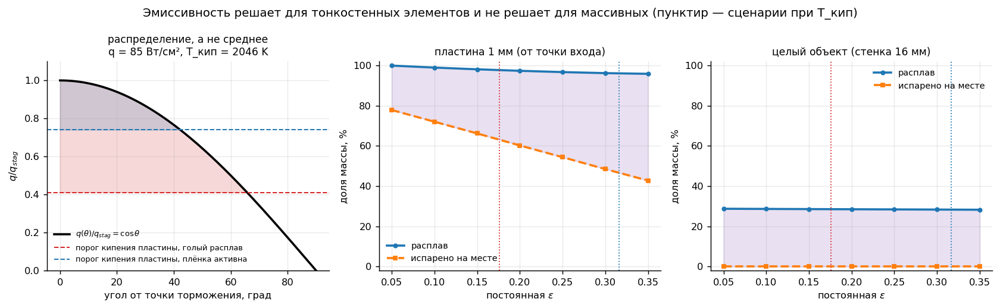

### 8.9 Результат шага 4 по фрагментам

Сценарий «плёнка активна», объект 175 кг, Al равномерно:

| фрагмент | m, кг | β | Rn, см | h разрушения | h пика q | T_кип, K | расплав | испарено |
|---|---|---|---|---|---|---|---|---|
| солнечные панели | 17.5<!--=step4.fragments.film.panels.mass:.1f--> | 5<!--=step4.fragments.film.panels.beta:.0f--> | 0.5<!--=step4.fragments.film.panels.rn_cm:.1f--> | 95<!--=step4.fragments.film.panels.h_break_km:.0f--> км | 79.7<!--=step4.fragments.film.panels.h_peak_q_km:.1f--> км | 1759<!--=step4.fragments.film.panels.Tb_min:.0f-->–2033<!--=step4.fragments.film.panels.Tb_max:.0f--> | 96<!--=step4.fragments.film.panels.melt_pct:.0f-->% | 44<!--=step4.fragments.film.panels.vap_pct:.0f-->% |
| силовой набор | 87.5<!--=step4.fragments.film.structure.mass:.1f--> | 55<!--=step4.fragments.film.structure.beta:.0f--> | 58.1<!--=step4.fragments.film.structure.rn_cm:.1f--> | 78<!--=step4.fragments.film.structure.h_break_km:.0f--> км | 64.2<!--=step4.fragments.film.structure.h_peak_q_km:.1f--> км | 2036<!--=step4.fragments.film.structure.Tb_min:.0f-->–2341<!--=step4.fragments.film.structure.Tb_max:.0f--> | 28<!--=step4.fragments.film.structure.melt_pct:.0f-->% | 0<!--=step4.fragments.film.structure.vap_pct:.0f-->% |
| мелкие элементы, MLI | 70.0<!--=step4.fragments.film.mli.mass:.1f--> | 4<!--=step4.fragments.film.mli.beta:.0f--> | 0.5<!--=step4.fragments.film.mli.rn_cm:.1f--> | 78<!--=step4.fragments.film.mli.h_break_km:.0f--> км | 78.0<!--=step4.fragments.film.mli.h_peak_q_km:.1f--> км | 1778<!--=step4.fragments.film.mli.Tb_min:.0f-->–2039<!--=step4.fragments.film.mli.Tb_max:.0f--> | 96<!--=step4.fragments.film.mli.melt_pct:.0f-->% | 30<!--=step4.fragments.film.mli.vap_pct:.0f-->% |

```
расплавлено        108<!--=step4.fragments.film.total.melt_kg:.0f--> кг (62<!--=step4.fragments.film.total.melt_pct:.0f-->%)  →  32.4<!--=step4.fragments.film.total.melt_al:.1f--> кг Al   верхняя граница
испарено на месте   28<!--=step4.fragments.film.total.vap_kg:.0f--> кг (16<!--=step4.fragments.film.total.vap_pct:.0f-->%)  →   8.5<!--=step4.fragments.film.total.vap_al:.1f--> кг Al
```

В сценарии «голый расплав»: панели 59<!--=step4.fragments.bare.panels.vap_pct:.0f-->%, MLI 43<!--=step4.fragments.bare.mli.vap_pct:.0f-->%; расплавлено 109<!--=step4.fragments.bare.total.melt_kg:.0f--> кг (63<!--=step4.fragments.bare.total.melt_pct:.0f-->%) → 32.8<!--=step4.fragments.bare.total.melt_al:.1f--> кг Al, испарено 40<!--=step4.fragments.bare.total.vap_kg:.0f--> кг (23<!--=step4.fragments.bare.total.vap_pct:.0f-->%) → 12.0<!--=step4.fragments.bare.total.vap_al:.1f--> кг Al.

Гистограмма пикует на **72–80 км** — внутри наблюдаемой полосы разрушения 70–80 км, которая на шагах 1–3 оставалась недостижимой.

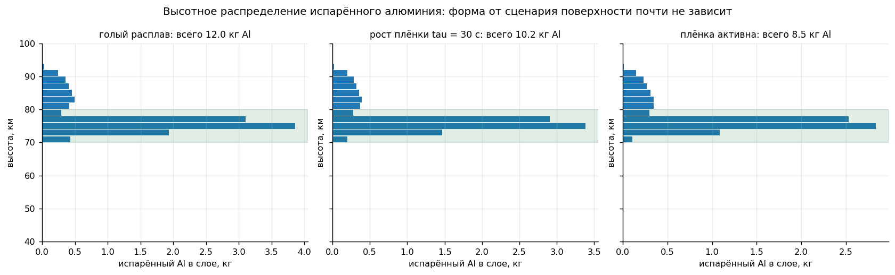

---

## 9. Шаг 5. Главный результат

### 9.1 Высотное распределение вброса

Объект 175 кг, 30% Al = 52.5 кг Al, распределён по фрагментам равномерно. Вход 120 км / 7500 м/с / −1.5°, i = 53°, NRLMSIS 2.1, три фрагмента из раздела 8.5, кипение при местном давлении.

| сценарий | ε при 2000 K | испарено Al, кг | выход | Al₂O₃ на кг спутника | медиана, км | выше 50 км | выше 85 км | расплав Al, кг |
|---|---|---|---|---|---|---|---|---|
| **плёнка активна** | 0.322<!--=step5.scenarios.film.eps2000:.3f--> | **8.5<!--=step5.scenarios.film.total:.1f-->** | 16<!--=step5.scenarios.film.yield_pct:.0f-->% | 0.092<!--=step5.scenarios.film.al2o3_per_kg:.3f--> | 76.1<!--=step5.scenarios.film.median:.1f--> | 100<!--=step5.scenarios.film.above_strat_pct:.0f-->% | 10<!--=step5.scenarios.film.above_meso_pct:.0f-->% | 32.4<!--=step5.scenarios.film.melt:.1f--> |
| **голый расплав** | 0.173<!--=step5.scenarios.bare.eps2000:.3f--> | **12.0<!--=step5.scenarios.bare.total:.1f-->** | 23<!--=step5.scenarios.bare.yield_pct:.0f-->% | 0.130<!--=step5.scenarios.bare.al2o3_per_kg:.3f--> | 75.9<!--=step5.scenarios.bare.median:.1f--> | 100<!--=step5.scenarios.bare.above_strat_pct:.0f-->% | 11<!--=step5.scenarios.bare.above_meso_pct:.0f-->% | 32.8<!--=step5.scenarios.bare.melt:.1f--> |

Для сравнения — постоянная ε (та же физика):

| ε | 0.05 | 0.10 | 0.15 | 0.20 | 0.25 | 0.30 | 0.35 |
|---|---|---|---|---|---|---|---|
| испарено Al, кг | 15.2<!--=step5.sweep.e005.total:.1f--> | 13.9<!--=step5.sweep.e010.total:.1f--> | 12.6<!--=step5.sweep.e015.total:.1f--> | 11.4<!--=step5.sweep.e020.total:.1f--> | 10.2<!--=step5.sweep.e025.total:.1f--> | 9.0<!--=step5.sweep.e030.total:.1f--> | 7.9<!--=step5.sweep.e035.total:.1f--> |
| выход | 29<!--=step5.sweep.e005.yield_pct:.0f-->% | 26<!--=step5.sweep.e010.yield_pct:.0f-->% | 24<!--=step5.sweep.e015.yield_pct:.0f-->% | 22<!--=step5.sweep.e020.yield_pct:.0f-->% | 19<!--=step5.sweep.e025.yield_pct:.0f-->% | 17<!--=step5.sweep.e030.yield_pct:.0f-->% | 15<!--=step5.sweep.e035.yield_pct:.0f-->% |
| медиана, км | 75.6<!--=step5.sweep.e005.median:.1f--> | 75.8<!--=step5.sweep.e010.median:.1f--> | 75.8<!--=step5.sweep.e015.median:.1f--> | 75.9<!--=step5.sweep.e020.median:.1f--> | 76.0<!--=step5.sweep.e025.median:.1f--> | 76.1<!--=step5.sweep.e030.median:.1f--> | 76.2<!--=step5.sweep.e035.median:.1f--> |

Стратопауза — 50 км. Выше неё частицы оседают годами (мезосферный вброс), ниже попадают в стратосферу почти сразу. В модели весь вброс идёт выше стратопаузы; около 10<!--=step5.scenarios.film.above_meso_pct:.0f-->% — выше мезопаузы (85 км), в основном от панелей, отделяющихся на 95 км. Первая версия писала «100% в мезосферу» — это «100% выше стратопаузы».

Медиана считается по сырому ряду (высота, масса), а не по гистограмме: медиана по бинам зависела от их ширины и гуляла на 1.5 км при бинах 0.5–5 км. Гистограмма осталась только для показа.


### 9.2 Что изменилось относительно первой версии

Первая версия давала 4.4–7.7 кг Al в сценарии «плёнка активна» (ε 0.19–0.29 при 2740 K) и 15.4 кг без плёнки (ε 0.05). Декомпозиция, кг испарённого Al при постоянной ε:

| шаг | ε = 0.05 | ε = 0.19 | ε = 0.29 |
|---|---|---|---|
| первая версия | 15.4 | 7.7 | 4.4 |
| + пластина двумя сторонами, пояс ≤ своей массы, расплав по максимуму | 11.2<!--=step5.changes.plates_fixed.e005:.1f--> | 2.4<!--=step5.changes.plates_fixed.e019:.1f--> | 0.5<!--=step5.changes.plates_fixed.e029:.1f--> |
| + свойства Al 6061 (c_p тв./ж., T_пл), кипение при 1 атм = 2792 K | 9.8<!--=step5.changes.new_props_1atm.e005:.1f--> | 1.6<!--=step5.changes.new_props_1atm.e019:.1f--> | 0.2<!--=step5.changes.new_props_1atm.e029:.1f--> |
| + кипение при местном давлении (база) | 15.2<!--=step5.changes.local_pressure.e005:.1f--> | 11.6<!--=step5.changes.local_pressure.e019:.1f--> | 9.2<!--=step5.changes.local_pressure.e029:.1f--> |

Две ошибки в модели пластин завышали испарение в 1.4–9 раз; неучёт давления при кипении занижал его в 1.5–45 раз. Затем ε из постоянной стала функцией температуры (раздел 13), и сценарии пришли к 8.5 и 12.0 кг.

### 9.3 Два сценария сблизились

Первая формулировка подавала ответ как два далёких сценария: «плёнка активна» (ε 0.19–0.29 при 2740 K) и «голый расплав» (ε ≈ 0.05), с разницей в 2–3.5 раза. Обе опоры сдвинулись:

- **Рабочая температура — ~2000 K, а не 2740 K.** Там ε плёнки определяется справочной точкой α-Al₂O₃ при 1800 K: 0.30–0.33 по всем 48 формам кривой (раздел 13.5). И Al₂O₃ при этом ещё твёрдый (плавится при 2345 K) — экстраполяции за точку плавления оксида больше нет.
- **ε ≈ 0.05 — это полированный твёрдый Al при 300–900 K.** У жидкого металла сопротивление в 2.4–5 раз выше, и оценка по сопротивлению (Parker–Abbott) даёт ~0.10 у плавления и ~0.17 при 2000 K (раздел 13.7).

Итог: 8.5<!--=step5.scenarios.film.total:.1f--> против 12.0<!--=step5.scenarios.bare.total:.1f--> кг, фактор 1.4. Сценарий поверхности перестал быть главной неопределённостью.

### 9.4 Рост оксидной плёнки: ε как траектория

Оксидная плёнка растёт по ходу полёта. Тонкая плёнка оптически прозрачна, и излучает фактически металл под ней. По мере утолщения ε растёт к значению плёнки. Реализовано как `Aluminium(tau_oxide=τ)` с параболическим ростом `δ ~ √t`, теперь между двумя кривыми ε(T):

```
ε(t, T) = ε_голый(T) + (ε_плёнка(T) − ε_голый(T)) · (1 − exp(−√(t/τ)))
```

Время t отсчитывается **с момента разрушения**: поверхность фрагмента новая, а нагрев фрагментов идёт в первые ~10–40 с. (Первая версия подписывала столбец «ε на пике нагрева (~200 с)», но печатала ε(200 с), тогда как часы фрагмента стартуют при разрушении; и брала для плёнки 0.35 — значение при 1800 K.)

| τ, с | ε(10 с), 2000 K | ε(30 с), 2000 K | испарено Al, кг | выход |
|---|---|---|---|---|
| 1 | 0.316<!--=step4.growth.tau1.eps10:.3f--> | 0.322<!--=step4.growth.tau1.eps30:.3f--> | 8.7<!--=step4.growth.tau1.total:.1f--> | 16<!--=step4.growth.tau1.yield_pct:.0f-->% |
| 10 | 0.267<!--=step4.growth.tau10.eps10:.3f--> | 0.296<!--=step4.growth.tau10.eps30:.3f--> | 9.6<!--=step4.growth.tau10.total:.1f--> | 18<!--=step4.growth.tau10.yield_pct:.0f-->% |
| 30 | 0.238<!--=step4.growth.tau30.eps10:.3f--> | 0.267<!--=step4.growth.tau30.eps30:.3f--> | 10.2<!--=step4.growth.tau30.total:.1f--> | 19<!--=step4.growth.tau30.yield_pct:.0f-->% |
| 100 | 0.213<!--=step4.growth.tau100.eps10:.3f--> | 0.236<!--=step4.growth.tau100.eps30:.3f--> | 10.8<!--=step4.growth.tau100.total:.1f--> | 21<!--=step4.growth.tau100.yield_pct:.0f-->% |
| 300 | 0.198<!--=step4.growth.tau300.eps10:.3f--> | 0.213<!--=step4.growth.tau300.eps30:.3f--> | 11.2<!--=step4.growth.tau300.total:.1f--> | 21<!--=step4.growth.tau300.yield_pct:.0f-->% |
| 1000 | 0.187<!--=step4.growth.tau1000.eps10:.3f--> | 0.197<!--=step4.growth.tau1000.eps30:.3f--> | 11.6<!--=step4.growth.tau1000.total:.1f--> | 22<!--=step4.growth.tau1000.yield_pct:.0f-->% |
| 10000 | 0.178<!--=step4.growth.tau10000.eps10:.3f--> | 0.181<!--=step4.growth.tau10000.eps30:.3f--> | 11.9<!--=step4.growth.tau10000.total:.1f--> | 23<!--=step4.growth.tau10000.yield_pct:.0f-->% |

Весь размах по τ укладывается между двумя сценариями. Неизвестное переименовывается из «какое ε» в «как быстро растёт плёнка». Отсюда вывод для эксперимента: мерить надо ε **как функцию толщины оксида**, а не одно число.

---

## 10. Что модель предсказывает, а что наследует

### 10.1 Возражение

В ранней версии было заявлено: «высота вброса устойчива — 75–76 км при любом ε». Утверждение верно, но вводит в заблуждение: ε никогда и не был кандидатом на управление высотой. Показана устойчивость к параметру, который и не должен был влиять.

Возражение рецензента было бы таким: «вы получили вброс на 75 км, потому что задали разрушение на 78».

### 10.2 Передаточная функция

Обе высоты разрушения из списка фрагментов сдвигаются вместе (сценарий «плёнка активна»):

| сдвиг, км | h разрушения корпуса | h панелей | медиана вброса, км | смещение, км | масса Al, кг |
|---|---|---|---|---|---|
| −15 | 63 | 80 | 74.0<!--=step5b.transfer.m15.median:.1f--> | −11.0<!--=step5b.transfer.m15.offset:+.1f--> | 2.5<!--=step5b.transfer.m15.mass:.1f--> |
| −10 | 68 | 85 | 67.5<!--=step5b.transfer.m10.median:.1f--> | +0.5<!--=step5b.transfer.m10.offset:+.1f--> | 4.4<!--=step5b.transfer.m10.mass:.1f--> |
| −5 | 73 | 90 | 71.9<!--=step5b.transfer.m5.median:.1f--> | +1.1<!--=step5b.transfer.m5.offset:+.1f--> | 6.5<!--=step5b.transfer.m5.mass:.1f--> |
| 0 | 78 | 95 | 76.1<!--=step5b.transfer.p0.median:.1f--> | +1.9<!--=step5b.transfer.p0.offset:+.1f--> | 8.5<!--=step5b.transfer.p0.mass:.1f--> |
| +5 | 83 | 100 | 79.7<!--=step5b.transfer.p5.median:.1f--> | +3.3<!--=step5b.transfer.p5.offset:+.1f--> | 10.2<!--=step5b.transfer.p5.mass:.1f--> |
| +10 | 88 | 105 | 82.6<!--=step5b.transfer.p10.median:.1f--> | +5.4<!--=step5b.transfer.p10.offset:+.1f--> | 11.1<!--=step5b.transfer.p10.mass:.1f--> |
| +15 | 93 | 110 | 84.8<!--=step5b.transfer.p15.median:.1f--> | +8.2<!--=step5b.transfer.p15.offset:+.1f--> | 11.5<!--=step5b.transfer.p15.mass:.1f--> |

- Коэффициент передачи **0.82<!--=step5b.transfer.gain_mid:.2f-->** в правдоподобном окне 68–83 км; 0.50<!--=step5b.transfer.gain_all:.2f--> по всему размаху (зависимость насыщается на краях).
- Масса меняется в **4.5<!--=step5b.transfer.mass_ratio:.1f--> раза** — высота разрушения оказалась главным рычагом и по массе тоже.

Смещение при фиксированной высоте разрушения (78 км) по остальным параметрам:

| параметр | смещение, км |
|---|---|
| плёнка активна (база) | +1.9<!--=step5b.offsets.film:+.1f--> |
| голый расплав | +2.1<!--=step5b.offsets.bare:+.1f--> |
| τ = 1 с / 10 000 с | +1.9<!--=step5b.offsets.tau1:+.1f--> / +2.1<!--=step5b.offsets.tau10000:+.1f--> |
| вдув η = 0.6 | +2.2<!--=step5b.offsets.blowing:+.1f--> |
| быстрое кувыркание | +2.0<!--=step5b.offsets.tumbling:+.1f--> |
| угол входа −1° / −3° | +1.7<!--=step5b.offsets.gamma1:+.1f--> / +2.8<!--=step5b.offsets.gamma3:+.1f--> |

**Смещение +1.7<!--=step5b.offsets.min:+.1f-->…+2.8<!--=step5b.offsets.max:+.1f--> км устойчиво ко всему, кроме самой высоты разрушения.**

### 10.3 Честная формулировка

Модель предсказывает не абсолютную высоту вброса, а **перевод высоты разрушения в высоту вброса**:

```
h_вброс ≈ 75.9<!--=step5b.transfer.intercept78:.1f--> + 0.82<!--=step5b.transfer.gain_mid:.2f--> · (H − 78) км,        H в окне 68–83 км
```

Первая версия писала «при разрушении на высоте H вброс происходит на H минус ~2 км» — это правило с коэффициентом 1, и оно верно только около 78 км: при H = 68 смещение +0.5<!--=step5b.transfer.m10.offset:+.1f--> км, при H = 88 — +5.4<!--=step5b.transfer.p10.offset:+.1f--> км.

Это полезный результат: он позволяет атмосферным моделистам переводить **наблюдаемые** высоты разрушения в высоты вброса. Но он условный.

Отсюда переставляется приоритет: **главная неопределённость по высоте лежит в наблюдательных данных по высоте разрушения, а не в модели.** Это стоит говорить прямо — работу это усиливает, а не ослабляет.

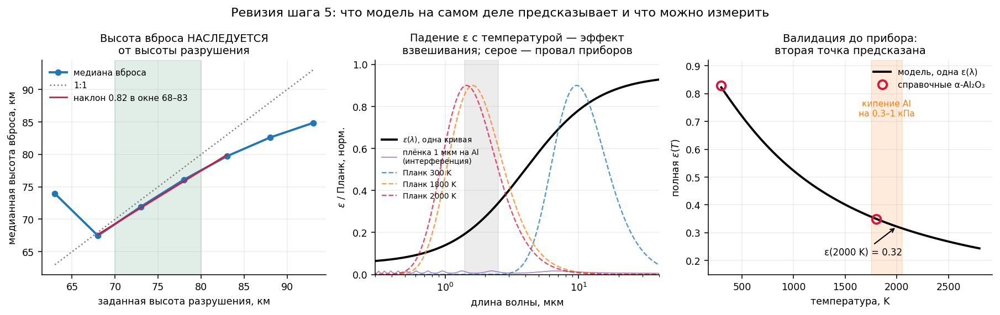

---

## 11. Сверка с Ferreira

### 11.1 Что на самом деле посчитал Ferreira

Ferreira et al. 2024 (GRL, 10.1029/2024GL109280): спутник 250 кг, 30% Al = 75 кг Al. Молекулярная динамика окисления Al в кислороде при 2200 K на высоте 86 км, результат масштабируется на спутник через подобие. Итог: **окисляется 24.0 кг Al (32%)**, образуя 29.8 кг кластеров AlO; 51.0 кг Al остаются неокисленными кластерами. Предполагается, что абляции подвергается весь Al.

То есть 32% — это **выход их модели**, а не допущение, и считается он для AlO-кластеров, а не для Al₂O₃.

**Ошибка первой версии.** Отчёт брал «~30 кг Al₂O₃», пересчитывал в Al по массовой доле Al в Al₂O₃ (0.529) и получал 15.9 кг Al = 21%. Правильно: 24.0 кг Al = 32%. Кроме того, в одном месте первая версия называла выход Ferreira «заданным предположением», в другом — «полученным молекулярной динамикой»; верно второе.

### 11.2 Сравнение

В нормировке на наш объект (52.5 кг Al) выход Ferreira — 16.8<!--=step5.ferreira.theirs.total:.1f--> кг Al, 0.096<!--=step5.ferreira.theirs.per_kg:.3f--> кг Al на кг спутника:

| сценарий | Al в пар, кг | доля Al | кг Al на кг спутника |
|---|---|---|---|
| плёнка активна, Al равномерно | 8.5<!--=step5.ferreira.film_uniform.total:.1f--> | 16<!--=step5.ferreira.film_uniform.pct:.0f-->% | 0.049<!--=step5.ferreira.film_uniform.per_kg:.3f--> |
| голый расплав, Al равномерно | 12.0<!--=step5.ferreira.bare_uniform.total:.1f--> | 23<!--=step5.ferreira.bare_uniform.pct:.0f-->% | 0.069<!--=step5.ferreira.bare_uniform.per_kg:.3f--> |
| плёнка активна, весь Al в тонкостенных | 17.0<!--=step5.ferreira.film_thin.total:.1f--> | 32<!--=step5.ferreira.film_thin.pct:.0f-->% | 0.097<!--=step5.ferreira.film_thin.per_kg:.3f--> |
| голый расплав, весь Al в тонкостенных | 24.0<!--=step5.ferreira.bare_thin.total:.1f--> | 46<!--=step5.ferreira.bare_thin.pct:.0f-->% | 0.137<!--=step5.ferreira.bare_thin.per_kg:.3f--> |
| **Ferreira (окислено)** | 16.8<!--=step5.ferreira.theirs.total:.1f--> | **32<!--=step5.ferreira.theirs.pct:.0f-->%** | 0.096<!--=step5.ferreira.theirs.per_kg:.3f--> |

1. **Путь совершенно другой.** У Ferreira молекулярная динамика окисления, у нас траектория, тепловой баланс и распределение потока по поверхности.
2. **При равномерном Al наши 16<!--=step5.ferreira.film_uniform.pct:.0f-->–23<!--=step5.ferreira.bare_uniform.pct:.0f-->% ниже их 32<!--=step5.ferreira.theirs.pct:.0f-->%.** 32% достижимы, если Al сосредоточен в тонкостенных элементах. Сравниваются разные величины: у нас — испарённый Al (весь пар окислится), у них — окисленная доля при допущении, что абляции подвергается весь Al.
3. **Совпадение по температуре.** Ferreira считает при 2200 K — ниже кипения при 1 атм и близко к нашему кипению на местном давлении (1759<!--=step4.fragments.film.panels.Tb_min:.0f-->–2039<!--=step4.fragments.film.mli.Tb_max:.0f--> K).
4. **Верхняя граница работает как ограничение сверху.** Расплав 62<!--=step5.scenarios.film.melt_pct:.0f-->% означает, что физически возможно почти вдвое больше, чем окисляется у Ferreira. Вся разница сидит в судьбе капельной фазы.

### 11.3 Оговорки

Без них подавать нельзя: другая масса объекта, другие условия входа, другие определяемые величины. Это **согласие по порядку величины, а не валидация**. Первая версия интерпретировала положение значения Ferreira между сценариями как «промежуточное состояние плёнки (ε ≈ 0.12, τ ≈ 300 с)» — эта интерпретация снята: она опиралась на неверный пересчёт (21%) и на устаревшую таблицу роста плёнки.

---

## 12. Бюджеты неопределённостей

### 12.1 Бюджетов два

Часть параметров двигает высоту вброса, часть — массу. Путать их нельзя.

**Бюджет шага 5** (главный результат, база — «плёнка активна», Al равномерно, 8.5<!--=step5.sensitivity.base.total:.1f--> кг):

| фактор | испарено Al, кг: от – до | раз | медиана, км |
|---|---|---|---|
| **распределение Al по фрагментам** | 0.0<!--=step5.sensitivity.al_split.lo:.1f--> – 17.0<!--=step5.sensitivity.al_split.hi:.1f--> | ∞ | 0.0<!--=step5.sensitivity.al_split.median_span:.1f--> |
| **доля тонкостенной массы 25–75%** | 4.3<!--=step5.sensitivity.thin_fraction.lo:.1f--> – 13.1<!--=step5.sensitivity.thin_fraction.hi:.1f--> | 3.1<!--=step5.sensitivity.thin_fraction.ratio:.1f-->× | 0.2<!--=step5.sensitivity.thin_fraction.median_span:.1f--> |
| **высота разрушения ±10 км** | 4.4<!--=step5.sensitivity.breakup.lo:.1f--> – 11.1<!--=step5.sensitivity.breakup.hi:.1f--> | 2.5<!--=step5.sensitivity.breakup.ratio:.1f-->× | **15.1<!--=step5.sensitivity.breakup.median_span:.1f-->** |
| наклонение орбиты 0–180° | 7.4<!--=step5.sensitivity.inclination.lo:.1f--> – 12.4<!--=step5.sensitivity.inclination.hi:.1f--> | 1.7<!--=step5.sensitivity.inclination.ratio:.1f-->× | 0.2<!--=step5.sensitivity.inclination.median_span:.1f--> |
| вдув пара, η 0–0.6 | 4.9<!--=step5.sensitivity.blowing.lo:.1f--> – 8.5<!--=step5.sensitivity.blowing.hi:.1f--> | 1.7<!--=step5.sensitivity.blowing.ratio:.1f-->× | 0.3<!--=step5.sensitivity.blowing.median_span:.1f--> |
| ориентация: устойчивая / быстрое кувыркание | 5.9<!--=step5.sensitivity.orientation.lo:.1f--> – 8.5<!--=step5.sensitivity.orientation.hi:.1f--> | 1.5<!--=step5.sensitivity.orientation.ratio:.1f-->× | 0.1<!--=step5.sensitivity.orientation.median_span:.1f--> |
| сценарий поверхности (плёнка / голый) | 8.5<!--=step5.sensitivity.surface.lo:.1f--> – 12.0<!--=step5.sensitivity.surface.hi:.1f--> | 1.4<!--=step5.sensitivity.surface.ratio:.1f-->× | 0.2<!--=step5.sensitivity.surface.median_span:.1f--> |
| рост плёнки τ 1–10⁴ с | 8.7<!--=step5.sensitivity.growth.lo:.1f--> – 11.9<!--=step5.sensitivity.growth.hi:.1f--> | 1.4<!--=step5.sensitivity.growth.ratio:.1f-->× | 0.2<!--=step5.sensitivity.growth.median_span:.1f--> |
| толщина пластин ×2 / ÷2 | 7.8<!--=step5.sensitivity.thickness.lo:.1f--> – 8.8<!--=step5.sensitivity.thickness.hi:.1f--> | 1.1<!--=step5.sensitivity.thickness.ratio:.1f-->× | 2.9<!--=step5.sensitivity.thickness.median_span:.1f--> |
| форма кривой плёнки (48 наборов) | 8.3<!--=step5.sensitivity.film_shape.lo:.1f--> – 9.0<!--=step5.sensitivity.film_shape.hi:.1f--> | 1.1<!--=step5.sensitivity.film_shape.ratio:.1f-->× | 0.1<!--=step5.sensitivity.film_shape.median_span:.1f--> |
| угол входа −1…−3° | 8.4<!--=step5.sensitivity.entry_angle.lo:.1f--> – 8.5<!--=step5.sensitivity.entry_angle.hi:.1f--> | 1.0<!--=step5.sensitivity.entry_angle.ratio:.1f-->× | 1.1<!--=step5.sensitivity.entry_angle.median_span:.1f--> |

«Распределение Al по фрагментам»: при той же общей доле 30% весь Al в силовом наборе (0<!--=step5.sensitivity.al_split.lo:.0f--> кг — он не испаряется), равномерно (8.5<!--=step5.sensitivity.base.total:.1f--> кг), весь Al в тонкостенных (17.0<!--=step5.sensitivity.al_split.hi:.1f--> кг).

Кипение при 1 атм вместо местного давления дало бы 0.6<!--=step5.changes.film_1atm:.1f--> кг вместо 8.5<!--=step5.scenarios.film.total:.1f--> — это не неопределённость, а исправленная физика (раздел 9.2), поэтому в бюджете её нет.

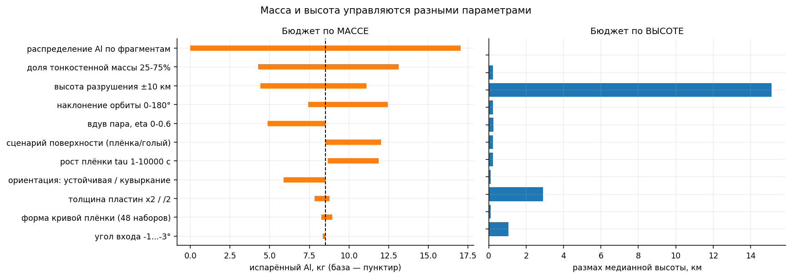

**Бюджет шага 3** (пик нагрева и удельная поглощённая энергия, целый объект, с вращением атмосферы):

| фактор | влияет на | высота пика, км | удельная энергия |
|---|---|---|---|
| фрагментация (размер L 1.0 → 0.1) | оба | **16.0<!--=step3.budget.fragmentation.h_km:.1f-->** | **887<!--=step3.budget.fragmentation.energy_pct:.0f-->%** |
| Cd 1.0–2.2 | оба | 5.8<!--=step3.budget.cd.h_km:.1f--> | 49<!--=step3.budget.cd.energy_pct:.0f-->% |
| широта входа −75…0° | оба | 4.6<!--=step3.budget.latitude.h_km:.1f--> | 3<!--=step3.budget.latitude.energy_pct:.0f-->% |
| угол входа −1…−3° | оба | 2.1<!--=step3.budget.entry_angle.h_km:.1f--> | 24<!--=step3.budget.entry_angle.energy_pct:.0f-->% |
| сезон март/сентябрь | оба | 1.8<!--=step3.budget.season.h_km:.1f--> | 1<!--=step3.budget.season.energy_pct:.0f-->% |
| наклонение 0–180° | оба | 0.9<!--=step3.budget.inclination.h_km:.1f--> | 43<!--=step3.budget.inclination.energy_pct:.0f-->% |
| версия MSIS 00 / 2.1 | оба | 0.9<!--=step3.budget.msis_version.h_km:.1f--> | 0<!--=step3.budget.msis_version.energy_pct:.0f-->% |
| корреляция С–Г / DKR | только масса | — | 4<!--=step3.budget.correlation.energy_pct:.0f-->% |
| солнечная активность F10.7 70–220 | оба | 0.0<!--=step3.budget.solar.h_km:.1f--> | 0<!--=step3.budget.solar.energy_pct:.0f-->% |
| эффективный Rn 0.2–1.0 м | только масса | — | 124<!--=step3.budget.rn.energy_pct:.0f-->% |
| форм-фактор φ 0.25–0.30 | только масса | — | 20<!--=step3.budget.shape_factor.energy_pct:.0f-->% |

(Широта и сезон здесь 4.6<!--=step3.budget.latitude.h_km:.1f--> и 1.8<!--=step3.budget.season.h_km:.1f--> км, в разделе 5.4 — 3.9<!--=verify_step2.env_span_km.lat:.1f--> и 1.6<!--=verify_step2.env_span_km.season:.1f--> км: там конфигурация шага 2, без вращения атмосферы. Наклонение 43<!--=step3.budget.inclination.energy_pct:.0f-->% здесь против 36% в разделе 6.3: там интегральный поток в точке торможения, здесь удельная энергия с поправкой на горячую стенку, которая сама зависит от скорости.)

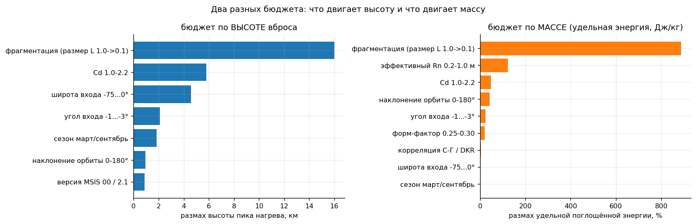

### 12.2 Структурный вывод

**Параметр может выпасть из одного бюджета и вернуться в другой.**

- **Угол входа** выпал из бюджета по высоте (2.1 км — гравитационный разворот стирает γ₀ раньше, чем включается торможение), но вернулся в бюджет по удельной энергии целого объекта на 24%: γ₀ управляет длительностью полёта. На массу испарённого Al во фрагментах он уже почти не влияет (1.0×): фрагменты стартуют с высоты разрушения.
- **Радиус затупления** — обратный случай: 124% по массе и **ровно ноль** по высоте, потому что Rn — константа вдоль траектории и выносится из-под argmax.
- **Высота разрушения** — в обоих бюджетах сразу: 15 км по медиане и 2.5× по массе.

Правило для всей работы: **список ведущих параметров надо строить отдельно для каждой выходной величины.** Единый рейтинг «что важно в этой модели» был бы неверен независимо от того, насколько аккуратно он посчитан. Для статьи такая структура аргумента ценнее любой отдельной цифры.

**Что изменилось в рейтинге.** В первой версии ε стояла главной осью по массе. После исправлений главные оси — **где лежит алюминий и какая доля массы тонкостенная**, то есть список материалов фрагментов конкретного аппарата. Состояние поверхности — одна из нескольких осей порядка 1.4–1.7×.

Наклонение и широта в этих таблицах — не неопределённости, а **известные входы**: для конкретного аппарата они берутся из его орбиты.

---

## 13. Эмиссивность: валидация, свип формы, два сценария

### 13.1 Где ε решает

Порог кипения прямо пропорционален ε: `q_порог = n·ε·σ·T_кип⁴/φ`. Температура равновесия идёт как `ε^(−1/4)`. Поэтому для тонкостенных фрагментов (Π ≫ 1) ε — заметная ось, а для массивных (Π ≪ 1) — нет.

### 13.2 Правильный материал

При ~2000 K излучает не окисленный **твёрдый** алюминий, а **расплав** — с оксидной плёнкой или без неё:

| поверхность | ε | T, K |
|---|---|---|
| полированный Al | 0.04–0.07 | 300–900 |
| окисленный Al | 0.07–0.09 | 450–900 |
| слабо окисленный Al | 0.11–0.19 | 473–873 |
| **α-Al₂O₃** | **0.83 → 0.35** | **300 → 1800 (падает)** |

Порядок строк «окисленный» и «слабо окисленный» в сводке выглядит перепутанным (у слабо окисленного ε больше) — это надо сверить с первоисточником; в расчёт эти строки не входят.

У оксида эмиссивность с температурой **падает**, а не растёт.

### 13.3 Метод: отражение при комнатной температуре → ε при рабочей

Прямая эмиссометрия при 1500–2200 K не нужна:

```
ε(λ) = 1 − R(λ)                          закон Кирхгофа, непрозрачный образец
ε(T) = ∫ε(λ)·B(λ,T) dλ / ∫B(λ,T) dλ      взвешивание по Планку
```

Функция `emissivity.total_emissivity_from_reflectance(λ, R, T)` принимает массивы прямо с прибора.

**Требование к образцу:** `ε = 1 − R` работает только для **непрозрачного** образца. Оксидная плёнка на металле непрозрачна за счёт подложки — годится. Свободная плёнка или порошок оксида — нет, там нужно `1 − R − T` с измерением пропускания.

**Нормальная против полусферической.** Интегрирующая сфера даёт ε около нормали; модели нужна полусферическая. Для металлов полусферическая выше нормальной на 10–30%, для диэлектриков чуть ниже. Для системы «плёнка на металле» поправку надо оценить по измеренному спектру (или мерить R под несколькими углами).

### 13.4 Проверка метода на справочных данных

Гипотеза: падение ε(T) у α-Al₂O₃ — эффект **планковского взвешивания**, а не изменения ε(λ). Оксид алюминия прозрачен в видимом и ближнем ИК, сильные фононные полосы у него в среднем ИК. При росте температуры максимум Планка уходит в короткие волны, где материал не излучает, и интегральная ε падает.

Модель спектра — плёнка на металле:

```
ε(λ) = ε_short + (ε_long − ε_short) / (1 + (λ_c/λ)^w)
```

`ε_short = 0.05` (в прозрачной области виден металл), `ε_long = 0.95` (фононная область), `w = 1.6`. Край λ_c подобран **по одной точке** — ε(1800 K) = 0.35 — и вышел 3.98<!--=step5b.kirchhoff.lam_c_um:.2f--> мкм (физически осмысленно: у сапфира прозрачность до ~5 мкм, дальше многофононное поглощение). Вторая точка тогда предсказывается:

```
ε(300 K) = 0.823<!--=step5b.kirchhoff.e300:.3f-->    против справочных 0.83    ошибка −0.9<!--=step5b.kirchhoff.err_pct:.1f-->%
```

Та же кривая при рабочих температурах:

| T, K | 300 | 800 | 1200 | 1500 | 1800 | 2000 | 2200 | 2740 |
|---|---|---|---|---|---|---|---|---|
| ε полная | 0.823<!--=step5b.film_eps.T300:.3f--> | 0.591<!--=step5b.film_eps.T800:.3f--> | 0.467<!--=step5b.film_eps.T1200:.3f--> | 0.401<!--=step5b.film_eps.T1500:.3f--> | 0.350<!--=step5b.film_eps.T1800:.3f--> | **0.322<!--=step5b.film_eps.T2000:.3f-->** | 0.298<!--=step5b.film_eps.T2200:.3f--> | 0.248<!--=step5b.film_eps.T2740:.3f--> |
| пик Вина, мкм | 9.66 | 3.62 | 2.41 | 1.93 | 1.61 | 1.45 | 1.32 | 1.06 |

Оговорка: кривая подобрана по данным для объёмного α-Al₂O₃, а применяется к плёнке на металле. Это и есть сценарий «плёнка оптически активна»; как ε зависит от толщины плёнки — вопрос к эксперименту.

### 13.5 Свип по форме: поддержка гипотезы, а не подтверждение

В кривой четыре параметра формы (`ε_short`, `λ_c`, `ε_long`, `w`), а по справочной точке подбирается только `λ_c`. Остальные три выбраны рукой, и совпадение второй точки может быть их следствием.

Свип по 48 наборам (`ε_short` 0.03–0.10, `ε_long` 0.85–1.00, `w` 1.0–4.0), каждый раз с перефитом `λ_c` под ту же точку 1800 K:

| величина | разброс по наборам |
|---|---|
| предсказанная ε(300 K), справочное 0.83 | **0.644<!--=step5b.shape.e300_min:.3f--> – 0.986<!--=step5b.shape.e300_max:.3f-->** (−22<!--=step5b.shape.e300_min_pct:.0f-->% … +19<!--=step5b.shape.e300_max_pct:+.0f-->%) |
| наборов в пределах ±10% от справочного | 28<!--=step5b.shape.n_ok300:.0f--> из 48<!--=step5b.shape.n:.0f--> |
| **рабочая ε(2000 K)** | **0.303<!--=step5b.shape.T2000.min:.3f--> – 0.334<!--=step5b.shape.T2000.max:.3f-->, фактор 1.10<!--=step5b.shape.T2000.factor:.2f-->** |
| ε(2000 K) только по наборам, воспроизводящим 300 K | 0.304<!--=step5b.shape.T2000.ok_min:.3f--> – 0.323<!--=step5b.shape.T2000.ok_max:.3f--> |
| ε(2100 K) | 0.282<!--=step5b.shape.T2100.min:.3f--> – 0.327<!--=step5b.shape.T2100.max:.3f--> |
| для сравнения ε(2740 K) | 0.189<!--=step5b.shape.T2740.min:.3f--> – 0.290<!--=step5b.shape.T2740.max:.3f-->, фактор 1.53<!--=step5b.shape.T2740.factor:.2f--> |

**Корректная формулировка:** в разумном семействе кривых существует набор, воспроизводящий обе справочные точки. Это поддержка гипотезы «падение ε — эффект взвешивания», а не её подтверждение.

### 13.6 Но рабочее число устойчиво

При рабочей температуре ~2000 K свобода формы почти не проходит в число: край пришпилен условием при 1800 K, а 2000 K от опорной точки недалеко. Разброс 10% против фактора 1.5 при 2740 K и фактора 5–7, который стоял в самых ранних версиях как главная неопределённость. В расчёте свип формы даёт 8.3<!--=step5.sensitivity.film_shape.lo:.1f-->–9.0<!--=step5.sensitivity.film_shape.hi:.1f--> кг Al (раздел 12).

Вторая выгода: при ~2000 K Al₂O₃ ещё твёрдый (плавится при 2345 K). Первая версия продолжала кривую твёрдого оксида до 2740 K — выше его собственной точки плавления.

### 13.7 Голый расплав: ε ≈ 0.17, а не 0.05

Значение 0.05 первой версии — это полированный **твёрдый** Al при 300–900 K. Излучательная способность металла растёт с его электросопротивлением (Хаген–Рубенс), а у жидкого Al сопротивление у плавления ~24 мкОм·см против ~11 у твёрдого при 900 K и 2.7 при комнатной температуре.

Оценка полной полусферической ε по сопротивлению (Parker & Abbott, NASA SP-55, 1965):

| T, K | 300 | 600 | 900 | 1000 (ж.) | 1500 | 2000 | 2740 |
|---|---|---|---|---|---|---|---|
| ρ_e, мкОм·см | 2.7 | 6.6 | 10.5 | 25.2<!--=verify_step5.resistivity.T1000:.1f--> | 32.4<!--=verify_step5.resistivity.T1500:.1f--> | 39.7<!--=verify_step5.resistivity.T2000:.1f--> | 50.4<!--=verify_step5.resistivity.T2740:.1f--> |
| ε | 0.021<!--=verify_step5.bare_eps.T300:.3f--> | 0.045<!--=verify_step5.bare_eps.T600:.3f--> | 0.068<!--=verify_step5.bare_eps.T900:.3f--> | 0.105<!--=verify_step5.bare_eps.T1000:.3f--> | 0.141<!--=verify_step5.bare_eps.T1500:.3f--> | **0.173<!--=verify_step5.bare_eps.T2000:.3f-->** | 0.217<!--=verify_step5.bare_eps.T2740:.3f--> |

Проверка там, где есть справочные данные: полированный твёрдый Al при 600–900 K — 0.045<!--=verify_step5.bare_eps.T600:.3f-->–0.068<!--=verify_step5.bare_eps.T900:.3f--> против справочных 0.04–0.07 (проверка 5.8). При 300–400 K формула ниже справочника (идеально чистая поверхность без нативного оксида).

Это **оценка, а не измерение**: прямых данных по полной ε жидкого Al выше ~1500 K найти не удалось; сопротивление жидкости выше ~1500 K — экстраполяция. Но порядок ясен: жидкий металл при 2000 K — это не блестящая полированная поверхность при комнатной температуре.

### 13.8 Отсюда два сценария — близкие

- **плёнка активна** → ε(2000 K) ≈ 0.30–0.33 → испарено 8.5 кг Al (8.3–9.0 по форме кривой);
- **плёнки нет** → ε(2000 K) ≈ 0.17 (оценка) → испарено 12.0 кг Al.

Разница между сценариями — 1.4×. Рост плёнки с любым τ даёт значения между ними.

**И это переформулирует вопрос к эксперименту.** Не «измерьте ε», а **«при какой толщине оксида плёнка становится оптически активной»** — с пониманием, что ответ сдвигает массу в пределах 1.4×, а не в разы.

---

## 14. Экспериментальная часть и приборы НУ

### 14.1 Замкнутая конструкция работы

Модель определяет, какие параметры решают исход; лабораторная часть измеряет один из них. После исправлений честная формулировка такая: **измерение прижимает сценарий поверхности (фактор 1.4) и порог по толщине оксида**. Главные неопределённости по массе — список материалов фрагментов и высота разрушения — лабораторией не закрываются; их закрывают данные по конкретному аппарату и наблюдения входов.

Ответ на вопрос «зачем вам установка»: измерить ε(T) системы «оксид на Al 6061» как функцию толщины оксида в рабочем диапазоне 1500–2200 K — одну из величин, от которых зависит выход алюминия в пар, и единственную, которую можно измерить на комнатной оптике.

### 14.2 Требуемая спектральная полоса

Какую долю планковской энергии несёт каждый диапазон — посчитано, а не оценено:

| T, K | пик Вина, мкм | 95% энергии, мкм |
|---|---|---|
| 1500 | 1.93<!--=step5.band.T1500.wien_um:.2f--> | 1.11<!--=step5.band.T1500.lo_um:.2f--> – 10.86<!--=step5.band.T1500.hi_um:.2f--> |
| 1800 | 1.61<!--=step5.band.T1800.wien_um:.2f--> | 0.92<!--=step5.band.T1800.lo_um:.2f--> – 9.05<!--=step5.band.T1800.hi_um:.2f--> |
| 2000 | 1.45<!--=step5.band.T2000.wien_um:.2f--> | 0.83<!--=step5.band.T2000.lo_um:.2f--> – 8.15<!--=step5.band.T2000.hi_um:.2f--> |
| 2200 | 1.32<!--=step5.band.T2200.wien_um:.2f--> | 0.76<!--=step5.band.T2200.lo_um:.2f--> – 7.41<!--=step5.band.T2200.hi_um:.2f--> |

Объединение по рабочим 1500–2200 K: **0.76<!--=step5.band.union_lo_um:.2f--> – 10.9<!--=step5.band.union_hi_um:.1f--> мкм**. Покрывается парой UV-Vis-NIR и FTIR среднего ИК, обе с интегрирующей сферой: нужна полная (зеркальная + диффузная) направленно-полусферическая R.

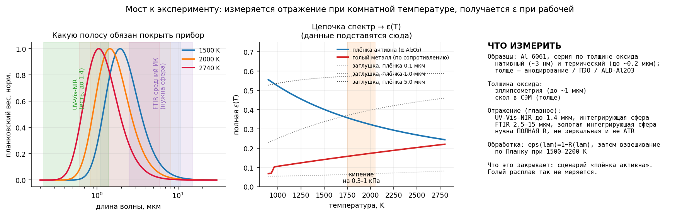

### 14.3 Протокол измерения

- **Образцы:** Al 6061, **тонкостенные** (ε важна только для них), серия по толщине оксида.
- **Как получить серию толщин.** Термическое окисление Al ниже температуры плавления самоограничивается на десятках–сотнях нанометров: печью можно получить только нижний участок серии (нативный ~3 нм → ~0.1–0.2 мкм). Толще — анодирование (пористый анодный оксид, нужна запечатка), плазменно-электролитическое оксидирование или осаждённый Al₂O₃ (ALD, магнетрон). Структура у них разная (аморфный/γ, а не α). У сплава 6061 в поверхностный оксид при нагреве уходит магний (MgO, шпинель MgAl₂O₄) — это часть реальной поверхности, и её стоит фиксировать (EDS/XPS).
- **Толщина оксида:** эллипсометрия до ~1 мкм; скол в СЭМ для более толстых.
- **Отражение:** полная полусферическая R(λ) в UV-Vis-NIR и в среднем ИК.
- **Обработка:** ε(λ) = 1 − R(λ) → взвешивание по Планку при 1500–2200 K → ε(T) как функция толщины оксида.
- **Цель:** найти толщину, на которой ε(2000 K) переходит от значения голого металла (~0.1–0.2) к значению плёнки (~0.3). Пороговый ли это переход или плавный — пока не известно; модель роста плёнки в разделе 9.4 предполагает плавный.

### 14.4 Что есть в НУ и чего не хватает

Публичного списка приборов на сайте Core Facilities НУ нет — только категории (84 прибора по аналитической химии, материаловедению, электронной микроскопии, биологии). Проверка по каталогу дала:

- **UV-Vis-NIR:** Shimadzu UV-2600i с интегрирующей сферой ISR-2600Plus — диапазон **0.22–1.4 мкм**, а не 2.5.
- **FTIR:** только **ATR** — Bruker Alpha II, Thermo Nicolet iS12.

Доля планковской энергии по участкам спектра:

| T, K | < 1.4 мкм | 1.4–2.5 | 2.5–5 | > 5 мкм |
|---|---|---|---|---|
| 1500 | 8.3<!--=step5b.fractions.T1500.lt14:.1f-->% | 35.1<!--=step5b.fractions.T1500.b14_25:.1f-->% | 40.1<!--=step5b.fractions.T1500.b25_5:.1f-->% | 16.6<!--=step5b.fractions.T1500.gt5:.1f-->% |
| 2000 | 22.8<!--=step5b.fractions.T2000.lt14:.1f-->% | 40.6<!--=step5b.fractions.T2000.b14_25:.1f-->% | 28.0<!--=step5b.fractions.T2000.b25_5:.1f-->% | 8.6<!--=step5b.fractions.T2000.gt5:.1f-->% |
| 2200 | 29.1<!--=step5b.fractions.T2200.lt14:.1f-->% | 40.0<!--=step5b.fractions.T2200.b14_25:.1f-->% | 24.1<!--=step5b.fractions.T2200.b25_5:.1f-->% | 6.8<!--=step5b.fractions.T2200.gt5:.1f-->% |

### 14.5 Провал 1.4–2.5 мкм не страшен — теперь проверено с интерференцией

На участок 1.4–2.5 мкм приходится ~35–40% планковской энергии. Первая версия проверяла интерполяцию провала на собственной гладкой кривой, которая там плоская по построению, — это проверка арифметики, а не физики (ошибка 0.1%).

Настоящая опасность — **интерференционные полосы** прозрачной плёнки на металле: при толщинах 0.3–5 мкм, которые и планируется мерить, их период `λ²/(2nd)` ложится ровно в этот диапазон. Расчёт для плёнки Al₂O₃ (n = 1.65) на Al (Друде, Rakic 1998), ошибка ε(2000 K) от линейной интерполяции провала:

| толщина плёнки, мкм | 0.1 | 0.3 | 0.5 | 1.0 | 2.0 | 5.0 |
|---|---|---|---|---|---|---|
| ошибка, абсолютная | +0.0002<!--=step5b.interference.d1.err_abs:+.4f--> | −0.0011<!--=step5b.interference.d3.err_abs:+.4f--> | +0.0008<!--=step5b.interference.d5.err_abs:+.4f--> | +0.0010<!--=step5b.interference.d10.err_abs:+.4f--> | +0.0002<!--=step5b.interference.d20.err_abs:+.4f--> | +0.0001<!--=step5b.interference.d50.err_abs:+.4f--> |
| от рабочей ε ≈ 0.32 | 0.0<!--=step5b.interference.d1.err_pct:+.1f-->% | −0.3<!--=step5b.interference.d3.err_pct:+.1f-->% | +0.3<!--=step5b.interference.d5.err_pct:+.1f-->% | +0.3<!--=step5b.interference.d10.err_pct:+.1f-->% | +0.1<!--=step5b.interference.d20.err_pct:+.1f-->% | 0.0<!--=step5b.interference.d50.err_pct:+.1f-->% |

Контраст полос мал: подложка Al отражает ~95%, и в прозрачной области вклад плёнки в ε — сотые. **Расширять UV-Vis за 1.4 мкм не нужно.** Оговорки: модель Друде без межзонного пика Al у 0.8 мкм и гладкая поверхность; на шероховатых образцах это стоит проверить.

### 14.6 Средний ИК обязателен

Если средний ИК не мерить и экстраполировать постоянной от 1.4 мкм:

| T, K | истинная ε | без среднего ИК | ошибка |
|---|---|---|---|
| 1500 | 0.401<!--=step5b.no_midir.T1500.true:.3f--> | 0.050 | −88<!--=step5b.no_midir.T1500.err_pct:.0f-->% |
| 2000 | 0.322<!--=step5b.no_midir.T2000.true:.3f--> | 0.050 | −84<!--=step5b.no_midir.T2000.err_pct:.0f-->% |
| 2200 | 0.298<!--=step5b.no_midir.T2200.true:.3f--> | 0.050 | −83<!--=step5b.no_midir.T2200.err_pct:.0f-->% |

Даже если взять положение фононного края из литературы, но не мерить, его неопределённость 3–6 мкм даёт:

| T, K | край 3 мкм | край 6 мкм | разброс |
|---|---|---|---|
| 1500 | 0.486<!--=step5b.edge.T1500.edge3:.3f--> | 0.292<!--=step5b.edge.T1500.edge6:.3f--> | +66<!--=step5b.edge.T1500.spread_pct:+.0f-->% |
| 2000 | 0.400<!--=step5b.edge.T2000.edge3:.3f--> | 0.229<!--=step5b.edge.T2000.edge6:.3f--> | +75<!--=step5b.edge.T2000.spread_pct:+.0f-->% |
| 2200 | 0.373<!--=step5b.edge.T2200.edge3:.3f--> | 0.211<!--=step5b.edge.T2200.edge6:.3f--> | +77<!--=step5b.edge.T2200.spread_pct:+.0f-->% |

Вся спектральная структура именно там.

### 14.7 Почему ATR не подходит

ATR меряет затухающей волной приповерхностный слой через прижатый к образцу кристалл:

1. Не даёт отражательной способности образца вообще — ни зеркальной, ни полусферической.
2. Глубина проникновения — ~0.5–2 мкм в среднем ИК. А нужна система «плёнка на металле» целиком, потому что в прозрачной области излучает подложка.
3. К жёсткому шероховатому металлическому купону оптический контакт нормально не прижать.

### 14.8 Что искать поимённо

**Интегрирующая сфера для среднего ИК с золотым покрытием** (например, внешний модуль к FTIR). Она даёт полную направленно-полусферическую R — ровно то, что нужно для ε = 1 − R. Это опция к спектрометру — её наличие проверяется отдельно от названия прибора; в каталоге она может числиться как accessory.

**DRIFT-приставка (Praying Mantis и аналоги) — только запасной вариант.** Она рассчитана на порошки, собирает не всю полусферу (эллипсоидальные зеркала вне оси) и не даёт абсолютной R без калибровки по эталону. Первая версия ставила её в один ряд со сферой — это неверно.

Если сферы нет, это **главный блокер экспериментальной части**, и обсуждать его надо первым пунктом. Варианты тогда:

1. Найти прибор с золотой сферой в другой лаборатории.
2. DRIFT с калибровкой по диффузному золотому эталону и явной оценкой потерянной доли зеркального отражения.
3. Сузить задачу: мерить только прозрачную область, а положение фононного края брать из литературы, честно неся ±75%. Это слабее, но различит голый металл (~0.1–0.2) и активную плёнку (~0.3).

### 14.9 Что измерение закрывает, а что нет

1. Оптические константы сами зависят от температуры — метод этого не ловит. Свип формы (13.5) показывает, что на рабочее число это влияет слабо.
2. Реальная поверхность на входе — расплав с плёнкой, а меряется твёрдый окисленный образец. Измерение прижимает сценарий «плёнка активна» и порог перехода; сценарий «голый расплав» так не меряется.
3. Кирхгоф требует непрозрачности; сфера даёт ε около нормали, модели нужна полусферическая (13.3).
4. **Измерение не закрывает главные неопределённости по массе** — распределение Al по фрагментам и высоту разрушения (раздел 12).

---

## 15. Полный список допущений

### Физика объекта

1. **Постоянный Cd = 1.5.** На 120–90 км течение свободномолекулярное (Kn ≫ 1, Cd ≈ 2.0–2.2), ниже ~70 км континуум (Cd ≈ 0.9–1.2). По числу Кнудсена не интерполируем: торможение в свободномолекулярной зоне пренебрежимо (`D/m ≈ 0.011 м/с²` против `g·sin γ ≈ 0.25`). Но Cd входит и в континуумную фазу, где решается всё, поэтому он параметр свипа. Разброс 1.0–2.2 стоит 5.8 км по высоте пика нагрева.
2. **Фиксированная форма и площадь миделя.** Кувыркание учтено статистически, через формулу Коши.
3. **Радиус затупления — подгоночный параметр.** У кувыркающегося нерегулярного тела его физически нет. Переход к среднему по поверхности через форм-фактор снимает остроту: разброс φ стоит 20%, разброс эффективного Rn — 124%.
4. **Корреляция для точки торможения** распространяется на поверхность угловым распределением `cos θ`, а не применяется ко всему телу целиком.
5. **Сосредоточенная по толщине тепловая модель.** Проверено: глубина прогрева `√(α·t) = 14 см` за полёт, обе рассматриваемые стенки (1 и 16 мм) много тоньше.
6. **Масса не убывает в траекторном уравнении.** Абляция считается вдоль траектории, обратная связь на β не замкнута.
7. **Фрагменты — три класса** (панели, силовой набор, мелкие элементы) с фиксированными долями массы. Доля тонкостенной массы — ось свипа (3.1× по массе).
8. **Все фрагменты термически — алюминий.** Доля Al во фрагменте задаёт только, какая часть испарённой массы — алюминий. Распределение Al по фрагментам при общих 30% — ось свипа: 0–17 кг, самая сильная по массе.
9. **Устойчивая ориентация** (распределение `cos θ`). Предел быстрого кувыркания (средний поток) проверен: 5.9 кг против 8.5.
10. **У оболочки нагревается только лобовая половина**: расплав компактного фрагмента не больше 50%.

### Динамика

11. **Уравнения в инерциальной системе.** Вращение атмосферы входит через `V_отн = V − ωR⊕·cos i` в сопротивлении и нагреве; членов Кориолиса и центробежного в такой постановке нет. Не учтены поперечная трассе составляющая скорости атмосферы (`ωR·cos(lat)·cos A`, ~220 м/с при 40° ю.ш.; в |V_отн| она входит квадратично, ~0.1%) и уклонение плоскости траектории. Первая версия называла «самым крупным допущением» Кориолис (`2ωV ≈ 1.1 м/с²`) — для инерциальной постановки это неверно.
12. **Сферическая Земля, гравитация μ/r², без J2** (J2 даёт ~10⁻³ от g за 300 с).
13. **Нет подъёмной и боковой силы** → движение планарное.
14. **Нет ветра.**

### Атмосфера

15. **Профиль заморожен на момент входа.** За 300 с объект проходит ~16° дуги, ~10° по широте, где ρ(70 км) меняется на единицы процентов — меньше собственной неопределённости MSIS.

### Нагрев и абляция

16. **Радиационный нагрев ударного слоя не учтён** — включается около 10 км/с, для входа с орбиты (7.5 км/с) пренебрежим.
17. **Кипение при давлении торможения на всей освещённой поверхности.** На боках давление ниже (`~cos²θ`), и кипение там идёт при меньшей температуре — допущение занижает испарение. Испарение ниже точки кипения (диффузионное, по Ленгмюру) не моделируется.
18. **Вдув пара не входит в базу**; ось чувствительности η 0–0.6 (8.5 → 4.9 кг).
19. **Теплота окисления Al не учтена** (~31 МДж на кг Al в Al₂O₃). Для плёнки нанометровой толщины вклад мал; если окисление идёт в пограничном слое над поверхностью, тепло уносится газом. Оценить скорость роста плёнки — задача отдельная.
20. **Осесимметричное угловое распределение** для кувыркающегося нерегулярного тела — идеализация без свободного параметра.
21. **Судьба сорванного расплава не моделируется** — это и есть ширина вилки расплав/испарение. Испарение на месте считается при удержании расплава (раздел 8.7).
22. **ε(T) плёнки** — одна спектральная кривая, подобранная по объёмному α-Al₂O₃; **ε(T) голого металла** — оценка по сопротивлению чистого Al.
23. **Высоты разрушения — входы**, а не результат модели (раздел 10).

---

## 16. Константы и их источники

| величина | значение | источник | неопределённость |
|---|---|---|---|
| μ = GM⊕ | 3.986004418e14 м³/с² | WGS-84 / IERS | ~1e−9 |
| R⊕ | 6371.0 км (средний) | — | сплюснутость ±21 км → < 0.3% в g |
| ω⊕ | 7.292115e−5 рад/с | — | точное |
| ρ₀ (заглушка) | 1.225 кг/м³ | U.S. Standard Atmosphere 1976 | — |
| H (заглушка) | 7.2 км | подгонка | см. 3.4 |
| k Саттона–Грейвса | 1.7415e−4 (СИ → Вт/м²) | NASA TR R-376 / TFAWS; размерность по Stardust | 10–20% корреляции, +5% вариант 1.83e−4 |
| показатель DKR | 3.15 | открытые реализации | константа не найдена, используется только форма |
| φ (форм-фактор) | 0.27 | ⟨cos θ⟩ = 0.25, полоса демиз-кодов 0.25–0.30 | 20% |
| c_p воздуха (горячая стенка) | 1300 Дж/(кг·К) | замороженная c_p при 2500–3000 K | ~15% |
| p₀ / (ρV²) | 0.92 | формула Рэлея для трубки Пито, γ = 1.4, M → ∞ | ~5% (→ ~5 K в T_кип) |
| η (вдув) | 0 в базе; ось 0–0.6 | ламинарный слой блокируется сильнее турбулентного (AIAA J. 10.2514/1.J053053) | значение не сверено |
| c_p Al 6061, тв. | 1038 Дж/(кг·К) | среднее 300–890 K по NIST Shomate для Al(s) | ~5% |
| c_p Al, ж. | 1177 Дж/(кг·К) | NIST Shomate для Al(l), 31.75 Дж/(моль·К) | ~5% |
| k (Al 6061) | 167 Вт/(м·К) | справочники дают 155–167 | ~7% |
| ρ (Al) | 2700 кг/м³ | — | — |
| T плавления (6061) | 890 K | солидус 855, ликвидус 925 K (ASM) | интервал ±35 K |
| L плавления | 397 кДж/кг | чистый Al | ~5% |
| T кипения при 1 атм | 2792 K | CRC Handbook | — |
| T кипения при p | Клапейрон–Клаузиус | против таблицы давления паров CRC: ≤ 1.4<!--=verify_step4.crc.max_diff_pct:.1f-->% | — |
| L испарения | 10.90 МДж/кг при 2792 K (294 кДж/моль) | CRC; поправка Кирхгофа −406 Дж/(кг·К) | ~3% |
| ORSAT heat of ablation (Al) | 934.5 кДж/кг | NTRS 20140016958 | — |
| пол радиуса кромки пластины | 5 мм | оценка самозатупления абляционной кромки | ось чувствительности |
| **ε(T) плёнки** | 0.32<!--=step5.scenarios.film.eps2000:.2f--> при 2000 K | кривая плёнка-на-металле, λ_c по α-Al₂O₃ ε(1800 K) = 0.35 | 0.30<!--=step5.film_shape.eps2000_min:.2f-->–0.33<!--=step5.film_shape.eps2000_max:.2f--> по 48 формам |
| **ε(T) голого металла** | 0.17<!--=step5.scenarios.bare.eps2000:.2f--> при 2000 K | Parker & Abbott по сопротивлению чистого Al | оценка, ±30% |
| справочная ε α-Al₂O₃ | 0.83 (300 K), 0.35 (1800 K) | сводка излучательных способностей металлов и оксидов | — |
| сопротивление Al | 2.65 (293 K) → 10.9 (тв., T_пл) → 24.2 мкОм·см (ж.) + 0.0145/K | Desai et al., JPCRD 13, 1131 (1984); жидкость выше ~1500 K — экстраполяция | ~10% |
| оптика Al (Друде) | ħω_p = 14.98 эВ, ħγ = 0.047 эВ | Rakić et al. 1998 | только для оценки интерференции |

Правило проекта: ни одно число не появляется в коде без строки об источнике.

---

## 17. Проверки: все 37

Принцип: каждая проверка бьёт по **тождеству или независимому бенчмарку**, а не по «выглядит правдоподобно». Каждая падает через `assert`; запуск — `python -m pytest` (или по одному файлу: `python verify_step4.py`). Две проверки на новые исправления прошли мутационный тест: если вернуть излучение пластины одной стороной или убрать ограничение испарения массой пояса, они падают.

Отдельно `test_docs.py` (6 тестов) сверяет документы с кодом: числа в README и в этом отчёте помечены невидимыми метками `<!--=ключ:формат-->` и сравниваются с `results/*.json`, которые пишут скрипты; сами результаты пересчитываются выборочно и сверяются между скриптами. Сверка сразу нашла три числа, разошедшихся с кодом (раздел 18.2).

### verify_step1.py — траектория (4<!--=checks.verify_step1:.0f-->)

1. **Кеплеров тест.** Сопротивление выключено: удельная энергия `V²/2 − μ/r` и момент импульса `V·r·cos γ` должны сохраняться. Дрейф ~1e−15 — машинная точность. Прямой тест правой части ОДУ.
2. **Сходимость.** rtol от 1e−6 до 1e−12, max_step от 5 до 0.25 с: высота пика 45.322 км во всех случаях.
3. **Аллен–Эггерс** — три аналитические цели; расхождение объяснено нарушением допущения γ = const.
4. **Чувствительность к β** — `h* ∝ H·ln β`: −5.0 км на удвоение против предсказанных 5.0.

### verify_step2.py — атмосфера (5<!--=checks.verify_step2:.0f-->)

1. Точность сплайна против прямого вызова pymsis на 20 000 высот: вдали от швов модели максимум 1.2e−5, медиана 3.7e−7.
2. **Численный поиск швов модели**: 72.5 и 123.4 км у NRLMSISE-00, у 2.1 изломов нет.
3. Сходимость по шагу табуляции (2000–100 м): высоты пиков совпадают до метра.
4. **Механизм F10.7**: чувствительность растёт с высотой (×1.07 на 120 км, ×15 на 400 км).
5. Ранжирование факторов среды.

### verify_step3.py — нагрев (10<!--=checks.verify_step3:.0f-->)

1. **Размерность k** по бенчмарку Stardust: 1258 Вт/см² против расчётных ~1200.
2. Энергетическая вменяемость: поглощённое тепло — 1.8% кинетической энергии.
3. **Вращение Земли**: i = 90° в точности совпадает с выключенным вращением.
4. Саттон–Грейвс против DKR: +0.40 км, −4.4%.
5. Rn не двигает высоту пика: разброс ровно 0.
6. **Формула Коши**: A_омыв = 4·A точно.
7. **Показатели по размеру** на замороженной траектории: +1.500 и −1.500 до шестого знака.
8. Энергия на расплав и на испарение против доступной по размерам (раздел 7.5).
9. **Вдув: замкнутая форма против 200 итераций** — 1e−9.
10. Горячая стенка по скоростям при T_кип на местном давлении и при 2740 K.

### verify_step4.py — абляция (10<!--=checks.verify_step4:.0f-->)

1. Среднее углового распределения = 0.25 точно.
2. Замкнутая формула скорости испарения против численного интегрирования: 1e−9.
3. Сходимость по числу поясов: разброс < 0.5 п.п. при 24 поясах.
4. **Энергетический баланс**: приход = переизлучение + запас + испарение + блокировано вдувом, невязка ~1e−15, в том числе с вдувом. Аудит накапливается **внутри той же системы ОДУ**.
5. Воспроизведение критерия ORSAT: 8%.
6. **Вложенность и сохранение массы по поясам**: в каждом поясе испарено ≤ расплавлено ≤ масса пояса. Без принудительного `max()` — первая версия этот тест проходила по построению.
7. Применимость сосредоточенной модели по глубине прогрева.
8. **Клапейрон–Клаузиус против таблицы давления паров Al (CRC)**: 1 Па – 1 атм, расхождение ≤ 1.4%.
9. **Пластина излучает двумя сторонами**: равновесная температура носового пояса против аналитики, 0.03%; отношение к оболочке — 2^(−1/4).
10. **Регуляризация вскипания**: постоянная 0.2 → 0.05 с меняет испарение на 0.004%.

### verify_step5.py — главный результат (8<!--=checks.verify_step5:.0f-->)

1. **Планк → Стефан–Больцман**: `π∫B dλ = σT⁴` с точностью 1e−9. Тождество без свободных параметров.
2. Постоянная ε возвращается в точности.
3. Смещение Вина: 1e−6.
4. Кирхгоф: путь `R → ε → ε(T)` совпадает с прямым.
5. **Сохранение массы**: сумма по слоям гистограммы = прямой счёт по фрагментам с их долями Al, 2e−16.
6. Независимость медианы от ширины бина — регрессионный тест (медиана по сырому ряду не зависит от бина по построению).
7. Требуемая полоса 0.76–10.9 мкм покрывается парой UV-Vis-NIR + FTIR.
8. **ε голого металла по сопротивлению** против справочника для полированного Al при 600–900 K.

### Дополнительно: analysis_step5b.py

Не проверки в строгом смысле, а анализы с численным ответом: передаточная функция высоты разрушения, валидация метода Кирхгофа на α-Al₂O₃, свип формы кривой (48 наборов), цена обрезанной полосы на приборах НУ с интерференцией в плёнке.

---

## 18. Ошибки, найденные по ходу, и как они пойманы

### 18.1 До ревью

Большая часть ошибок найдена проверками, а не глазом — и все они выглядели правдоподобно до проверки.

| что было неверно | как поймано | цена, если бы прошло |
|---|---|---|
| **Пояс на кипении не мог остывать** — при падении прихода излучал энергию, которой у него нет | энергетический баланс разошёлся на 50% | завышенное испарение; все остальные величины выглядели правдоподобно |
| **Метрика массы через q_stag в Вт/м²** | анализ размерности: `q ~ Rn^(−1/2)`, но `A ~ Rn²` → `P ~ Rn^(+3/2)` | **ошибка знака**: крупное тело «грелось бы меньше» вместо «больше» |
| **Rn пластины из сфероэквивалента** | панель с β = 4 получила Rn = 96 см | панели не испарялись бы вовсе |
| **Медиана по гистограмме** | тест независимости от ширины бина: гуляла на 1.5 км | цифру пришлось бы защищать в статье |
| **Два независимых учёта расплава и испарения** | у толстого тела «расплав 0%, испарение 1.6%» | вилка не складывалась |
| **«Солнечная активность меняет ρ на 120 км в разы»** | прямая проверка: ×1.07 | лишняя ось свипа, неверная физическая картина |
| **Критерий режимов через глубину прогрева** | и 1 мм, и 16 мм много тоньше 14 см — не разделяет | верная физика с неверным обоснованием |
| **«Высота вброса устойчива»** | передаточная функция | заявка шире доказанного |
| **«Метод Кирхгофа подтверждён»** | свип 48 наборов формы: ε(300 K) от 0.644 до 0.986 | заявка сильнее доказанного |
| **Размерность k Саттона–Грейвса** (подпись Вт/см² в источнике) | бенчмарк Stardust | ошибка на четыре порядка |

Численные дефекты, найденные попутно:

- `argmax` по узлам солвера давал зависимость высоты пика от `max_step` на ~1 км — починено пересэмплированием через dense_output.
- Жёсткое переключение «греется / кипит» давало разрыв правой части: LSODA считала пластину 14 с вместо 0.07 — сглаживание по окну 1% дало ускорение в 200 раз без потери сходимости.
- Функция `allen_eggers()` брала ρ₀ и H из объекта атмосферы, чего у обёртки над MSIS нет — параметры сделаны явными.

### 18.2 После ревью (версия 2)

| что было неверно | как поймано | цена |
|---|---|---|
| **Пластина излучала одной стороной** | ревью кода; теперь проверка 4.9 против аналитики | для пластин ε фактически вдвое ниже; плёночный сценарий завышен в 3–9 раз |
| **Пояс испарял больше своей массы** (ограничение стояло только на сумму) | ревью кода; теперь проверка 4.6 по поясам | панели при ε = 0.05: +4.6 кг сверх массы; сценарий «без плёнки» завышен на 12% |
| **Расплав по конечной энтальпии**, а вложенность — через `max()` | ревью кода: у пластины при ε = 0.35 «расплав = испарение = 1.8%» | столбец «расплав» ложно падал с ε (33 → 16 кг); проверка вложенности была тавтологией |
| **Кипение при 1 атм** на поверхности, где давление 0.1–1 кПа | оценка давления торможения вдоль траекторий фрагментов | порог испарения завышен втрое; в плёночном сценарии 0.6 кг вместо 8.5 |
| **ε голого расплава 0.05** — значение для полированного твёрдого Al | оценка по сопротивлению жидкого Al | сценарии «плёнка/без плёнки» казались разнесёнными в 2–3.5 раза, на деле 1.4 |
| **Кривая твёрдого Al₂O₃ продолжалась до 2740 K**, выше его плавления (2345 K) | ревью | снято: рабочая температура ~2000 K |
| **Все фрагменты — алюминий, ×0.30 равномерно**, без записи в допущения | ревью кода | самая сильная ось по массе не была видна |
| **Ferreira: 21% вместо 32%**, пересчёт AlO как Al₂O₃; «предположение» vs «МД» | чтение статьи | сверка и её интерпретация («ε ≈ 0.12, τ ≈ 300 с») были неверны |
| **Демизабельность 95% сравнивалась с испаримой долей 3%** | ревью: 95% — критерий расплава | «разрыв в 30 раз» вместо ~2× |
| **Шаги 1–2 не воспроизводились**: `earth_rotation=True` стало умолчанием на шаге 3 | прогон verify_step1: 44.94 км вместо 45.32 | цифры раздела 3 не совпадали с кодом |
| **c_p = 900 для жидкости и T_пл = 933 K для сплава** | ревью свойств | энтальпия до кипения занижена на ~24%; совпадение с ORSAT 3.4% — компенсация ошибок |
| **Π пластины по полной толщине** | ревью: омываются обе грани | Π = 7.1 вместо 13.2 (режим тот же) |
| **Рост плёнки: ε(200 с) и ε_окс = 0.35** | ревью: часы фрагмента стартуют при разрушении | столбец таблицы роста плёнки не соответствовал расчёту |
| **η вдува: подписи ламинарный/турбулентный перепутаны; вдув описан как часть модели, но не вызывался** | ревью кода | допущение описывало то, чего не было |
| **Провал 1.4–2.5 мкм проверялся на гладкой модели** | ревью: круговой аргумент | теперь проверено с интерференцией; вывод устоял (≤ 0.3%) |
| **DRIFT в одном ряду с интегрирующей сферой**; термический оксид до 5 мкм | ревью протокола | неверный приборный запрос; нереализуемая серия образцов |
| **«Кориолис — главное динамическое допущение»** в инерциальной постановке | ревью уравнений | неверно названное допущение |
| **«H минус ~2 км»** при коэффициенте передачи 0.77 | ревью | правило верно только около 78 км |
| **Девять проверок всегда возвращали True**: сходимость, Аллен–Эггерс, чувствительность к β, швы MSIS, география против F10.7, С–Г против DKR, энергия на испарение, горячая стенка, применимость сосредоточенной модели | перевод на pytest: `return True` не может упасть | теперь в каждой — условие через `assert` |
| **Проверка двусторонней пластины брала аналитику из того же флага модели** | мутационный тест: при сломанной пластине проверка проходила | число сторон теперь задаёт геометрия, а не флаг |
| **Высота по Аллену–Эггерсу с γ в пике: 45.49 км в тексте, 45.40 в коде**; 72.0 и 84.9 км в передаточной функции, 400 Вт/см² — ручные округления | `check_docs.py` | исправлено автоматически из результатов |
| Мелочи: «4–16%» при ×1.24 на 40 км; «16° по широте» (≈10°); Stardust «измеренный»; линия Ferreira 15.9 кг на графике для 175 кг; 12 коммитов вместо 11 | ревью | — |

---

## 19. Ожидаемые вопросы и ответы на них

**«Вы получили вброс на 75 км, потому что задали разрушение на 78.»**
Да, и это сказано прямо. Модель не предсказывает абсолютную высоту вброса; она переводит высоту разрушения H в высоту вброса: `h ≈ 75.9 + 0.82·(H − 78)` км в окне 68–83 км. Это позволяет переводить наблюдаемые высоты разрушения в высоты вброса. Главная неопределённость по высоте — в наблюдательных данных.

**«Почему алюминий у вас кипит при 2000 K, а не при 2790?»**
Потому что на поверхности фрагмента давление — это давление торможения, 0.1–1 кПа на 70–80 км, а не 1 атм. По Клапейрону–Клаузиусу (сверено с таблицей давления паров CRC до 1.4%) Al кипит там при 1759<!--=step4.fragments.film.panels.Tb_min:.0f-->–2039<!--=step4.fragments.film.mli.Tb_max:.0f--> K. Ferreira, кстати, считает окисление при 2200 K.

**«Ваша валидация метода Кирхгофа подобрана.»**
Частично — да. По справочной точке подбирается один параметр из четырёх. Свип по 48 наборам формы показывает, что предсказание второй точки гуляет от 0.644 до 0.986. Поэтому заявка — поддержка гипотезы, а не подтверждение. Но рабочее число ε(2000 K) устойчиво к выбору формы: 0.303–0.334.

**«ε голого жидкого алюминия у вас взята с потолка.»**
Это оценка по электросопротивлению (Parker–Abbott), проверенная на твёрдом полированном Al при 600–900 K (совпадает со справочником). Прямых измерений полной ε жидкого Al выше 1500 K мы не нашли. Даже при ошибке ±30% разница между сценариями остаётся порядка 1.3–1.6×.

**«Ваша сверка с Ferreira — совпадение.»**
Это согласие по порядку величины, а не валидация: другая масса, другие условия входа, другие определяемые величины (у них окисленная доля при полной абляции, у нас испарённая). Их 32% выше наших 16–23% при равномерном Al и достигаются, если Al сосредоточен в тонкостенных элементах.

**«Радиус затупления у кувыркающегося тела не определён.»**
Согласны. Поэтому массовый канал считается через угловое распределение `cos θ`, среднее которого — форм-фактор φ = 0.25. Разброс φ стоит 20%, эффективного Rn — 124%, и Rn не влияет на высоту вообще. Предел быстрого кувыркания проверен отдельно: 5.9 кг против 8.5.

**«Почему не DRAMA?»**
Критерий демиза DRAMA/ORSAT — плавление (0.93–1.01 МДж/кг), а не испарение (13.6 МДж/кг). Для атмосферной химии нужна испарённая масса, а она в 13.4 раза дороже по энергии. Верхняя граница нашей вилки воспроизводит критерий DRAMA — это сравнение с ним, а не замена.

**«Почему NRLMSIS 2.1, если все используют NRLMSISE-00?»**
У NRLMSISE-00 шов производной плотности на 72.5 км — прямо в зоне абляции; у 2.1 его нет, и 2.x переподогнана по мезосфере. Атмосферные работы (Barker — GEOS-Chem, Maloney — WACCM) MSIS не используют. Версия 00 сохранена переключаемой, разница идёт строкой в бюджете: 0.9 км.

**«Кориолис?»**
Уравнения записаны в инерциальной системе, вращение атмосферы входит через скорость относительно воздуха. Членов Кориолиса в такой постановке нет. Не учтена поперечная составляющая скорости атмосферы — в модуле скорости она даёт ~0.1%.

**«Что решает массу, если не ε?»**
Где лежит алюминий (0–17 кг при тех же 30%), какая доля массы тонкостенная (4.3–13.1 кг) и на какой высоте объект разрушается (4.4–11.1 кг). Всё это — данные о конкретном аппарате и его входе.

**«Зачем вам наша установка?»**
Чтобы измерить ε(T) системы «оксид на Al 6061» как функцию толщины оксида при 1500–2200 K — одну из величин, от которых зависит выход Al в пар, и единственную, которую можно измерить на комнатной оптике. Нужна полная полусферическая отражательная способность в полосе 0.76–11 мкм: UV-Vis со сферой (есть) и FTIR с золотой сферой для среднего ИК.

---

## 20. Что делать дальше

**Модельная часть**

- Взять реальный список фрагментов и материалов конкретного аппарата (Starlink/OneWeb-подобного) вместо трёх классов с равномерным Al — это самая сильная ось по массе.
- Испарение ниже точки кипения (диффузионное/по Ленгмюру) и давление на боках `~cos²θ`.
- Критерий кувыркания: сравнить период вращения фрагментов с тепловой постоянной (~3 с для пластины 1 мм).
- Сверить η вдува с первоисточником и решить, входит ли вдув в базу.
- Замкнуть обратную связь абляции на баллистический коэффициент.
- Заменить осесимметричное угловое распределение на несимметричное для реальной геометрии фрагментов.

**Наблюдательная часть**

- Главная неопределённость по высоте — в данных по высоте разрушения. Расширение выборки наблюдённых входов даст больше, чем любое уточнение физики.

**Экспериментальная часть**

- Первым пунктом выяснить наличие золотой интегрирующей сферы для среднего ИК.
- Серия образцов Al 6061: нативный и термический оксид (до ~0.2 мкм), анодный/ПЭО/ALD для толстых; толщина — эллипсометрия и СЭМ; состав поверхности — EDS/XPS.
- Найти толщину оксида, на которой ε(2000 K) переходит от ~0.1–0.2 к ~0.3.
- Литературный поиск прямых измерений ε жидкого Al при > 1500 K.

**Публикационная часть**

- Ось статьи: DRAMA считает расплав, атмосфере нужен пар; разница 13.4× по энергии; Al кипит при давлении торможения (~2000 K); результат — вилка, ширина которой задаётся капельной фазой.
- Структурный результат про два бюджета неопределённостей и про то, что масса упирается в список материалов фрагментов.
- Сверка с Ferreira как согласие по порядку величины.

---

## 21. Структура репозитория и как запускать

```
pip install -r requirements-dev.txt

python run_step1.py        # траектория на экспоненциальной заглушке
python explore_step1b.py   # диагностика: пик нагрева, Cd, фрагментация
python run_step2.py        # NRLMSIS: атмосфера, траектория, свипы среды
python run_step3.py        # нагрев, вращение Земли, бюджет неопределённостей
python run_step4.py        # фрагментация, тепловой отклик, абляция, вилка
python run_step5.py        # главный результат, бюджет, сверка с Ferreira
python analysis_step5b.py  # передаточная функция, валидация ε, свип формы, приборы

python -m pytest           # 37 проверок verify_step*.py + 6 тестов документов
python check_docs.py       # числа в README и отчёте против results/*.json
python check_docs.py --fix # переписать числа из results/
```

Каждый `run_step*.py` и `verify_step*.py` пишет свои числа в `results/<имя>.json`; после изменения модели надо перезапустить скрипты, затем `check_docs.py --fix` и pytest.

Графики (папка `figures/`):

| файл | что показывает |
|---|---|
| `figures/step1_trajectory.png` | траектория на экспоненциальной атмосфере, сверка с Алленом–Эггерсом |
| `figures/step1_gamma_sweep.png` | свип по углу входа: время меняется, высота пика нет |
| `figures/step1b_fragmentation.png` | пик нагрева против торможения, осколки после разрушения, насыщение по β |
| `figures/step2_atmosphere.png` | профиль MSIS против заглушки, локальная шкала высот |
| `figures/step2_trajectory.png` | траектория на трёх атмосферах |
| `figures/step3_heating.png` | тепловой поток, накопленное тепло, вращение Земли по наклонению |
| `figures/step3_budget.png` | бюджеты по высоте и по массе |
| `figures/step4_epsilon.png` | угловое распределение и порог кипения, пластина и целый объект по ε |
| `figures/step4_bracket.png` | высотное распределение испарённого Al: голый расплав, рост плёнки, плёнка |
| `figures/step5_main.png` | главный результат: распределение по сценариям, масса и медиана по ε, линия Ferreira |
| `figures/step5_sensitivity.png` | два бюджета шага 5 |
| `figures/step5_experiment.png` | требуемая полоса, ε(T) двух сценариев, протокол измерения |
| `figures/step5b_revision.png` | передаточная функция, взвешивание по Планку с интерференцией, валидация на α-Al₂O₃ |

Git-история: по коммиту на каждый шаг и на каждую крупную ревизию. Что и почему исправлялось по ходу работы — в разделе 18 и в истории git; промежуточные формулировки первой версии — в старых коммитах (`README_history.md`).

---

## 22. Литература

- Allen H.J., Eggers A.J. *A study of the motion and aerodynamic heating of ballistic missiles entering the Earth's atmosphere at high supersonic speeds.* NACA TR-1381, 1958.
- Sutton K., Graves R.A. *A general stagnation-point convective heating equation for arbitrary gas mixtures.* NASA TR R-376, 1971.
- NASA TFAWS Aerothermodynamics Course, 2012 (значение k = 1.7415e−4 для Земли).
- Lees L. *Laminar heat transfer over blunt-nosed bodies at hypersonic flight speeds.* Jet Propulsion 26, 1956.
- Emmert J.T. et al. *NRLMSIS 2.0: A whole-atmosphere empirical model of temperature and neutral species densities.* Earth and Space Science 8, e2020EA001321, 2021.
- Emmert J.T. et al. *NRLMSIS 2.1: An empirical model of nitric oxide incorporated into MSIS.* JGR Space Physics 127, e2022JA030896, 2022.
- Lips T. et al. *Equivalent re-entry breakup altitude and fragment list.* 6th European Conference on Space Debris (SESAM: панели 95 км, корпус 78 км).
- Ferreira J.P. *Space Debris Demise in the Atmosphere: The case of Aluminum.* UNOOSA/IAF, 2024 (наблюдения: ATV-1 74 км, Cygnus OA6 70 км, Cluster II SALSA 80 км; демизабельность конструкции типа OneWeb/SpaceX 95%).
- Ferreira J.P., Huang Z., Nomura K., Wang J. *Potential ozone depletion from satellite demise during atmospheric reentry in the era of mega-constellations.* Geophysical Research Letters 51, e2024GL109280, 2024 (24.0 кг Al из 75 окисляется в AlO, 32%).
- Barker et al. Earth's Future, 2026 (название и DOI уточнить).
- Maloney et al. *Investigating the potential atmospheric accumulation and radiative impact of the coming increase in satellite reentry frequency.* JGR: Atmospheres, 2025.
- NASA ODPO, ORSAT; Kelley R.L., Jarkey D.R. *CubeSat material limits for design for demise*, NTRS 20140016958 (heat of ablation для generic aluminum 934.5 кДж/кг).
- CRC Handbook of Chemistry and Physics: температура кипения и теплота испарения Al; давление паров металлов.
- NIST Chemistry WebBook: уравнения Шомейта для Al (тв., ж.).
- Parker W.J., Abbott G.L. *Theoretical and experimental studies of the total emittance of metals.* NASA SP-55, 1965.
- Desai P.D. et al. *Electrical resistivity of aluminum and manganese.* J. Phys. Chem. Ref. Data 13, 1131, 1984.
- Rakić A.D., Djurišić A.B., Elazar J.M., Majewski M.L. *Optical properties of metallic films for vertical-cavity optoelectronic devices.* Applied Optics 37, 5271, 1998.
- *Variable transpiration cooling effectiveness in laminar and turbulent flows for hypersonic vehicles.* AIAA Journal, 10.2514/1.J053053.
- Сводка излучательных способностей металлов и оксидов при высоких температурах (White Rose eprints 133266): α-Al₂O₃ 0.83 → 0.35 на 300–1800 K; Engineering ToolBox, излучательная способность алюминиевых поверхностей.
